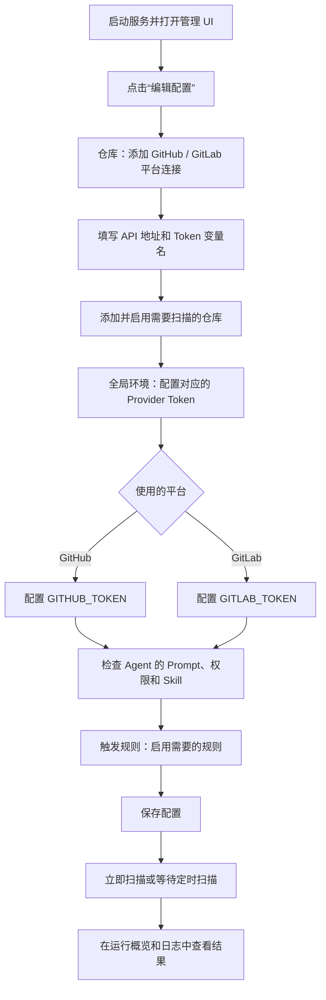

# Teamwork Review Agents

这是一个面向 GitHub Pull Request 和 GitLab Merge Request 的轻量 Agent 编排服务。它定时读取变更请求状态，将前后快照转换为语义事件，再按照 YAML 规则启动不同的 Codex CLI Agent。

核心能力：

- GitHub 与 GitLab 统一的变更请求模型。
- 提交、状态、Draft、标签、审批、流水线和可合并状态变化检测。
- SQLite 事件收件箱、运行审计与幂等控制。
- 每次 Agent 运行使用独立临时 worktree，同一 MR/PR 源分支写操作串行化。
- 使用 `codex exec --json` 运行 Agent。
- 通过 MCP `invoke_agent` 工具调用配置好的 sub-agent。
- sub-agent 白名单、递归深度、总调用次数和超时限制。
- 全局、仓库、Agent 三级环境变量与 `${{ENV_NAME}}` Prompt 渲染。
- Codex Skill 文件夹管理与按 Agent 独立装载。
- Codex CLI 运行时默认参数与 Agent 级独立覆盖。
- FastAPI 常驻后台、配置热加载、React 管理界面和实时运行日志。

## 快速开始

```bash
python -m pip install -e '.[dev]'
cp config_example.yaml config.yaml
teamwork-review-agents validate
teamwork-review-agents start
```

所有命令默认读取当前工作目录的 `config.yaml`。需要使用其他配置时，仍可通过 `-c /path/to/other.yaml` 覆盖。

全部配置项、默认值和字段用途见 [`config_example.yaml`](config_example.yaml)。复制后会得到三个内置 Agent 和两条内置规则模板；所有内置规则都设置为 `enabled: false`，不会自动启动 Agent。

首次启动时，管理 UI 中的 GitHub / GitLab 连接、仓库、环境变量和 Skill 都是空的；Agent 页面会显示内置 Agent，触发规则页面会显示已关闭的内置模板。运行时配置显示默认继承状态，但不会预先写入某个模型。访问 [http://127.0.0.1:8080](http://127.0.0.1:8080) 后先配置平台连接和仓库，检查 Agent 权限与 Prompt，再按需启用规则。

### 首次配置流程

首次使用时，建议在一次编辑中依次完成平台连接、仓库、Provider Token 和触发规则配置，最后统一保存：



具体操作顺序如下：

1. 打开管理 UI，点击右上角“编辑配置”。
2. 进入“仓库”，点击“添加平台连接”：
   - GitHub.com 的 API 地址保持 `https://api.github.com`，Token 变量名通常使用 `GITHUB_TOKEN`。
   - GitLab.com 的 API 地址保持 `https://gitlab.com/api/v4`，Token 变量名通常使用 `GITLAB_TOKEN`；自建 GitLab 应填写该实例实际的 `/api/v4` 地址。
3. 在同一页面点击“添加仓库”，选择刚创建的平台连接，填写远端项目路径或 SSH/HTTPS Git 地址、本地基础仓库目录，并打开“启用”。未启用的仓库不会参与扫描。
4. 进入“全局环境”，添加实际使用平台对应的变量：GitHub 配置 `GITHUB_TOKEN`，GitLab 配置 `GITLAB_TOKEN`。只使用一个平台时不需要配置另一个平台的 Token。
5. Provider Token 推荐选择“宿主机环境”，并让它读取同名宿主机变量，避免真实 Token 写入 `config.yaml`；也可以选择“固定值”。系统会自动把与平台连接 `token_env` 同名的变量保护为 Provider 凭据，不允许进入 Prompt 或 Codex CLI 进程。
6. 按需检查“Agent”页面中的 Prompt、Sandbox、写操作声明、Skill 和允许调用的 sub-agent。
7. 进入“触发规则”，打开需要的规则并确认其事件、仓库和 Agent。内置规则默认全部关闭，不主动启用就只会记录 MR/PR 和事件，不会运行 Agent。
8. 点击右上角“保存配置”。保存成功后，可以在“运行概览”点击“立即扫描”，或者等待下一次定时扫描，再到“运行与日志”查看结果。

`GITHUB_TOKEN` 和 `GITLAB_TOKEN` 是界面为两类平台提供的默认变量名，不是不可修改的硬编码。自定义变量名时，平台连接中的 `token_env` 与“全局环境”中的变量名必须完全一致。

## 运行模式

### `start`：在后台启动

```bash
teamwork-review-agents start
```

校验配置后启动脱离当前终端的 FastAPI 管理服务和后台调度器。命令会输出 PID、管理界面地址和后台日志路径；关闭当前终端不会停止服务。服务启动后立即执行一次扫描，之后默认每 5 分钟持续扫描；底层配置仍以 `scanner.interval_seconds: 300` 保存秒数。

默认运行文件位于 `config.yaml` 同目录的 `data/`：

- `teamwork-review-agents.pid`：当前进程身份。
- `teamwork-review-agents.lock`：防止同一配置重复启动。
- `teamwork-review-agents.log`：后台进程的标准输出与错误日志。

Agent 运行日志仍保存在 SQLite 中，并可以在管理 UI 查看。

### `run`：在前台运行

```bash
teamwork-review-agents run
```

功能与 `start` 相同，但进程保留在当前终端，按 `Ctrl+C` 结束。`serve` 作为旧版本兼容命令保留，行为等同于 `run`。

### `stop` / `end`：结束服务

```bash
teamwork-review-agents stop
# 或
teamwork-review-agents end
```

两个命令完全等价。默认发送 `SIGTERM` 等待当前服务收尾；30 秒后仍未退出时会强制结束。服务没有运行时命令也会正常返回。

### `restart`：重启后台服务

```bash
teamwork-review-agents restart
```

先校验新配置，再停止当前服务并重新在后台启动。如果服务原本没有运行，则直接启动。

以上命令都默认使用当前目录的 `config.yaml`。自定义配置时必须在启动、停止和重启时传入同一路径：

```bash
teamwork-review-agents start -c /path/to/config.yaml
teamwork-review-agents restart -c /path/to/config.yaml
teamwork-review-agents stop -c /path/to/config.yaml
```

生产环境需要故障自动拉起和开机启动时，仍建议让进程管理器运行前台命令 `run`：

- [systemd 服务模板](deploy/teamwork-review-agents.service)
- [macOS launchd 模板](deploy/com.teamwork.review-agents.plist)

### `scan-once`：扫描一次后退出

```bash
teamwork-review-agents scan-once
```

执行一个完整周期：扫描全部启用仓库、保存 MR/PR 快照、生成状态变化事件、匹配触发规则并等待对应 Agent 执行完成，最后将本次统计结果输出为 JSON 后退出。适合手动调试、CI 或由 cron 调用。

### `scan-once --dry-run`：只扫描，不启动 Agent

```bash
teamwork-review-agents scan-once --dry-run
```

该模式仍会请求 Provider、保存最新快照并生成事件，但不会处理事件或启动 Agent。生成的事件会保留为待处理状态，之后执行普通 `scan-once` 或启动 `run` / `start` 时仍可能被处理。

首次扫描仓库时，系统会向前回看一个扫描周期：例如扫描间隔为 5 分钟，就会输出最近 5 分钟内新建 PR 的 `change_request.opened`，以及 GitHub Timeline 能确认发生时间的关闭、重开、提交、Draft 和标签等动作；更早的历史 PR 只建立快照，不会被误报为新建。后续窗口从该仓库上一次成功轮次的开始时间起算，并依靠稳定事件 ID 消除重叠读取。`scanner.emit_initial_events` 只控制是否额外生成 `change_request.discovered`，窗口内真实发生的事件不受它影响。

管理界面的“已扫描 MR / PR”统计和列表来自已保存的最新快照；“变化事件”是新发现、提交、状态、标签等变化产生的事件，两者不会混为一个计数。对于已经建立基线但没有首次事件的 MR / PR，可以在列表中选择“补发首次事件”。补发不会删除快照或重新请求 Provider，只会幂等写入 `change_request.discovered`，并按当前规则调度；操作前请先确认规则与 Agent 权限。

## GitHub / GitLab 连接与仓库

“GitHub / GitLab 连接”是后台扫描远端 MR / PR 时使用的平台 API 配置，不是 Git clone 或 SSH 地址。连接中的 `token_env` 保存 Provider Token 的变量名，例如 `GITHUB_TOKEN`。系统按以下顺序取值：

1. “全局环境”中的同名变量，可以配置固定值，也可以通过 `from_system` 引用另一个宿主机变量。
2. 如果全局环境没有该变量，直接读取启动服务时的同名宿主机环境变量，以兼容原有配置。

推荐在“全局环境”中选择“宿主机环境”来源，例如让 `GITHUB_TOKEN` 读取宿主机的 `GITHUB_TOKEN`，这样真实 Token 不会写入 `config.yaml`。如果选择“固定值”，Token 会以明文保存在本机且已被 Git 忽略的 `config.yaml` 中，但管理 API、UI 和配置历史只会显示 `********`。

与 Provider `token_env` 同名的环境变量会自动标记为 Provider 凭据：系统强制将其视为 Secret，并禁止进入 Prompt 和 Codex 子进程。它只供后台扫描器访问平台 API。

仓库配置同时关联两类位置：

- 远端仓库地址或项目路径，用于平台 API 扫描。支持 GitHub 的 `owner/repository`、GitLab 的 `group/project`、`git@host:group/project.git` SSH 地址和 HTTPS Git 地址；后台会自动提取规范项目路径。
- 基础 Git 仓库目录，用于克隆、校验、fetch 和管理 worktree。目录不存在时，服务会根据 SSH/HTTPS 地址自动克隆；目录已经存在时只校验并更新远端引用，不会覆盖文件。Codex CLI 不直接在这个目录运行。

推荐在管理 UI 中按“添加平台连接 → 添加仓库 → 启用仓库 → 保存配置”的顺序操作。

每次 Agent 启动前，服务会执行 `git fetch`，把当前 MR/PR head 保存到 `refs/teamwork/change-requests/<编号>/head`，再在数据库目录旁的 `worktrees/<仓库>/<run-id>/` 创建独立 detached worktree。Prompt 运行上下文会同时提供这个引用和目标分支引用，Agent 可以直接执行 `git diff`。基础仓库的当前分支和用户已有修改不会被切换或覆盖。

扫描器会先按更新时间倒序读取 PR / MR 列表，并在上次成功扫描时间水位处提前停止。`scanner.max_items_per_repository` 是单个仓库每轮的安全上限，默认 100 条；它限制需要继续读取详情、活动、Review、流水线与合并状态的 MR/PR 数量，避免大型仓库单轮请求失控。`scanner.api_page_size` 只是高级分页参数，通常无需修改。

GitHub 候选 PR 会额外增量读取 Issue Timeline。PR 详情负责提供当前快照，Timeline 的稳定 `id` / `node_id` 负责识别同一轮轮询间发生的 `closed`、`reopened`、`merged`、`committed`、Draft 和标签动作；因此即使扫描前后都为打开状态，中间的关闭和重新打开也能分别入库。全新数据库第一次扫描某个 PR 时只回看上述扫描周期；升级后数据库里已经有快照但缺少 Timeline 游标的 PR 只补齐活动基线，不重放不确定的历史动作。GitLab 暂时继续使用快照差异。

同一个 MR/PR 可以在不同时间重复产生 `closed`、`reopened` 等事件；事件 ID 包含远端更新时间，因此重复状态转换不会再被上一轮同名事件吞掉。同一远端快照被重复扫描时仍然保持幂等。

规则可配置 `deduplicate_per_scan: true`。开启后，同一轮扫描中同一个 MR/PR 的多个已选事件匹配同一规则时，每个目标 Agent 只运行一次，并把动作合并到 `mr.action`；关闭时仍按每个事件分别运行。GitHub Timeline 可以恢复轮询间的离散动作，快照仍用于保存当前真值并补充审批、流水线和可合并状态等变化；需要更低延迟时可进一步接入 Webhook，并保留扫描器作为对账兜底。

运行概览会分开展示事件状态和 Agent 进度。事件没有匹配规则时会立即显示“未触发”；匹配规则后显示“已触发”，相关任务结束后显示“已处理”或“处理失败”。Agent 独立使用“排队中”“执行中”“已完成”“失败”“超时”“已取消”等状态，因此同批次中未被规则选择的 `change_request.updated` 不会再因为其他事件正在执行 Agent 而显示为“处理中”。历史版本已经完成但没有调度关联记录的事件会显示“历史已处理”。

## Codex CLI 运行时配置

左侧“运行时配置”用于设置 Teamwork 启动 Codex CLI 时采用的默认参数，包括模型、推理强度、快速模式、输出详细度、交互风格和联网搜索。它们保存在 `runtime.codex`，不会改写你的 `~/.codex/config.toml`：

```yaml
runtime:
  codex_binary: codex
  # 可选：让后台服务使用独立的 Codex 配置和缓存目录。
  codex_home: ./data/codex-home
  # 可选：不匹配时拒绝启动 Agent，避免多个 Codex 版本争用模型缓存。
  expected_codex_version: 0.146.0
  # 默认隔离 ~/.codex/config.toml 中的用户 MCP；可按名称显式放行。
  inherit_user_mcp_servers: false
  allowed_user_mcp_servers: []
  # 连续 5 分钟没有新的 Codex JSONL 进度时提前终止。
  agent_idle_timeout_seconds: 300
  codex:
    model: gpt-5.6-sol
    model_reasoning_effort: high
    fast_mode: fast
    model_verbosity: medium
    personality: pragmatic
    web_search: cached
    extra_config:
      history.max_bytes: 1048576
```

实际合并顺序是 Codex 用户/仓库配置 → Teamwork 运行时默认 → 当前 Agent 显式覆盖 → 应用托管的 Sandbox、MCP 网关和 Skill 参数。后面的值覆盖前面的值。Agent 页的对应字段全部可留空；sub-agent 使用目标 Agent 自己的配置，不继承父 Agent 的模型或推理参数。

后台运行默认把用户配置中的 MCP Server 逐个设为禁用，只保留 Teamwork 自己的 `invoke_agent` 网关和 `allowed_user_mcp_servers` 明确列出的服务。这样不会因为用户桌面环境中配置了浏览器、Computer Use 或应用内工具，就让无人值守 Agent 卡在等待交互的工具调用上。如果确实需要继承全部用户 MCP，可以显式设置 `inherit_user_mcp_servers: true`，但这会重新引入无人值守运行风险。

`codex_home` 留空时继续使用服务进程当前的 `CODEX_HOME` 或 `~/.codex`。配置独立目录可以隔离 `config.toml`、登录状态与 `models_cache.json`，但首次使用前必须先为该目录完成 Codex 登录。`expected_codex_version` 用来固定后台实际执行的 CLI 版本；服务会在启动 Agent 前调用 `codex --version`，不匹配时立即失败并显示实际路径、实际版本和缓存版本诊断，而不是让多个版本反复覆盖同一个模型缓存。

Agent 的 `timeout_seconds` 是单次运行总时长上限；`runtime.agent_idle_timeout_seconds` 是连续没有新 JSONL 进度的上限，两者任意一个先到都会终止整个 Codex 进程组。Agent 还可以用 `idle_timeout_seconds` 单独覆盖默认值。在“运行与日志”中可以对“排队中”或“执行中”的任务点击“取消运行”：排队任务会直接取消，执行中任务会先请求正常终止，短暂等待后再强制结束整个进程组，取消状态会持久化到 SQLite，因此后台服务与 UI 不在同一进程时仍然有效。

模型候选来自服务端当前 `codex_binary` 的本机模型目录。读取失败时仍可手工填写模型 ID。Agent 模型留空时，界面会优先显示具体的 Teamwork 运行时模型，其次显示 `~/.codex/config.toml` 中可读取的模型；如果两处都没有固定模型，则明确显示“由 Codex CLI / 账号默认决定”，不会猜测一个可能变化的模型。不同仓库里的 `.codex/config.toml` 仍可能影响没有被更高层覆盖的运行。

`extra_config` 的键使用 Codex `config.toml` 点号格式，值支持字符串、数字、布尔值和简单数组。模型结构化字段请使用上方专门配置；Sandbox、审批策略、MCP、Skill 和其他应用托管边界禁止通过高级配置覆盖。“快速模式”会把 Codex `service_tier` 设为 `fast`，“标准模式”设为 `default`；快速档位是否可用以及相应的用量倍率由当前模型和账号决定。

## Agent 与 sub-agent

触发规则中的 Agent 是本次事件直接启动的根 Agent。“允许调用的 sub-agent”只是白名单权限：根 Agent 可以在确有必要时通过 `invoke_agent` 委托其中一个 Agent，但勾选后不会自动执行，也不会改变触发规则。

Agent 配置本身不固定绑定工作目录。仓库配置目录只是基础 Git 仓库；每次根 Agent 都在当前 MR/PR Head 上获得一个按运行 ID 隔离的临时 worktree。同一仓库的不同 MR 或不同源分支可以并发；声明“本地仓库写操作”后，同一源分支会串行，避免多个运行同时推送覆盖远端。

每次 sub-agent 调用都会启动独立的 Codex CLI 进程，拥有自己的运行 ID、超时和日志，并继承当前仓库上下文。当前 Agent 不能调用自身；如果没有候选项，需要先创建另一个 Agent。

sub-agent 的具体输入由父 Agent 决定。父 Agent 调用 `invoke_agent(agent_name, task, extra_context)` 时指定目标 Agent 和委托任务；sub-agent 自动继承仓库 ID 和远端项目，工作目录按规则选项决定，但不会自动收到根 Agent 的 MR/PR 数据或动作。如果任务需要这些信息，父 Agent应在 `task` 或 `extra_context` 中明确传递。

规则可配置 `inherit_workspace: true`。开启后，sub-agent 复用父 Agent 本次运行的临时 worktree，因此父 Agent 已切换的分支、暂存区和未提交文件对子 Agent 可见，子 Agent 的修改也会直接留在该目录；共享工作区委托会串行执行。该选项不传递 MR 输入、动作数组或父 Agent 对话。默认关闭时，每次 sub-agent 委托也会创建自己的独立 worktree。

拥有临时 worktree 的 Agent 成功结束后，如果没有本地修改、没有新增提交，或者新增提交已经存在于 `origin`，系统会立即删除该 worktree。失败、超时、存在未提交文件或新增提交尚未推送时，工作区会保留，并在“运行与日志”中标记为“工作区待清理”。`runtime.worktree_retention_days` 默认是 7 天；超过期限后，会在下次准备同一仓库时强制清理，因此这个期限也是遗留本地修改的最长恢复窗口。

触发规则直接启动的根 Agent 会收到当前 MR/PR 的统一 JSON 信息，其中 `mr.action` 始终是动作数组，例如 `["reopened", "updated"]`。旧快照、新快照、内部变化字段和规则匹配字段不会进入 Prompt。

Agent 的 Prompt 支持两种来源：

- 内联模板：直接在管理 UI 中编辑。
- 文件：手工填写相对于 `config.yaml` 的路径，选择 `./prompts/` 中已有文件，或点击“从电脑选择并导入”。

从电脑导入时，后台会将 UTF-8 编码的 `.md` 或 `.txt` 文件复制到配置目录旁的 `./prompts/`，然后自动填写相对路径。浏览器原始路径不会被写入配置；同名但内容不同的文件会自动增加数字后缀。

仓库根目录的 `/prompts/` 默认由 Git 忽略，用于保存每个部署环境自己的 Prompt，不会因为 UI 导入而进入版本控制。项目只精确提交以下内置 Prompt：

- `prompts/general-review.md`
- `prompts/增量文档更新入口.md`
- `prompts/增量文档更新.md`

其他 Prompt 仍保持忽略。内置 Agent 会随示例配置显示，但内置规则默认关闭；只有管理员主动启用规则后，扫描事件才会启动对应 Agent。

### 目标仓库文件与目录准备

内置 Agent 不要求业务仓库为了启动扫描而预先创建固定文件或目录。不过，启用内置审核或文档更新规则前，应了解下面这些可选路径；一旦为目录变量配置了非空值，对应目录就必须真实存在于目标仓库内并且可读，否则 Agent 会把它视为配置错误，而不会静默回退到自动发现。

| 使用方 | 配置或约定 | 是否需要预先创建 | 行为 |
| --- | --- | --- | --- |
| `general-reviewer` | `REVIEW_DESIGN_DOC_DIR` | 可选 | 目标仓库内的设计、架构、ADR 或 Spec 文档目录，例如 `docs/design/`。留空时自动发现；没有找到也不阻塞审核。配置非空值时，目录必须存在、可读且位于当前仓库内。 |
| `general-reviewer` | `REVIEW_CHANGE_HISTORY_DIR` | 可选 | 目标仓库内的变更历史或归档目录，例如 `docs/changes/`。留空时自动发现；没有找到也不阻塞审核。配置非空值时适用与设计文档目录相同的校验。 |
| `general-reviewer` | `REVIEW_SKILLS` | 不属于仓库路径 | 可选的 Teamwork Skill ID 列表，例如 `security-review,python-guidelines`。这些 Skill 需要先在本服务的“SKILL”页面配置并由当前 Agent 装载，不要求目标仓库创建同名目录。 |
| `incremental-doc-updater` | `DOC_UPDATE_INDEX_PATH` | 无需预先创建 | 文档索引文件路径，默认是 `docs/README.md`。文件或安全的父目录不存在时，Agent 会创建并把它纳入文档更新提交；指定其他路径后不会再回退到默认路径。 |
| `incremental-doc-updater` | `DOC_UPDATE_EXCLUDE_DIRECTORIES` | 无需创建 | 可选的排除目录列表或说明，只用于跳过目标仓库中已经存在的目录。留空时使用内置排除规则。 |
| `incremental-doc-updater` | `.tmp/` 或 `tmp/` | 无需创建 | 可选的任务临时目录。只有路径位于仓库内且已被 Git 实际忽略时才会使用；否则自动改用系统临时目录。 |
| 所有内置 Agent | `AGENTS.md`、`CLAUDE.md`、`CONTRIBUTING*` | 无需专门创建 | 仓库中存在这些约束或贡献说明时，Agent 会按适用范围读取；不存在不影响运行。 |

这些路径通常按仓库配置，推荐使用相对于目标仓库根目录的相对路径。内置 Prompt 是通过 Codex CLI 进程读取这些变量，因此变量需要开启“传给进程”；不需要把路径值直接渲染进 Prompt。例如：

```yaml
repositories:
  - id: example
    provider: github-main
    project: owner/repository
    workspace: ./workspaces/example
    environment:
      REVIEW_DESIGN_DOC_DIR:
        value: docs/design
        expose_to_prompt: false
        expose_to_process: true
      REVIEW_CHANGE_HISTORY_DIR:
        value: docs/changes
        expose_to_prompt: false
        expose_to_process: true
      REVIEW_SKILLS:
        value: security-review,python-guidelines
        expose_to_prompt: false
        expose_to_process: true
      DOC_UPDATE_INDEX_PATH:
        value: docs/README.md
        expose_to_prompt: false
        expose_to_process: true
      DOC_UPDATE_EXCLUDE_DIRECTORIES:
        value: vendor,generated
        expose_to_prompt: false
        expose_to_process: true
```

如果不需要固定目录或项目专属 Skill，可以不添加相应变量。尤其是 `REVIEW_DESIGN_DOC_DIR` 和 `REVIEW_CHANGE_HISTORY_DIR`：留空表示自动发现，不应为了填写配置而创建空目录。启用增量文档更新规则时还应注意，默认索引 `docs/README.md` 不存在会触发文档索引的全量初始化，并由 Agent 自动创建该文件。

## Skill 配置与装载

左侧“SKILL”页面用于注册 Codex Skill 文件夹。每个文件夹根目录必须包含 `SKILL.md`，其 YAML frontmatter 至少包含 `name` 与 `description`；`scripts/`、`references/`、`assets/` 等资源目录会连同层级一起保留。可以填写服务端已有的相对或绝对路径，也可以点击“从电脑导入文件夹”，由后台复制到配置文件旁的 `./skills/`。

导入完成只代表 Skill 已保存并加入顶层配置。还需要在 Agent 页面为每个 Agent 独立勾选要装载的 Skill：

```yaml
skills:
  incremental-doc-update:
    path: ./skills/incremental-doc-update

agents:
  incremental-doc-updater:
    prompt: 请按需更新文档。
    skills:
      - incremental-doc-update
```

勾选表示该 Skill 对本次 Agent 可用：Codex 可以根据 `description` 隐式匹配，也可以由 Prompt 使用 `$skill-name` 显式要求；它不会因为被勾选就每次强制执行。运行前，服务把应用中配置的 Skill 临时投影到本次独立 worktree 的 Codex 原生发现目录，并只启用当前 Agent 选择的项目；投影对该进程的 `git status` 和普通 `git add -A` 隐藏，运行结束后立即清理，不会写入业务仓库的正常 Git 变更。

sub-agent 始终使用目标 Agent 自己的 `skills` 配置，不继承父 Agent 的选择。规则中的 `inherit_workspace` 只共享当前 worktree、分支、暂存区和未提交文件，不改变技能列表。`/skills/` 默认被 Git 忽略，用于部署环境自己的 Skill；以后增加内置 Skill 时，应只为明确的内置目录增加 `.gitignore` 例外。

## 环境变量与 Prompt 模板

配置按“全局 → 仓库 → Agent → 运行时内置变量”合并，后面的同名变量覆盖前面的值：

```yaml
environment:
  global:
    ORGANIZATION_NAME: Example Team
    GITHUB_TOKEN:
      from_system: GITHUB_TOKEN
      secret: true
      expose_to_prompt: false
      expose_to_process: false
    INTERNAL_API_TOKEN:
      from_system: TEAMWORK_INTERNAL_API_TOKEN
      secret: true
      expose_to_prompt: false
      expose_to_process: true

repositories:
  - id: example
    provider: github-main
    project: owner/repository
    workspace: ./workspaces/example
    environment:
      DEPLOY_ENV: staging

agents:
  reviewer:
    prompt: |
      请审查 ${{ORGANIZATION_NAME}} 的 #${{MR_NUMBER}}。
      未定义变量：${{NOT_DEFINED}}
    sandbox: read-only
    environment:
      REVIEW_STYLE: concise
```

模板中的未定义变量会渲染为空字符串。Secret 默认不进入 Prompt；配置 API、配置历史、渲染后的 Prompt、Codex JSONL 和 stderr 落库前都会脱敏。UI 中的 `********` 是保留原 Secret 的占位符。Provider 凭据比普通 Secret 更严格：即使手工把 `expose_to_prompt` 或 `expose_to_process` 设为 `true`，运行时也会强制关闭。

系统还会注入仓库、MR/PR、事件与运行信息，包括 `REPOSITORY_ID`、`MR_NUMBER`、`MR_HEAD_SHA`、`MR_URL`、`EVENT_TYPE` 和 `RUN_ID`。

## 管理界面认证

默认只监听 `127.0.0.1`，可不配置管理 Token。只要监听非本机地址，就必须将 Token 放在宿主机环境变量中：

```yaml
web:
  host: 0.0.0.0
  port: 8080
  admin_token_env: TEAMWORK_ADMIN_TOKEN
```

```bash
export TEAMWORK_ADMIN_TOKEN='使用高强度随机值'
teamwork-review-agents run
```

在 UI 顶部输入同一个 Token。Token 只保存在当前浏览器的 `localStorage`，不会写入 YAML。

## 前端开发

发布包已包含构建好的 UI。只有修改前端源码时才需要：

```bash
cd ui
npm install
npm run build
```

本地联调可以先启动 Python 后台，再在 `ui` 目录运行 `npm run dev`；Vite 会把 `/api` 转发到 `127.0.0.1:8080`。

## 运行前提

- 系统中需要安装 `git`，并准备好克隆地址对应的 SSH Key 或 HTTPS 凭据；工作目录不存在时会自动克隆。
- Codex CLI 已完成认证，或者运行环境提供仅对 `codex exec` 生效的认证方式。
- GitHub 默认使用 `GITHUB_TOKEN`，GitLab 使用连接中 `token_env` 指定的变量；该变量既可在“全局环境”配置，也可直接来自宿主机环境。
- 需要进行 GitHub/GitLab 写操作的 Agent，可以使用本机已认证的 `gh`/`glab`，并应在提示词中明确操作边界。
- Provider Token 永远不会传进 Codex 子进程；写平台操作应使用单独的最小权限身份。

详细架构见 [系统设计](docs/design.md)，分阶段实施与验收项见 [实施方案](docs/implementation-plan.md)。
