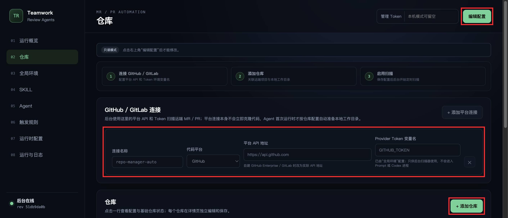
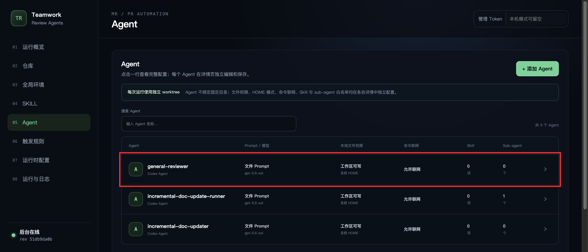
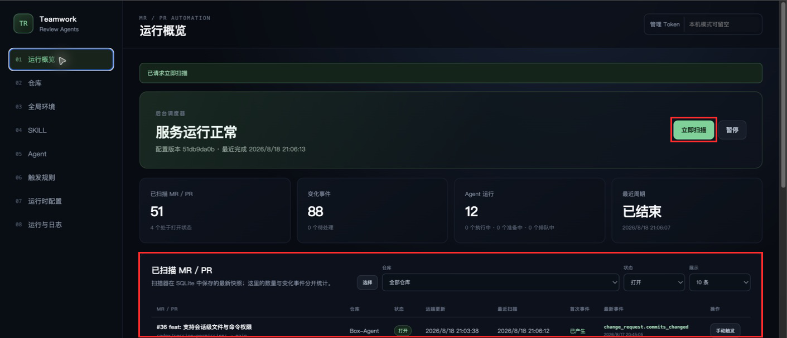

# Teamwork Review Agents

> Vibe coding 负责快速产出代码；本项目负责让代码可靠进入主分支。

PR / MR 越来越快、越来越多，但审核、CI、合并门禁和文档同步仍靠人工。结果是审核缺少上下文、旧结论误用于新提交、合并后文档过期。

Teamwork Review Agents 持续扫描 GitHub PR / GitLab MR，把状态变化转换为事件，再按规则启动隔离的模型 Agent，完成审核、合并和文档更新。

## 方案

- 固定源、目标 SHA，结合完整 diff、设计、历史变更和 CI 审核。
- 每次 Agent 使用独立 Git 工作区：可写 Agent 使用自带 `.git` 的本地 clone，只读 Agent 使用轻量 worktree，避免并发任务互相污染。
- 合并后按净差异和文档索引，只更新受影响文档。
- 快照、事件、规则、运行和日志统一写入 SQLite，并在管理界面展示。
- GitHub PR 可在 Review Agent 前执行仓库自定义的确定性 Preflight CI。

主链路：`扫描 PR/MR → 语义事件 → 规则匹配 → 模型 Agent → 审计与日志`


| Agent | 职责 | 触发时机 |
| --- | --- | --- |
| `general-reviewer` | 审核代码和门禁；全部通过才评论并合并 | PR / MR `opened`、`reopened`、源/目标分支提交变化 |
| `dependency&incremental-doc-update-runner` | 编排依赖更新与增量文档更新，统一创建、门禁、合并和清理 | GitHub PR / GitLab MR `merged` |
| `dependency-reviewer` | 扫描并升级全仓依赖，提交并推送依赖变更 | 组合 Runner 通过 MCP 委托 |
| `incremental-doc-updater` | 增量更新受影响文档 | Runner 通过 MCP 委托 |

内置规则默认关闭。先验证扫描，再按需启用。

## 快速开始

运行端支持 Linux、macOS、原生 Windows 和 WSL2，需要 Python 3.11+、Git、Codex CLI，以及 GitHub / GitLab Token。默认内置 Provider 使用 Codex CLI，选择它时还需要完成 Codex 登录；使用 API Provider 时需要在管理页单独配置对应 API Key。

> [!IMPORTANT]
> 使用 GitHub 仓库前，必须为启动 Teamwork 服务的同一系统用户安装并登录 `gh`；使用 GitLab 仓库前，必须以相同方式配置 `glab`。否则 Agent 无法通过平台 CLI 读取或执行评论、审批、标签、合并等操作。具体命令见[配置 `gh` / `glab`](docs/platform-cli-auth.md)。

Linux、macOS 或 WSL2：

```bash
python -m pip install -e .
cp config_example.yaml config.yaml
teamwork-review-agents validate
teamwork-review-agents start
```

Windows PowerShell：

```powershell
python -m pip install -e .
Copy-Item config_example.yaml config.yaml
teamwork-review-agents validate
teamwork-review-agents start
```

原生 Windows 支持 `run`、`start`、`stop`、`restart`、`scan-once` 等 CLI 命令。需要长期托管时，可以让 Windows 服务管理器或任务计划程序执行前台命令 `teamwork-review-agents run -c C:\path\to\config.yaml`；需要 Bash 工具链的仓库 CI 脚本可以继续使用 Git Bash 或 WSL2。

打开 [http://127.0.0.1:8080](http://127.0.0.1:8080)，点击“编辑配置”：

> 第一次使用建议直接按[首次配置图文指南](docs/first-time-setup.md)操作；下面只保留最短配置路径。

1. 添加 GitHub / GitLab 连接，填写 API 地址和 Token 变量名。
2. 添加目标仓库，填写远端地址和本地基础仓库目录并启用；目录不存在时会自动克隆。GitHub 仓库还可按需启用“本地 CI 门禁”，配置要顺序执行的程序、参数和超时。
3. 在“全局配置与环境”中引用宿主机的 `GITHUB_TOKEN` 或 `GITLAB_TOKEN`，并确认全局默认模型。
4. 在“Provider”页检查不可删除的内置 Codex CLI；新增 API Provider 时填写 Base URL 和 API Key，点击“检测模型”后选择默认模型，也可以跳过检测手工维护模型目录。
5. 检查 Agent 的模型继承、权限和 Prompt，保存后执行“立即扫描”。
6. 确认仓库、事件和日志正常，再启用触发规则；需要在 Agent 前执行本地 CI 的规则，同时选择“执行仓库 CI（如已启用）”。

平台连接与仓库配置：



Agent 权限与能力摘要：



首次扫描结果检查：



Provider Token 按“仓库环境变量 → 全局环境变量 → 服务进程宿主机环境变量”解析。不同仓库即使绑定同一个 Provider，也可以在仓库环境中用相同的 `token_env` 名称引用各自独立的宿主机 Token；仓库未配置时继续使用全局或宿主机默认值。Provider Token 始终按 Secret 脱敏，默认只供扫描、Commit Status 和托管评论等服务侧平台 API 使用；管理员也可以在环境变量中分别开启“进入 Prompt”和“进入进程”，每次从关闭切换为开启时管理界面都会提示泄露风险。该 Token 默认不能代替 Agent 所需的本机 `gh` / `glab` 登录态。

本地 CI 当前仅支持 GitHub。仓库未启用或未配置 CI 时，即使规则选择执行 CI，也会跳过门禁并直接启动 Agent，不会报错；完整配置和执行语义见[GitHub 本地 CI 门禁](#github-本地-ci-门禁)。

## 目标仓库准备

扫描本身不要求目标仓库新增文件。为提高审核质量并避免文档 Agent 首次全量扫描，建议提交：

```text
your-project/
├── AGENTS.md
└── docs/
    ├── README.md
    ├── design/
    │   └── README.md
    └── changes/
        └── README.md
```

其中 `docs/design/` 和 `docs/changes/` 可选；没有对应文档时不要创建空目录。

### `AGENTS.md`

记录项目常用命令和边界，供维护者和自动化在明确需要时作为仓库资料读取：

```markdown
# Project rules

- 安装：`<实际命令>`
- 测试：`<实际命令>`
- 静态检查：`<实际命令>`
- 主要代码：`<路径>`
- 禁止修改：`<生成目录或受保护路径>`
- 公开接口、配置或行为变化时，同步更新 `docs/`。
```

提交前替换全部占位符。

Teamwork 启动的后台 Codex 会关闭原生项目指令发现，因此源分支和目标分支中的
`AGENTS.md`、`AGENTS.override.md`、其他 Prompt、审核规范以及 PR / MR 模板不会
自动成为可信指令。审核 Agent 仍可按外部 Prompt 的需要读取这些文件，但只能把它们
作为被审核材料；真正可信的流程、权限和门禁来自 Teamwork 配置、内置 Prompt 与显式
分配的 Skill。

### `docs/README.md`

这是文档 Agent 默认使用的索引：

```markdown
# 文档索引

| 文档 | 用途 | 关联模块 | 更新条件 |
| --- | --- | --- | --- |
| `README.md` | 项目入口 | CLI、启动配置 | 命令或首次使用流程变化 |
| `docs/api.md` | API 说明 | `src/api/` | 路由、鉴权或请求响应变化 |
```

若该文件不存在，第一次文档任务会扫描全部非排除文档并自动创建索引，耗时和 Token 消耗更高。

### 设计与变更历史

- `docs/design/`：保存仍有效的架构、ADR 和 Spec。
- `docs/changes/`：保存重要变更、迁移、回滚和兼容性决策。

配置固定目录后，路径必须已存在且可读；否则留空，让审核 Agent 自动发现。

在目标仓库环境中配置：

| 变量 | 示例值 |
| --- | --- |
| `REVIEW_SKILLS` | `security-review, style-review` |
| `REVIEW_DESIGN_DOC_DIR` | `docs/design` |
| `REVIEW_CHANGE_HISTORY_DIR` | `docs/changes` |
| `REVIEW_AUTO_MERGE` | `false` |
| `DEPENDENCY_AUTO_UPDATE_AGENT_NAME` | `dependency-reviewer` |
| `INCREMENTAL_DOC_UPDATE_AGENT_NAME` | `incremental-doc-updater` |
| `DOC_UPDATE_REPOSITORY_ROOT` | `/workspace/project` |
| `DOC_UPDATE_INDEX_PATH` | `docs/README.md` |
| `DOC_UPDATE_EXCLUDE_DIRECTORIES` | `vendor,generated` |

以上配置变量只需在对应 Agent 的环境变量中开启“传给 Prompt”；它们会在模型启动前直接渲染到内置 Prompt，不需要模型通过 Bash、`env` 或 `printenv` 再次读取。“传给进程”仅在确实需要让 Agent 启动的命令读取变量时开启。`REVIEW_AUTO_MERGE` 只有去除空白且不区分大小写等于 `true` 时，通用审核 Agent 才会在全部门禁通过后自动合并，缺失或其他值均只审核和评论。`REVIEW_SKILLS` 不是仓库路径；Skill 应导入本服务后再分配给 Agent。

Prompt 使用沙盒化 Jinja2 渲染，支持 `{{ VARIABLE }}` 和 `` 等标准语法。布尔环境变量可以使用 ``；已有 `${{ENV_NAME}}` 写法继续兼容，缺失变量仍渲染为空字符串。只有开启“Prompt”的非 Provider 变量才进入模板上下文，变量值不会作为 Jinja 模板再次执行。

## 首次启用

1. 保持规则关闭，执行一次“立即扫描”。
2. 启用 `general-review`，用新的 PR / MR 验证审核链。
3. 准备好 `docs/README.md` 后，再启用“依赖更新&增量文档更新”。

当前内置组合更新 Runner、依赖更新 Agent、文档更新 Agent 与通用审核 Agent 都支持 GitHub PR 和 GitLab MR。Runner 根据运行上下文中的平台类型选择 `gh` / GitHub API 或 `glab` / GitLab API；不会根据 URL 或 Git remote 猜测平台。

## 运行概览与手动事件

“已扫描 MR / PR”和“最近变化事件”可以分别按启用仓库、状态和展示数量筛选。MR / PR 按远端更新时间倒序，事件按实际发生时间倒序；每张列表默认显示 10 条，也可选择 20、50、全部或输入自定义正整数。

GitHub 历史 PR 的列表行会展示 Timeline 原始顺序中最后一条可转换为规则事件的“最新平台事件”。它是可手动触发的 Provider 活动参考，不等同于已经写入规则队列、可在详情中追踪的关联事件；首次回看窗口内的活动仍会全部自动记录和调度，窗口内没有活动的历史 PR 只缓存最新平台事件，不自动重放旧事件。点击行内“手动触发”会基于该参考创建一条具有独立 ID 的手动事件；也可以点击列表上方“选择”，勾选多个 PR 后批量触发，每个 PR 分别使用自己的最新平台事件并按当前规则调度。Timeline 最新性不按活动时间字段重新排序，`committed` 条目展示的时间可能是提交作者或提交者时间。此操作不会重新请求 GitHub，也不会直接修改远端 PR。GitLab 当前没有统一活动流实现，因此不会按 MR 当前状态猜测最新平台事件。

“最近变化事件”支持单条和批量手动触发。每次操作都会复制来源事件保存的快照上下文并创建新的独立手动事件，来源事件及其状态保持不变；相同 Head 与配置版本通常复用已有 Preflight / CI 结果，但已耗尽重试次数的基础设施异常会创建新的 CI 运行重新验证。MR / PR 详情会展示最新平台事件参考和触发按钮，关联事件保持左键查看详情，并可通过右键或键盘上下文菜单手动触发。

GitHub 合并 PR 时 Timeline 可能同时返回 `merged` 和由合并自动产生的 `closed`；系统将其归并为一次 `change_request.merged`，不会把自动关闭另算为普通关闭，也不会重复触发合并规则。

`change_request.commits_changed` 表示 PR / MR 源分支 Head 变化；`change_request.target_commits_changed` 表示打开状态 PR / MR 的目标分支真实 Head 变化。目标分支按仓库和分支每轮只查询一次，首次读取只建立基线。目标分支变化事件作为轻量可靠触发信号入队，进入完成、未匹配、失败或取消终态后仍会在事件历史中保留，并与实时日志共用 `web.log_retention_days`（默认 30 天）保留期；由它创建的 Agent 运行与固化上下文不随事件过期清理。

## Agent 运行状态与 Git 超时

Agent 先显示“排队中”，表示等待并发额度或资源锁；开始克隆、fetch 和创建隔离 Git 工作区后显示“准备工作区”，所选模型 Provider 真正启动后才显示“执行中”。可写 Agent 的运行目录是自带独立 `.git` 的本地 clone，Teamwork 外层沙盒会允许该 clone 及其独立 `.git` 写入，因此 Agent 可以执行 fetch、建分支和提交；Codex 的工作区权限档案还允许系统临时目录写入，用于每轮临时 HOME 和工具缓存，但基础仓库不在可写范围内。只读 Agent 使用轻量 linked worktree。工作区准备日志会定期记录当前 Git 操作和已耗时秒数，但不会记录完整远端 URL。

不同 PR / MR 的事件批次可以并发调度，同一 PR / MR 的后续批次仍按时间顺序等待。扫描期间新产生的其他 PR / MR 事件会及时填补空闲额度，不需要等待某个长时间 Agent 结束。“全局配置与环境”页的 `runtime.max_concurrent_agents` 和 `runtime.agent_concurrency_limit` 默认均为 `5`，根 Agent 实际总并发取两者较小值。每个 Agent 还可以填写 `max_concurrent_runs`；留空表示不增加同名 Agent 限制，填写后同时约束该名称的根 Agent 与 sub-agent。sub-agent 复用父根任务的全局额度，避免父任务等待子任务时产生额度死锁。

排队记录会说明当前是在等待全局/运行时额度、此 Agent 额度、同一 PR / MR 前序批次、前序事件重试、业务资源锁还是基础仓库锁。前序事件发生可重试失败时只短暂延迟当前 PR / MR，其他变更请求继续使用空闲额度；达到重试上限后，该失败事件保留终态并立即继续同一 PR / MR 的后续批次。修改并发配置只影响尚未取得额度的新运行，不会强制终止已经开始准备或执行的任务。

`runtime.repository_initialization_timeout_seconds` 控制基础仓库首次克隆的最长等待时间，默认 `1800` 秒；基础仓库就绪后，`runtime.git_timeout_seconds` 控制 fetch、引用获取、运行 clone 和 worktree 等单次 Git 操作，默认 `600` 秒。等待仓库锁不计入这两个超时。排队、准备工作区和执行中的运行均可取消；准备阶段取消或 Git 超时时会终止整个 Git 进程组，避免遗留 ssh、index-pack 等子进程。

这两个超时可以在管理界面左侧“全局配置与环境”中修改，分别显示为“基础仓库初始化超时（秒）”和“Git 操作超时（秒）”。

Codex 的当前目录仍是本次 PR / MR 的临时 Git clone 或 linked worktree，所以 Git、测试
和平台 CLI 都会作用于正确仓库。Teamwork 会在每次 `codex exec` 最后强制设置
`project_doc_max_bytes=0`，只关闭仓库 `AGENTS.md` 的自动指令注入，不改变工作目录、
Git 仓库识别、显式 Prompt 或 Skill 装载。

仓库页的“基础仓库状态”可以提前初始化尚不存在的基础 Git 仓库，也可以对已就绪仓库执行增量更新。初始化完成后，Agent 不会再次完整下载仓库，而是复用基础仓库中的 Git 对象并执行增量 fetch；可写 Agent 创建拥有独立 `.git` 的运行 clone，只读 Agent 创建 linked worktree。这样既减少网络传输，也不会让 Agent 修改基础仓库工作文件或共享 Git 元数据。初始化与 Agent 准备过程使用同一仓库锁，支持查看阶段、耗时、磁盘占用、失败原因以及取消操作。点击仓库状态或仓库行可以查看每条脱敏 Git 命令的实时状态；若操作来自 Agent，可继续进入对应运行记录。

## 模型 Provider 与全局默认模型

“Provider”页管理 Agent 的模型执行后端。页面使用整列列表直接展示每个 Provider 的协议或模式、具体默认模型和状态，点击一行后在详情抽屉中单独查看、编辑、保存或测试该 Provider。`codex-cli` 是系统自动补齐的内置 Provider：可以停用，但不能删除，初始全局默认模型也指向它。API Provider 支持 OpenAI Responses、OpenAI Chat Completions、Anthropic Messages 和 Gemini GenerateContent 协议，可分别配置 Base URL、默认模型、模型目录、超时和并发上限。API Key 与 `config.yaml`、配置历史分开保存；列表只显示掩码，管理员主动点击小眼睛时才通过受管理 API 临时读取明文，Key 不进入 Prompt、工具子进程、运行快照或日志。

新建或编辑 API Provider 时，不需要先填写占位模型。填写 Base URL 和 API Key 后点击“检测模型”，Teamwork 会按所选协议读取模型目录，用户可在表单内选择默认模型；检测失败不会保存半成品，也可以改用手工模型目录。已保存 Provider 在未输入新 Key 时会复用受管凭据。检测和保存之外，详情抽屉还提供“连接测试”，只发送不带固定推理等级和工具声明的最小请求，用于验证凭据、地址和模型是否可用。

连接测试或模型目录请求失败时，详情抽屉会显示上游返回的 HTTP 状态和具体原因，例如不支持的参数、认证失败、限流、模型不存在或服务端错误；可用的错误类型、代码、参数和请求 ID 会一并展示。错误正文经过长度限制和凭据脱敏，不会把完整响应、API Key 或 Token 写入配置、运行记录或日志。

Agent 可以显式选择 Provider 和模型，也可以继承“全局配置与环境”页的全局默认模型。选择框会把继承结果显示为具体值，例如 `继承全局默认（Codex CLI / gpt-5.6-sol）` 或 `Codex CLI / 基座默认模型（gpt-5.6-sol）`；无法从 Codex 配置和账号可靠解析时会明确显示原因。运行开始后会把实际 Provider、驱动和模型固化到运行快照，后续修改或删除 Provider 不会改写历史记录。

全局默认模型和 Agent 都可以配置有序回退链。Agent 显式主模型的顺序是“Agent 主模型 → Agent 回退链 → 全局默认模型 → 全局回退链”；未显式指定主模型时从全局默认模型开始。相同 Provider 和模型只尝试一次，运行快照会记录每次实际尝试及脱敏原因。只有认证/额度拒绝、限流、模型不可用、连接超时和临时 5xx 等 Provider 不可用类故障会回退；Prompt、工具协议、Git/工作区、取消、总超时和输出校验错误不会误触发回退。

推理 effort 是具体模型能力，不是通用 Provider 参数。OpenAI Responses 和 Chat Completions 的 GPT 系列模型才会显示并发送 effort；Anthropic、Gemini、DeepSeek 等非 GPT 模型会省略该参数。节点配置优先于 Agent 配置，再回退到 Provider 默认值；切换到不支持的模型后，历史 effort 会安全忽略。

删除 API Provider 时，如果全局默认模型引用它，全局默认会先回退到 `codex-cli`；所有显式引用它的 Agent 会清除自己的 Provider 与模型并改为继承新的全局默认。停用与删除不同：停用会保留全部引用，新运行直接明确失败，不会悄悄改用其他模型。如果回退后的 Codex CLI 本身处于停用状态，配置迁移仍会完成，但需要重新启用或更换全局默认后才能运行。

Codex CLI 内置 Provider 默认使用基座模式，也可以在详情中切换为完整 CLI 模式。基座模式和外部 API Provider 由 Teamwork 提供 `execute_command`、`apply_patch`、白名单 `invoke_agent`，以及按 Agent 配置开放的 `publish_comment`，负责函数调用回传、Skill 指令、日志、取消、超时和 Token 用量；它们不继承完整 Codex CLI 的内置工具、用户 MCP 或仓库 `.codex/config.toml`。Codex OAuth token 和外部 API Key 都只用于宿主模型请求。

## Teamwork 跨平台外层沙盒

受限 Agent 在模型基座驱动下没有 Codex 内层沙盒可回退，因此 `read-only` 和 `workspace-write` 的每个命令、补丁进程都必须成功进入 Teamwork 外层沙盒；即使 `fail_closed` 配成 `false`，该驱动仍失败关闭。`danger-full-access` 继续表示管理员明确允许工具直接访问宿主环境。

受限 Agent 默认不再直接依赖 `codex exec --sandbox` 保护本地文件。Teamwork 先根据 Agent 的文件与网络权限生成本轮权限档案，再调用当前 `runtime.codex_binary` 提供的 `codex sandbox` 建立操作系统级外层沙盒：macOS 使用 Seatbelt，Linux 和 WSL 使用 Linux sandbox，原生 Windows 使用 Windows sandbox。外层沙盒建立成功后，内层 `codex exec` 才关闭自己的重复沙盒，避免 Codex 对 `.git` 的额外保护阻止本次独立 clone 执行正常 Git 写操作。

```yaml
runtime:
  managed_sandbox:
    enabled: true
    fail_closed: true

agents:
  general-reviewer:
    # 允许写本次运行 clone、它自己的 .git 和系统临时目录。
    sandbox: workspace-write
    # 文件权限与命令联网分别控制。
    network_access: true
    # 留空表示允许普通网络；也可以只允许指定域名。
    network_domains: [api.github.com, github.com]
```

`read-only` 使用只读外层档案；`workspace-write` 允许写当前独立运行 clone（含它自己的 `.git`）和 Codex 权限档案定义的系统临时目录，后者承载每轮临时 HOME 与工具缓存；基础仓库和真实 HOME 不会因此变成可写。`danger-full-access` 会绕过受限外层沙盒，属于明确的高风险配置。网络关闭和普通联网由外层档案执行；域名白名单非空时，Teamwork 还会显式启用 Codex 网络代理，确保规则不只是配置声明。Provider Token 默认从 Codex 环境中移除，明确开启“进入进程”后除外。

sub-agent 和托管评论都不需要为此获得配置文件、数据库或 Provider Token 权限。Teamwork 会在外层沙盒内启动一个只暴露 `invoke_agent` 与 `publish_comment` 的最小 MCP 代理，并通过每次运行独有的临时文件通道把请求交给沙盒外 Broker；Broker 继续执行白名单、写作用域、源版本代次、幂等和并发校验。`publish_comment` 只接收完整正文，仓库、PR/MR、Agent 槽位和源版本代次全部来自服务签发的可信上下文。沙盒只获准访问该次通道，不能读取 `config.yaml`、SQLite、基础仓库或其他 Agent 工作区；Provider Token 默认也不可见，除非管理员明确开启对应变量的 Prompt 或进程暴露。通道及其随机令牌会在本轮结束后删除。取消、超时、`stop` 和 `restart` 会同时收尾 Codex、Broker 及仍在运行的 sub-agent。

Agent 详情页可以开启“按源版本托管顶层评论”。开启后必须同时声明 `change_request` 写作用域，并保存一个不会随 Agent 重命名变化的 `managed_comment_slot`。同一 Agent、同一 PR/MR、同一源版本代次只维护一条顶层评论：目标分支变化但源分支未变时更新原评论；源分支新增提交或 force-push 时创建下一代评论，保留时间线中的旧审核记录。人工删除评论不会被后台立即补回，只有该 Agent 下一次实际调用 `publish_comment` 时才会重新创建。关闭开关也不会删除历史评论。

可同时开启“附加模型签名”。Teamwork 会读取本轮 Agent 启动时固化的模型快照，在 `publish_comment` 正文末尾自动追加如 `gpt-5.6-sol (high)` 或 `deepseek-v4-pro` 的签名；无法解析具体模型时明确显示账号默认且未记录型号。签名不依赖 Prompt，也不会附加到没有模型运行的 Preflight / CI 评论。

`fail_closed: true` 是默认值。若当前平台不受支持、Codex CLI 版本没有 `codex sandbox --permission-profile`，或能力检查失败，运行会在模型启动前失败并写入诊断日志。只有显式改成 `false` 时，Codex CLI 驱动才回退到自己的同级内层沙盒；受限 Agent 永远不会自动回退为完全访问。权限档案目前是 Codex Beta 能力，可以在“全局配置与环境”页面查看当前平台、后端和能力状态，升级 Codex CLI 后应重新检查该诊断。

## GitHub 本地 CI 门禁

通用引擎负责轮询 PR、隔离检出、顺序执行、结果持久化、Commit Status 回写和 Agent 编排；接入仓库负责 CI 脚本、具体审核规则和 GitHub Ruleset。仓库启用 CI 只是声明具备该能力，只有同时设置 `run_preflight: true` 的触发规则才会等待 Preflight 成功后启动 Review Agent。GitHub Ruleset 只负责阻止不合格合并，不负责触发 CI；真正的触发器是持续运行的 `teamwork-review-agents` 服务。

开启 `publish_failure_comment` 后，Preflight 以 `status_context` 作为独立槽位，并且同一 PR 只保留一条活动失败评论：每次真实 CI 再次失败或超时时先删除旧评论，再在时间线底部创建本轮评论；相同 CI 结果被多个事件复用时不反复刷新，映射缺失时才补建；当前最新源版本成功后会删除该槽位全部历史失败评论。Agent 托管评论仍按源版本代次保留审核历史，不受该策略影响。


配置分为以下三部分：

| 位置 | 必需内容 | 作用 |
| --- | --- | --- |
| 接入仓库 | CI 脚本，例如 `ci/preflight.sh` | 安装依赖、编译、测试和构建；脚本随 PR Head 一起检出并执行 |
| Teamwork 配置 | `repositories[].preflight`、Review Agent 和触发规则 | 指定扫描仓库、CI 命令、超时、状态名称以及成功后启动的 Agent |
| GitHub 仓库设置 | Ruleset 中的 Required Status Check | 将与 `status_context` 同名的检查设为合并门禁 |

下面是完整的最小配置。Prompt 可以继续放在本仓库，通过 `TEAMWORK_REVIEW_AGENTS_ROOT` 引用，不需要复制到接入仓库；启动服务前必须把该环境变量设置为本仓库的绝对路径：

```yaml
scanner:
  interval_seconds: 300
  # 即使为 false，启用 Preflight 的仓库也会自动产生首次 discovered 事件。
  emit_initial_events: false

repositories:
  - id: example-github
    provider: github-main
    project: owner/repository
    workspace: ./workspaces/example-github
    preflight:
      enabled: true
      # 按仓库共享多语言依赖下载缓存，不按分支重复下载。
      cache_enabled: true
      # 可选：失败时维护一条 PR 评论，后续通过后自动删除；默认关闭。
      publish_failure_comment: false
      status_context: teamwork/local-ci
      timeout_seconds: 1800
      max_output_bytes: 1000000
      steps:
        - name: repository-ci
          command: [bash, ci/preflight.sh]

agents:
  general-reviewer:
    prompt_file: "${TEAMWORK_REVIEW_AGENTS_ROOT}/prompts/general-review.md"
    sandbox: read-only
    timeout_seconds: 1800
    write_scopes: []
    allowed_sub_agents: []

rules:
  - name: example-general-review
    events:
      - change_request.discovered
      - change_request.commits_changed
      - change_request.reopened
      - change_request.draft_changed
    agents: [general-reviewer]
    repositories: [example-github]
    conditions:
      state: opened
      draft: false
    # 仓库未启用或未配置 CI 时不报错，直接运行 Agent。
    run_preflight: true
    enabled: true

# 可选：按时间直接在仓库远端默认分支的最新提交上运行 Agent。
scheduled_rules:
  - name: example-scheduled-maintenance
    agents: [general-reviewer]
    repositories: [example-github]
    schedule:
      kind: cron
      cron: "0 9 * * 1-5"
      timezone: Asia/Shanghai
    enabled: true
```

定时规则也支持 `kind: interval`，并通过 `interval_value` 与 `interval_unit`（`minutes`、`hours` 或 `days`）设置固定间隔。每个到期周期都会独立创建“仓库 × Agent”根运行；即使上一周期尚未结束，新周期也不会被跳过。定时运行不绑定虚构的 MR / PR，不执行 MR 专属 Preflight，也不发布 MR 评论；运行详情会记录规则名、计划时间、周期实例、默认分支和 Head SHA。服务暂停或停止期间错过的周期不会在恢复后补跑。

可写 Agent 建议启用每次运行独立的临时 HOME，避免仓库程序把缓存、工具配置或测试产物写进服务账号真实的 `~/`：

```yaml
agents:
  general-reviewer:
    sandbox: workspace-write
    home_mode: temporary
```

`home_mode: temporary` 是通用运行隔离，不需要随仓库配置 `BOX_AGENT_HOME`、`UV_HOME` 等项目专用变量。根 Agent 和 sub-agent 每次运行各自创建临时 HOME，并在成功、失败、取消或超时后清理；服务异常退出遗留的目录会在后续启动执行器时回收。真实 `CODEX_HOME` 继续显式传入，已有的 `gh`、`glab`、Git 全局配置和 SSH Agent 只桥接必要入口，不会复制整个用户目录、私钥或其他凭据。macOS 会额外把临时 HOME 的 `Library/Keychains` 链接到当前系统用户的钥匙串目录，使 `gh` 在 HOME 隔离后仍能使用原有 Keychain 登录态；任务清理只删除链接，不会删除真实钥匙串。该过程不会生成 `GH_TOKEN`，Provider Token 也不会被隐式注入 Codex 进程；只有明确开启对应变量的“进入进程”后才会传入。只读 Agent 不能选择临时 HOME；`danger-full-access` 仅改变默认 HOME，并不形成文件系统安全边界。

接入仓库中的 `ci/preflight.sh` 应当是可独立运行、首个错误即退出的确定性脚本，例如：

```bash
#!/usr/bin/env bash
set -euo pipefail

uv sync --frozen --all-extras
uv run python -m compileall -q your_package
uv run pytest tests/ -q --tb=short
uv build
```

完成配置后，在 GitHub Ruleset 中添加 Required Status Check `teamwork/local-ci`，其名称必须与 `status_context` 完全一致。然后校验配置并启动服务：

```bash
# 指向包含 prompts/general-review.md 的 Teamwork Review Agents 仓库。
export TEAMWORK_REVIEW_AGENTS_ROOT=/path/to/teamwork_review_agents

teamwork-review-agents validate -c /path/to/review.config.yaml
teamwork-review-agents start -c /path/to/review.config.yaml

# 调试时可以立即执行一轮，不等待扫描间隔。
teamwork-review-agents scan-once -c /path/to/review.config.yaml
```

Preflight 在临时 detached worktree 中校验准确的 PR Head SHA，不修改基础仓库或 Agent 运行工作区。启用的仓库会在首次发现 PR 时自动产生 `change_request.discovered` 事件，不受全局开关影响。同一仓库、PR、Head SHA 和配置版本只运行一次。规则要求 CI、仓库启用 CI 且 PR 当前打开时，代码失败或超时只阻断该类规则；未选择 CI 的规则不等待门禁。仓库没有配置 CI，或 PR 已关闭、合并时，规则会跳过 CI 并直接启动 Agent。Git、进程启动或首次状态发布等基础设施错误沿用要求 CI 的事件重试；本地命令已有终态后，GitHub 回写失败只补发状态，不会重新执行命令。

默认启用的 `cache_enabled` 会为每个仓库建立稳定缓存根目录，并把 uv、pip、Poetry、PDM、npm/pnpm/Yarn、Bun、Cargo、Go、Maven、Gradle、NuGet、Composer、Playwright、Puppeteer 和 Deno 等常见缓存定向到该目录。同一仓库跨分支、跨 PR 共享下载缓存，但临时 worktree、HOME 和安装产物仍按运行隔离。仓库详情中的“执行 CI / 预热缓存”会针对远端默认分支最新提交启动不限时、可取消的手动 CI；它不创建 MR / PR 事件、不触发 Agent，也不回写 Commit Status。运行概览、事件详情和运行与日志页使用同一个 CI 详情抽屉持续显示 Git 阶段、当前步骤与命令输出。

可选的 `publish_failure_comment` 默认关闭。开启后，自动 MR / PR CI 首次失败会创建一条包含 Head SHA、失败步骤、退出码和有界末尾输出的评论；新的真实失败先删除旧评论，再在时间线底部创建最新评论，同时始终只保留一条活动失败评论。缓存复用失败不会反复刷新评论，当前最新源版本通过时删除全部历史代次失败评论且不发布成功评论。手动仓库 CI 没有关联 PR，因此始终不评论。评论回写异常只记录在 CI 日志中，不会改变真实 CI 结论。

每个 CI 步骤本质上是一条“执行程序 + 参数数组”，不是隐式拼接的一整段 Bash。简单检查可直接配置为 `python -m pytest`、`npm test` 等参数数组；复杂流程建议由目标仓库维护 `ci/preflight.sh`，再配置 `bash ci/preflight.sh`。仓库页提供相同的结构化步骤编辑器。

Provider Token 需要读取 PR 和写 Commit Status 的权限；开启失败评论时，还需要创建、更新和删除 PR Issue Comment 的权限。CI 子进程只隐式继承工具所需的基础环境，`HOME` 会替换成一次性空目录；Provider Token 默认不传入，只有对应环境变量明确开启“进入进程”后才会加入 CI 环境。Codex/OpenAI 模型凭据始终不会通过该开关进入 CI。部署方应在 GitHub Ruleset 中把 `status_context` 配为 required status check。具体步骤、工具安装和目标仓库脚本由接入仓库维护。

Preflight 的临时 worktree 和环境过滤不是容器或操作系统级安全边界。本方案的威胁模型是可信内部成员提交的 PR，建议使用专门的 WSL 用户运行服务，不在该账号下保存无关凭据。若未来需要检查 fork 或其他不可信代码，应先把执行器迁移到独立容器或虚拟机，并限制文件系统、进程和网络访问。

## 常用命令

```bash
teamwork-review-agents validate
teamwork-review-agents start
teamwork-review-agents restart
teamwork-review-agents stop
teamwork-review-agents run
teamwork-review-agents scan-once
teamwork-review-agents scan-once --dry-run
teamwork-review-agents runs --limit 20
```

默认读取当前目录的 `config.yaml`。其他配置文件使用 `-c /path/to/config.yaml`。

`stop` 会先持久化取消所有排队中、准备中和执行中的 Agent，并等待 Codex CLI
及其子命令退出；超过收尾时限后会按进程身份快照强制清理残留后代进程。
`restart` 复用同一停止流程，确认旧 Agent/Codex 已退出后才启动新服务，避免重启后
旧 Codex 继续消耗 Token。管理界面的“取消运行”也会递归取消该根 Agent 的
sub-agent，并终止对应 Codex 进程树。两类取消的业务语义不同：管理界面主动取消
属于终态，不会自动重试；`stop` / `restart` 引起的服务中断会把关联事件重新入队，
抵消本轮事件领取次数，并在新服务中复用同一幂等运行记录继续执行，不占用业务失败
重试额度。旧版本因重启取消而形成的特征化失败记录会在首次升级数据库时一次性恢复。

## 文档导航

| 文档 | 用途 |
| --- | --- |
| [`docs/README.md`](docs/README.md) | 完整文档导航与更新路由 |
| [`config_example.yaml`](config_example.yaml) | 完整配置字段和默认值 |
| [`docs/first-time-setup.md`](docs/first-time-setup.md) | 首次启动后的管理界面图文配置流程 |
| [`docs/platform-cli-auth.md`](docs/platform-cli-auth.md) | 配置并验证本机 `gh` / `glab` 登录 |
| [`docs/preflight-ci.md`](docs/preflight-ci.md) | GitHub Preflight 的执行、幂等与安全边界 |
| [`docs/operations.md`](docs/operations.md) | 部署、权限、启停和排障 |
| [`docs/architecture.md`](docs/architecture.md) | 架构、Agent 边界和数据流 |
| [`docs/design.md`](docs/design.md) | 精确实现语义 |
| [`docs/design-overview-change-request-multi-status-filter.md`](docs/design-overview-change-request-multi-status-filter.md) | 运行概览筛选与手动事件交互设计 |
| [`docs/design-managed-comment-model-signature.md`](docs/design-managed-comment-model-signature.md) | 托管评论模型签名设计 |
| [`docs/design-model-runtime-log-normalization.md`](docs/design-model-runtime-log-normalization.md) | 模型运行消息与日志归一化设计 |
| [`CONTRIBUTING.md`](CONTRIBUTING.md) | 本地开发、测试和前端联调 |
| [`docs/implementation-plan.md`](docs/implementation-plan.md) | 历史实施阶段和验收记录 |
| [`deploy/`](deploy/) | systemd / launchd 模板 |

管理界面默认只监听 `127.0.0.1`。对外监听时必须配置 `web.admin_token_env`。
