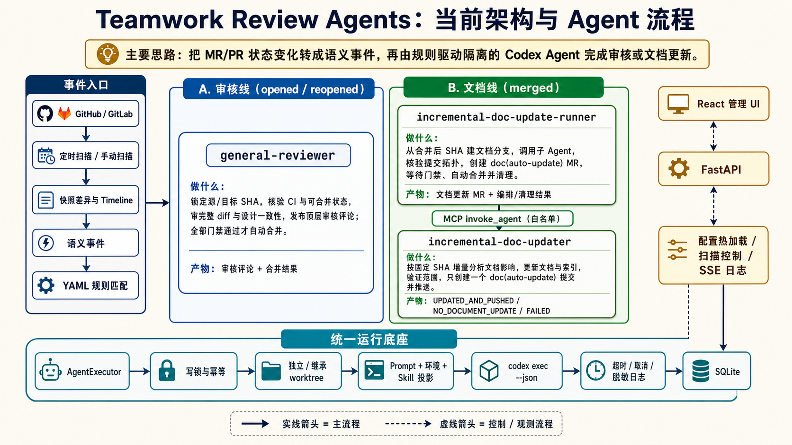

# Teamwork Review Agents

> Vibe coding 负责快速产出代码；本项目负责让代码可靠进入主分支。

PR / MR 越来越快、越来越多，但审核、CI、合并门禁和文档同步仍靠人工。结果是审核缺少上下文、旧结论误用于新提交、合并后文档过期。

Teamwork Review Agents 持续扫描 GitHub PR / GitLab MR，把状态变化转换为事件，再按规则启动隔离的 Codex Agent，完成审核、合并和文档更新。

## 方案

- 固定源、目标 SHA，结合完整 diff、设计、历史变更和 CI 审核。
- 每次 Agent 使用独立 Git worktree，避免并发任务互相污染。
- 合并后按净差异和文档索引，只更新受影响文档。
- 快照、事件、规则、运行和日志统一写入 SQLite，并在管理界面展示。
- GitHub PR 可在 Review Agent 前执行仓库自定义的确定性 Preflight CI。

主链路：`扫描 PR/MR → 语义事件 → 规则匹配 → Codex Agent → 审计与日志`



| Agent | 职责 | 触发时机 |
| --- | --- | --- |
| `general-reviewer` | 审核代码和门禁；全部通过才评论并合并 | PR / MR `opened`、`reopened` |
| `incremental-doc-update-runner` | 编排文档分支、sub-agent、文档 MR 和清理 | GitLab MR `merged` |
| `incremental-doc-updater` | 增量更新受影响文档 | Runner 通过 MCP 委托 |

内置规则默认关闭。先验证扫描，再按需启用。

## 快速开始

运行端需要 Linux / macOS、Python 3.11+、Git、已登录的 Codex CLI，以及 GitHub / GitLab Token。

> [!IMPORTANT]
> 使用 GitHub 仓库前，必须为启动 Teamwork 服务的同一系统用户安装并登录 `gh`；使用 GitLab 仓库前，必须以相同方式配置 `glab`。否则 Agent 无法通过平台 CLI 读取或执行评论、审批、标签、合并等操作。具体命令见[配置 `gh` / `glab`](docs/platform-cli-auth.md)。

```bash
python -m pip install -e .
cp config_example.yaml config.yaml
teamwork-review-agents validate
teamwork-review-agents start
```

打开 [http://127.0.0.1:8080](http://127.0.0.1:8080)，点击“编辑配置”：

1. 添加 GitHub / GitLab 连接，填写 API 地址和 Token 变量名。
2. 添加目标仓库，填写远端地址和本地基础仓库目录并启用；目录不存在时会自动克隆。
3. 在全局环境中引用宿主机的 `GITHUB_TOKEN` 或 `GITLAB_TOKEN`。
4. 检查 Codex、Agent 权限和 Prompt，保存后执行“立即扫描”。
5. 确认仓库、事件和日志正常，再启用触发规则。

Provider Token 只供扫描器使用，不会传给 Codex，也不能代替 Agent 所需的本机 `gh` / `glab` 登录态。平台操作使用独立的最小权限 CLI 身份。

## 目标仓库准备

扫描本身不要求目标仓库新增文件。为提高审核质量并避免文档 Agent 首次全量扫描，建议提交：

```text
your-project/
├── AGENTS.md
└── docs/
    ├── README.md
    ├── design/
    │   └── README.md
    └── changes/
        └── README.md
```

其中 `docs/design/` 和 `docs/changes/` 可选；没有对应文档时不要创建空目录。

### `AGENTS.md`

记录 Agent 必须遵守的项目命令和边界：

```markdown
# Project rules

- 安装：`<实际命令>`
- 测试：`<实际命令>`
- 静态检查：`<实际命令>`
- 主要代码：`<路径>`
- 禁止修改：`<生成目录或受保护路径>`
- 公开接口、配置或行为变化时，同步更新 `docs/`。
```

提交前替换全部占位符。

### `docs/README.md`

这是文档 Agent 默认使用的索引：

```markdown
# 文档索引

| 文档 | 用途 | 关联模块 | 更新条件 |
| --- | --- | --- | --- |
| `README.md` | 项目入口 | CLI、启动配置 | 命令或首次使用流程变化 |
| `docs/api.md` | API 说明 | `src/api/` | 路由、鉴权或请求响应变化 |
```

若该文件不存在，第一次文档任务会扫描全部非排除文档并自动创建索引，耗时和 Token 消耗更高。

### 设计与变更历史

- `docs/design/`：保存仍有效的架构、ADR 和 Spec。
- `docs/changes/`：保存重要变更、迁移、回滚和兼容性决策。

配置固定目录后，路径必须已存在且可读；否则留空，让审核 Agent 自动发现。

在目标仓库环境中配置：

| 变量 | 示例值 |
| --- | --- |
| `REVIEW_DESIGN_DOC_DIR` | `docs/design` |
| `REVIEW_CHANGE_HISTORY_DIR` | `docs/changes` |
| `DOC_UPDATE_INDEX_PATH` | `docs/README.md` |
| `DOC_UPDATE_EXCLUDE_DIRECTORIES` | `vendor,generated` |

这些变量需要开启“传给进程”。`REVIEW_SKILLS` 不是仓库路径；Skill 应导入本服务后再分配给 Agent。

## 首次启用

1. 保持规则关闭，执行一次“立即扫描”。
2. 启用 `general-review`，用新的 PR / MR 验证审核链。
3. 准备好 `docs/README.md` 后，再启用“增量文档更新”。

当前内置文档 Runner 面向 GitLab MR；通用审核同时支持 GitHub PR 和 GitLab MR。

## 运行概览与手动事件

“已扫描 MR / PR”和“最近变化事件”可以分别按启用仓库、状态和展示数量筛选。MR / PR 按远端更新时间倒序，事件按实际发生时间倒序；每张列表默认显示 10 条，也可选择 20、50、全部或输入自定义正整数。

GitHub 历史 PR 的列表行会展示 Timeline 中最新一条可转换为规则事件的“最新事件”。首次回看窗口内的活动仍会全部自动记录和调度；窗口内没有活动的历史 PR 只缓存最新事件作为参考，不自动重放旧事件。点击行内“手动触发”会基于该参考创建一条具有独立 ID 的手动事件；也可以点击列表上方“选择”，勾选多个 PR 后批量触发，每个 PR 分别使用自己的最新事件并按当前规则调度。此操作不会重新请求 GitHub，也不会直接修改远端 PR。GitLab 当前没有统一活动流实现，因此不会按 MR 当前状态猜测最新事件。

`change_request.commits_changed` 表示 PR / MR 源分支 Head 变化；`change_request.target_commits_changed` 表示打开状态 PR / MR 的目标分支真实 Head 变化。目标分支按仓库和分支每轮只查询一次，首次读取只建立基线。目标分支变化事件仅作为可靠触发信号短期入队，成功处理或未匹配规则后立即删除，不进入长期事件历史，但由它创建的 Agent 运行与日志仍会保留。

## Agent 运行状态与 Git 超时

Agent 先显示“排队中”，表示等待并发额度或资源锁；开始克隆、fetch 和创建隔离 worktree 后显示“准备工作区”，Codex CLI 真正启动后才显示“执行中”。工作区准备日志会定期记录当前 Git 操作和已耗时秒数，但不会记录完整远端 URL。

`runtime.repository_initialization_timeout_seconds` 控制基础仓库首次克隆的最长等待时间，默认 `1800` 秒；基础仓库就绪后，`runtime.git_timeout_seconds` 控制 fetch、引用获取和 worktree 等单次 Git 操作，默认 `600` 秒。等待仓库锁不计入这两个超时。排队、准备工作区和执行中的运行均可取消；准备阶段取消或 Git 超时时会终止整个 Git 进程组，避免遗留 ssh、index-pack 等子进程。

这两个超时可以在管理界面左侧“运行时配置”中修改，分别显示为“基础仓库初始化超时（秒）”和“Git 操作超时（秒）”。

仓库页的“基础仓库状态”可以提前初始化尚不存在的基础 Git 仓库，也可以对已就绪仓库执行增量更新。初始化完成后，Agent 不会再次完整下载仓库，而是复用基础仓库执行 fetch，再为每次运行创建独立 worktree；这样既减少网络传输，也不会让 Agent 修改基础仓库工作文件。初始化与 Agent 准备过程使用同一仓库锁，支持查看阶段、耗时、磁盘占用、失败原因以及取消操作。点击仓库状态或仓库行可以查看每条脱敏 Git 命令的实时状态；若操作来自 Agent，可继续进入对应运行记录。

## GitHub 本地 CI 门禁

通用引擎负责轮询 PR、隔离检出、顺序执行、结果持久化、Commit Status 回写和 Agent 编排；接入仓库负责 CI 脚本、具体审核规则和 GitHub Ruleset。仓库启用 CI 只是声明具备该能力，只有同时设置 `run_preflight: true` 的触发规则才会等待 Preflight 成功后启动 Review Agent。GitHub Ruleset 只负责阻止不合格合并，不负责触发 CI；真正的触发器是持续运行的 `teamwork-review-agents` 服务。


配置分为以下三部分：

| 位置 | 必需内容 | 作用 |
| --- | --- | --- |
| 接入仓库 | CI 脚本，例如 `ci/preflight.sh` | 安装依赖、编译、测试和构建；脚本随 PR Head 一起检出并执行 |
| Teamwork 配置 | `repositories[].preflight`、Review Agent 和触发规则 | 指定扫描仓库、CI 命令、超时、状态名称以及成功后启动的 Agent |
| GitHub 仓库设置 | Ruleset 中的 Required Status Check | 将与 `status_context` 同名的检查设为合并门禁 |

下面是完整的最小配置。Prompt 可以继续放在本仓库，通过 `TEAMWORK_REVIEW_AGENTS_ROOT` 引用，不需要复制到接入仓库；启动服务前必须把该环境变量设置为本仓库的绝对路径：

```yaml
scanner:
  interval_seconds: 300
  # 即使为 false，启用 Preflight 的仓库也会自动产生首次 discovered 事件。
  emit_initial_events: false

repositories:
  - id: example-github
    provider: github-main
    project: owner/repository
    workspace: ./workspaces/example-github
    preflight:
      enabled: true
      status_context: teamwork/local-ci
      timeout_seconds: 1800
      max_output_bytes: 1000000
      steps:
        - name: repository-ci
          command: [bash, ci/preflight.sh]

agents:
  general-reviewer:
    prompt_file: "${TEAMWORK_REVIEW_AGENTS_ROOT}/prompts/general-review.md"
    sandbox: read-only
    timeout_seconds: 1800
    write_scopes: []
    allowed_sub_agents: []

rules:
  - name: example-general-review
    events:
      - change_request.discovered
      - change_request.commits_changed
      - change_request.reopened
      - change_request.draft_changed
    agents: [general-reviewer]
    repositories: [example-github]
    conditions:
      state: opened
      draft: false
    # 仓库未启用或未配置 CI 时不报错，直接运行 Agent。
    run_preflight: true
    enabled: true
```

接入仓库中的 `ci/preflight.sh` 应当是可独立运行、首个错误即退出的确定性脚本，例如：

```bash
#!/usr/bin/env bash
set -euo pipefail

uv sync --frozen --all-extras
uv run python -m compileall -q your_package
uv run pytest tests/ -q --tb=short
uv build
```

完成配置后，在 GitHub Ruleset 中添加 Required Status Check `teamwork/local-ci`，其名称必须与 `status_context` 完全一致。然后校验配置并启动服务：

```bash
# 指向包含 prompts/general-review.md 的 Teamwork Review Agents 仓库。
export TEAMWORK_REVIEW_AGENTS_ROOT=/path/to/teamwork_review_agents

teamwork-review-agents validate -c /path/to/review.config.yaml
teamwork-review-agents start -c /path/to/review.config.yaml

# 调试时可以立即执行一轮，不等待扫描间隔。
teamwork-review-agents scan-once -c /path/to/review.config.yaml
```

Preflight 在临时 detached worktree 中校验准确的 PR Head SHA，不修改基础仓库或 Agent worktree。启用的仓库会在首次发现 PR 时自动产生 `change_request.discovered` 事件，不受全局开关影响。同一仓库、PR、Head SHA 和配置版本只运行一次。规则要求 CI、仓库启用 CI 且 PR 当前打开时，代码失败或超时只阻断该类规则；未选择 CI 的规则不等待门禁。仓库没有配置 CI，或 PR 已关闭、合并时，规则会跳过 CI 并直接启动 Agent。Git、进程启动或首次状态发布等基础设施错误沿用要求 CI 的事件重试；本地命令已有终态后，GitHub 回写失败只补发状态，不会重新执行命令。

每个 CI 步骤本质上是一条“执行程序 + 参数数组”，不是隐式拼接的一整段 Bash。简单检查可直接配置为 `python -m pytest`、`npm test` 等参数数组；复杂流程建议由目标仓库维护 `ci/preflight.sh`，再配置 `bash ci/preflight.sh`。仓库页提供相同的结构化步骤编辑器。

Provider Token 需要读取 PR 和写 Commit Status 的权限。CI 子进程只继承工具所需的基础环境，`HOME` 会替换成一次性空目录；Provider Token、Codex/OpenAI 凭据不会通过环境变量传入。部署方应在 GitHub Ruleset 中把 `status_context` 配为 required status check。具体步骤、工具安装和目标仓库脚本由接入仓库维护。

Preflight 的临时 worktree 和环境过滤不是容器或操作系统级安全边界。本方案的威胁模型是可信内部成员提交的 PR，建议使用专门的 WSL 用户运行服务，不在该账号下保存无关凭据。若未来需要检查 fork 或其他不可信代码，应先把执行器迁移到独立容器或虚拟机，并限制文件系统、进程和网络访问。

## 常用命令

```bash
teamwork-review-agents validate
teamwork-review-agents start
teamwork-review-agents restart
teamwork-review-agents stop
teamwork-review-agents run
teamwork-review-agents scan-once
teamwork-review-agents scan-once --dry-run
teamwork-review-agents runs --limit 20
```

默认读取当前目录的 `config.yaml`。其他配置文件使用 `-c /path/to/config.yaml`。

## 文档导航

| 文档 | 用途 |
| --- | --- |
| [`config_example.yaml`](config_example.yaml) | 完整配置字段和默认值 |
| [`docs/platform-cli-auth.md`](docs/platform-cli-auth.md) | 配置并验证本机 `gh` / `glab` 登录 |
| [`docs/preflight-ci.md`](docs/preflight-ci.md) | GitHub Preflight 的执行、幂等与安全边界 |
| [`docs/operations.md`](docs/operations.md) | 部署、权限、启停和排障 |
| [`docs/architecture.md`](docs/architecture.md) | 架构、Agent 边界和数据流 |
| [`docs/design.md`](docs/design.md) | 精确实现语义 |
| [`CONTRIBUTING.md`](CONTRIBUTING.md) | 本地开发、测试和前端联调 |
| [`docs/implementation-plan.md`](docs/implementation-plan.md) | 历史实施阶段和验收记录 |
| [`deploy/`](deploy/) | systemd / launchd 模板 |

管理界面默认只监听 `127.0.0.1`。对外监听时必须配置 `web.admin_token_env`。
