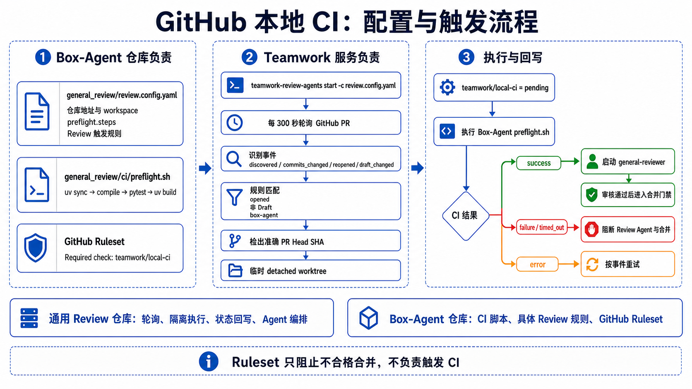
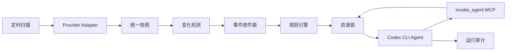

# 系统设计

## 1. 目标

系统负责定时扫描 GitHub Pull Request 与 GitLab Merge Request，根据状态变化触发配置好的 Agent。每个 Agent 由独立的 `codex exec` 进程执行，并可通过受控 MCP 工具将任务委托给其他配置好的 Agent。

第一版采用单服务、SQLite 和本地进程模型，优先保证配置清晰、状态可追溯、触发幂等以及写操作不会互相破坏。接口层保留替换 PostgreSQL、消息队列和远程执行器的空间。

## 2. 组件

1. **Provider Adapter**：将 GitHub/GitLab API 数据规范化为统一变更请求快照。
2. **Scanner**：按照固定间隔拉取变更请求，并与 SQLite 中的上一版快照比较。
3. **Event Detector**：输出提交、状态、Draft、标签、审批、流水线、可合并状态等语义事件。
4. **Event Inbox**：持久化待处理事件，使用稳定事件 ID 避免重复入队。
5. **Rule Engine**：按事件类型、仓库和条件选择 Agent。
6. **Agent Executor**：申请资源锁、组装提示词、启动 Codex CLI、解析 JSONL 输出并记录运行结果。
7. **Sub-agent MCP Gateway**：向 Codex 暴露 `invoke_agent`，执行白名单、深度和次数校验后启动另一个 Codex CLI。
8. **State Store**：保存快照、事件、Agent 运行记录和跨进程资源锁。

## 3. 数据流

下图是面向部署和评审人员的流程概览；后面的 Mermaid 图保留为可维护、可检索的结构化版本。

## 4. 统一快照

快照包含：平台、仓库、编号、标题、状态、Draft、源分支、目标分支、Head SHA、标签、审批数、流水线状态、可合并状态、更新时间和网页地址。

统一状态采用：

- `opened`
- `closed`
- `merged`

平台原始字段保存在 `raw` 中，便于提示词使用和后续兼容。

## 5. 事件模型

支持以下事件：

- `change_request.discovered`
- `change_request.opened`
- `change_request.reopened`
- `change_request.closed`
- `change_request.merged`
- `change_request.commits_changed`
- `change_request.target_commits_changed`
- `change_request.draft_changed`
- `change_request.labels_changed`
- `change_request.approvals_changed`
- `change_request.pipeline_changed`
- `change_request.merge_status_changed`
- `change_request.updated`

普通事件 ID 由仓库、变更请求编号、事件类型、旧值和新值生成。同一变化重复扫描不会产生第二个事件。目标分支变化事件还包含扫描批次，以便目标分支往返到旧提交时仍能再次触发，同时保持单轮幂等。

## 6. 规则条件

规则可匹配事件、仓库以及新旧快照字段。没有 `old.` 或 `new.` 前缀的字段默认读取新快照。

支持操作符：

- 等于：`state: opened`
- 不等于：`state__ne: closed`
- 包含：`labels__contains: security`
- 属于集合：`pipeline_status__in: [success, skipped]`
- 数值比较：`approvals__gte: 2`
- 字段发生变化：`head_sha__changed: true`

## 7. 写操作串行化

Agent 可声明以下写作用域：

- `change_request`：评论、审批、标签、合并等平台变更。
- `workspace`：修改本地代码、提交或推送。

资源锁按实际对象生成，因此不同 MR/PR 或不同工作目录仍可并发。锁以 SQLite 租约实现，支持同一调用链重入，并由后台心跳续期。

`write_scopes` 是编排器的并发与审计声明，不是操作系统级权限隔离。第一版仍需为 `gh`/`glab` 配置最小权限身份，并通过 Agent 提示词约束允许动作。需要强权限隔离的部署应使用独立容器或后续的平台专用 MCP 工具。

执行合并或推送前，Agent 仍应重新读取远端 Head SHA、CI、审批和冲突状态。资源锁防止本系统内部互相冲突，但不能阻止外部用户同时修改远端状态。

## 8. Sub-agent 安全边界

父 Agent 只能调用其 `allowed_sub_agents` 中列出的 Agent。系统同时限制：

- 最大递归深度。
- 单个根任务的最大 Agent 运行次数。
- 单次运行超时。
- 与父任务一致的仓库和变更请求上下文。
- 写 Agent 必须申请对应资源锁。

sub-agent 不是模型内部的逻辑角色，而是由编排器启动的另一个真实 `codex exec` 进程，因此具有独立日志、运行 ID 和超时。

父 Agent 调用 `invoke_agent(agent_name, task, extra_context)` 时负责指定目标 sub-agent 和具体委托任务。sub-agent 自动继承仓库标识与远端项目，但不自动继承根 Agent 的 MR / PR 数据或动作列表。父 Agent 判断任务确有需要时，可在 `task` 或 `extra_context` 中明确传递所需信息。sub-agent 是否与父 Agent 共用本地工作目录由触发规则的 `inherit_workspace` 决定。

## 9. 凭据与权限

Provider Token 优先从全局环境配置中的同名变量解析，没有配置时回退到宿主机环境。它只用于扫描器调用 API，并被强制标记为 Secret；启动 Codex CLI 前会从 Prompt 和子进程环境中移除，不把高权限 Provider Token 直接交给模型。

需要平台写操作时，推荐使用权限受控的 `gh`/`glab` 登录身份。生产版本可进一步增加窄权限的平台 MCP 工具，将评论、审批和合并变成可审计的确定性接口。

Codex 沙箱按 Agent 配置，默认 `read-only`。只有明确需要修改工作目录的 Agent 才使用 `workspace-write`，不默认开放 `danger-full-access`。

基础 Git 仓库不存在时，执行器根据仓库 SSH/HTTPS 地址原子克隆；已存在时只校验并 fetch。当前 MR/PR head 写入 `refs/teamwork/change-requests/<编号>/head`，每次运行再从该引用创建独立临时 Git 工作区，不会 checkout 或覆盖基础仓库。

## 10. 已知边界

- 第一版使用轮询，不包含 Webhook。
- 扫描器按更新时间自动分页，并在上次成功扫描时间水位处提前停止；`max_items_per_repository` 作为单仓库单轮安全上限，`api_page_size` 只控制内部 API 分页大小。
- GitHub 审批数按每位用户最新有效 Review 粗略计算；复杂分支保护规则仍由合并前的远端检查兜底。
- 单机 SQLite 适合初期部署，多实例生产部署应迁移到 PostgreSQL。
- 根 Agent 与未继承父目录的 sub-agent 都使用按运行 ID 创建的独立 Git 工作区；可写 Agent 使用独立 clone，只读 Agent 使用 detached worktree。规则开启工作区继承时，sub-agent 调用链复用根 Agent 本次运行目录和实时 Git 状态。
- 第一版尚未提供窄权限的平台写入 MCP，评论、审批和合并依赖部署方预先认证的 `gh`/`glab`。

## 11. 后台管理服务

应用升级为 FastAPI 后台服务，HTTP API、配置管理、定时扫描和 Agent 队列在同一服务进程中运行。CLI 提供 `run` 前台运行，以及 `start`、`stop`、`end`、`restart` 本地后台进程管理；同一配置文件通过 PID 文件和进程锁保证只有一个服务实例。

`start` 使用脱离终端的子进程运行服务，并将标准输出与错误写入配置目录旁的 `data/teamwork-review-agents.log`。`stop` 先写入绑定 PID 与启动时间的停止请求，让服务进入应用生命周期收尾；POSIX 同时发送 `SIGTERM` 唤醒服务，Windows 则由服务内轮询接收请求。只有等待超时后才统一强制结束完整进程树。PID 记录同时保存进程启动时间，防止 PID 被系统复用时误结束其他进程。

生产环境需要故障自动恢复和开机启动时，仍由 systemd、launchd、Windows 服务管理器、任务计划程序或容器平台运行 `run` 并负责保活。

后台支持立即扫描、暂停、恢复、配置热加载、服务心跳和运行状态汇总。默认只监听 `127.0.0.1`；监听非本机地址时必须配置管理员 Token。

## 12. 分层环境变量与模板

环境变量依次合并：全局、仓库、Agent、系统运行变量。后者覆盖前者，系统运行变量不可被用户覆盖。

每个变量支持字面值或显式引用宿主机环境变量，并可分别控制是否传给 Codex 进程、是否允许渲染进 Prompt。模板语法为 `${{ENV_NAME}}`，变量不存在或禁止向 Prompt 暴露时渲染为空字符串。

系统注入 `REPOSITORY_ID`、`REPOSITORY_PROJECT`、`REPOSITORY_WORKSPACE`、`MR_NUMBER`、`MR_TITLE`、`MR_STATE`、`MR_HEAD_SHA`、`MR_SOURCE_BRANCH`、`MR_TARGET_BRANCH`、`MR_URL`、`EVENT_TYPE` 和 `RUN_ID`。

Secret 默认不渲染进 Prompt。运行日志、环境变量快照、渲染 Prompt、最终消息及 Codex JSONL 事件在落库前统一脱敏。

## 13. 配置来源与热加载

YAML 是非敏感配置的唯一来源。UI 读取 YAML 的结构化内容，保存时执行以下流程：

1. 合并 UI 中未修改的 Secret 占位值。
2. 完整执行 Pydantic 校验与跨引用校验。
3. 写入同目录临时文件。
4. 使用原子替换更新正式配置。
5. 在 SQLite 中记录配置版本与内容快照。
6. 唤醒后台服务，让下一轮扫描和新 Agent 使用新版本。

手动修改 YAML 后也会被检测。配置无效时继续使用上一版有效配置，并在 UI 展示错误。

## 14. 实时运行日志

Codex CLI 的标准输出与标准错误按行异步读取。JSONL 事件在产生时写入 `run_logs`，包括线程启动、命令执行、文件变化、MCP 调用、Agent 消息、用量和错误。

UI 使用 SSE 按游标订阅日志。断线重连时从最后一条日志继续，不要求 Codex 进程重新发送历史内容。

## 15. 管理 UI

React 管理 UI 包含：

- 仪表盘：后台状态、扫描状态、队列、运行统计和最近错误。
- 仓库：Provider、项目、本地目录、启停和仓库环境变量。
- 全局环境变量：值、宿主机引用、Secret 和暴露策略。
- Agent：Prompt、模型、沙箱、超时、写作用域、环境变量和 sub-agent 白名单。
- 规则：MR 事件、仓库过滤、条件、目标 Agent 和启停。
- 运行：过滤列表、父子 Agent 关系、最终结果和实时日志。
- 配置历史：版本、来源、时间和内容查看。

规则中的触发事件、目标 Agent 和仓库范围均使用直接点击的复选框多选，不依赖浏览器原生 `Command/Ctrl` 多选操作；界面显示已选数量，底层 YAML 仍保存为字符串数组。

## 16. 已扫描变更请求与首次事件补发

管理首页分别展示“已扫描 MR / PR”与“变化事件”，避免把事件数量误认为远端变更请求数量。已扫描列表直接读取 SQLite 中的最新快照，展示仓库、编号、标题、远端状态、更新时间、最近扫描时间和原始链接。

对于首次建立基线时没有产生 `change_request.discovered` 的快照，管理员可以手动补发首次发现事件。补发操作不会删除或改写快照，也不会重新请求 Provider；它只根据当前快照幂等写入一条 `change_request.discovered` 事件，并唤醒后台周期按当前规则处理。若该 MR / PR 已存在首次发现事件，接口返回已存在状态，不会重复入队或重复运行 Agent。

由于补发事件可能触发具有写权限的 Agent，UI 必须在操作前说明影响并要求确认。没有匹配规则时事件仍会被记录，但不会启动 Agent。

## 17. 重复变化、规则去重与 Agent 输入

事件 ID 同时包含 MR / PR 的远端更新时间，因此同一个变更请求先后多次发生 `closed -> reopened` 等相同字段转换时，每一次被扫描器观察到的转换都会形成不同事件；同一远端快照被重复扫描时仍保持幂等。

规则可启用“单轮扫描同一 MR / PR 只触发一次”。启用后，一次扫描为同一个 MR / PR 产生的多个事件如果同时匹配同一规则，则每个目标 Agent 只运行一次，`action` 按事件产生顺序合并为数组。不同规则彼此独立，不同目标 Agent 也各自运行一次；后续扫描再次发生变化时仍可重新触发。

根 Agent 的动态输入只提供统一 MR / PR 信息，不暴露旧快照、新快照、变化字段或内部匹配字段。其 JSON 结构以 `mr` 为根对象，`mr.action` 始终是短动作名数组，例如 `["reopened", "updated"]`。sub-agent 的动态输入只包含仓库上下文，以及父 Agent 指定的 `delegated_task` 和可选 `delegated_context`；系统内部用于准备工作目录、加锁和审计的事件不会自动暴露给 sub-agent。

仅依靠快照轮询只能识别相邻两次扫描之间最终可见的状态。如果一次扫描间隔内先关闭又重新打开，且扫描器没有看到中间关闭状态，则平台最终快照仍是打开。GitHub 仓库额外读取 PR Timeline，以稳定的 `id` / `node_id` 恢复同一周期内的 `closed`、`reopened`、`merged`、`committed`、Draft 和标签变化；GitLab 等尚未实现活动流的 Provider 继续使用快照差异。需要更低延迟或更强投递保证时，仍应增加带签名校验的 Webhook 事件源，并保留周期扫描用于对账。

## 18. 每次运行独立工作区与 sub-agent 继承

仓库配置中的 `workspace` 是基础 Git 仓库，只负责克隆、校验、fetch 和管理运行工作区，不再直接作为 Codex CLI 的工作目录。每次根 Agent 运行都会在数据库目录旁的 `worktrees/<仓库>/<run-id>/` 创建以当前 MR / PR Head 为起点的独立 Git 工作区，并将该路径写入 Prompt 仓库上下文、`REPOSITORY_WORKSPACE`、运行审计和日志。可写 Agent 使用拥有独立 `.git` 的本地 clone，只读 Agent 使用 detached linked worktree。这样同一仓库的不同 MR、不同分支或同一 Agent 的不同运行可以真正并发，互不共享当前分支、暂存区和未提交文件。

声明 `workspace` 写作用域时，资源锁按仓库与 MR 源分支生成，而不是按临时目录生成。同一源分支的写 Agent 串行执行，防止不同临时 clone 同时 push 覆盖远端；不同源分支可以并发。`change_request` 写作用域仍按 MR / PR 资源键串行。

规则可配置 `inherit_workspace`，默认关闭。开启时，根 Agent 的后代 sub-agent 共用父 Agent 本次运行的临时 clone 或 worktree，因此父 Agent 的分支切换、暂存区和未提交文件对子 Agent 可见；共享工作区委托在单个 MCP 进程内串行执行。关闭时，sub-agent 按自身写权限为运行创建另一个独立 Git 工作区。该选项只继承文件系统与 Git 状态，不自动继承 MR / PR Prompt、动作数组或父 Agent 对话内容。

拥有运行工作区的 Agent 结束后执行安全清理：运行成功且工作区无修改、没有新增提交，或者新增提交已经存在于远端引用时立即删除；linked worktree 使用 `git worktree remove`，独立 clone 删除经归属校验的运行目录。失败、超时、存在未提交文件或新增提交尚未推送时保留工作区，并在运行记录中标记“待清理”。保留超过 `runtime.worktree_retention_days` 后，后台在下次准备同仓库工作区时强制清理；这项期限明确代表对遗留本地修改的最长恢复窗口。默认数据库位于项目 `data/` 时，仓库根目录的 `.gitignore` 必须忽略整个 `/data/worktrees/` 运行目录，包括保留标记，避免临时工作区进入版本控制；忽略规则不替代后台安全清理。

Agent 配置本身不绑定仓库或固定目录。管理 UI 在 Agent 页面说明基础仓库与临时运行工作区的关系，并在运行详情展示本次实际路径、清理状态和保留原因。

## 19. SKILL 管理与按 Agent 装载

配置顶层增加 `skills`，每个条目引用一个符合 Codex Skill 规范的目录；目录中必须存在带 `name` 与 `description` 元数据的 `SKILL.md`，并可同时包含 `scripts/`、`references/`、`assets/` 等资源。Agent 通过 `skills` 字符串数组独立选择本次运行允许装载的技能。sub-agent 使用自己的 Agent 配置，不继承父 Agent 的技能选择；规则的 `inherit_workspace` 仍只控制文件系统与 Git 状态。

管理 UI 增加独立的 SKILL 页面，支持填写服务端已有目录，也支持从浏览器选择整个技能文件夹并复制到配置文件旁的 `./skills/`。导入时校验目录层级、文件数量、总大小和 `SKILL.md` 元数据，并拒绝路径穿越、重复目标及非法文件。导入只负责保存技能目录，管理员仍需将其加入配置后再在 Agent 中选择。

运行 Codex CLI 前，执行器把应用配置中的技能完整投影到本次临时 Git 工作区的 `.agents/skills/` 下，并通过当前 Agent 的 Codex 配置显式启用已选技能、禁用其他由本应用管理的技能。投影保留技能内部相对路径和资源，但不修改技能源目录；Codex 子进程同时使用仅对本次进程生效的 Git 忽略文件，使投影不会出现在 `git status` 或普通 `git add -A` 中；进程结束后立即清理。根 Agent 与继承工作区的 sub-agent 可以看到同一份稳定投影，但各自的启用列表仍由各自 Agent 配置决定。未继承工作区的 sub-agent 在自己的临时 clone 或 worktree 中创建和清理投影。

技能装载表示该技能可被 Codex 根据 `description` 隐式匹配，也可由 Prompt 使用 `$skill-name` 显式要求；选择技能不等于每次运行都强制执行。应用只控制 `skills` 中注册的技能，Codex 自带技能及部署环境原有的其他发现来源不在这份选择列表内。

## 20. GitHub Timeline 增量事件与快照对账

GitHub 扫描采用“候选 PR、活动流、当前快照”三层模型。PR 列表继续按 `updated_at` 倒序筛出本周期发生过活动的候选项；对每个候选 PR，Provider 在读取详情、Review 和提交状态之外读取 Issue Timeline。Timeline 不能替代 PR 列表，因为它按单个 PR 分页，也不能替代 PR 详情，因为审批汇总、流水线、可合并状态和完整分支信息仍来自其他接口。

Timeline 游标按 Provider、仓库和 PR 编号持久化。游标记录最后一个可见 Timeline 项的稳定标识和所在页；后续扫描从上一页开始重叠读取并寻找该标识，只转换它之后的新项目。每轮在按 `updated_at` 筛选候选 PR 之前，先为数据库中已有但缺少游标的快照补齐基线，避免升级后的第一次变化才开始初始化。游标与快照、语义事件在同一 SQLite 事务中提交，进程在事务前退出时可以安全重试；单独的首次基线不产生事件。首次启用 Timeline 或游标无法恢复时不重放不确定的历史动作，同时仍执行一次快照对账。

时间范围不作为幂等依据。`committed` Timeline 项没有统一的活动发生时间，commit 作者时间也可能早于它被推送到 PR 的时间；扫描请求延迟和失败重试还会跨越周期边界。因此系统使用 Timeline `id` / `node_id` 生成稳定事件 ID，时间只用于展示和排序。

Timeline 负责能够明确还原的离散动作：关闭、重新打开、合并、新增提交、强制推送、Draft 切换和标签变化。转换时按 Timeline 顺序构造事件发生时的旧、新快照，以便规则继续匹配 `old.*` 与 `new.*`；事件同时携带本轮最终快照，Agent 的 Prompt、环境变量、工作区和分支锁始终使用扫描结束时的当前真值。每个离散动作仍配套产生一条 `change_request.updated`，规则可通过 `deduplicate_per_scan` 合并同轮多动作。

活动转换完成后，系统从已应用活动的中间快照与最终 PR 快照继续执行差异检测，以补充审批数、流水线状态、可合并状态、标题等 Timeline 未覆盖或不适合直接汇总的字段。Timeline 已消费的状态、提交、Draft 和标签变化不会被快照逻辑重复生成。Provider 不支持活动流、首次建立活动基线或游标重置时，快照差异仍作为完整兜底路径。

## 21. 通用审核标准扩展

通用审核 Prompt 增加改动范围与爆炸半径、仓库卫生、路径可移植性、配置命名与归属四类跨项目检查。这些检查不引入 aGen 的目录白名单、环境变量前缀、Workflow 入口、Agent 工具边界或 Router 契约等项目专属规则。

新检查只扩展审核覆盖面，不改变阻塞问题的证据和影响门槛。改动较广、未拆分、出现普通临时产物、采用某种路径写法或命名不一致，都不会自动导致拒绝合并；仍需证明问题由本次变更引入、触发路径现实可达且具有实质影响，或由项目审核 Skill 明确规定为阻塞项。

## 22. Codex CLI 运行时默认配置

管理 UI 增加独立的“运行时配置”页面，用于配置本服务启动 Codex CLI 时采用的默认模型、推理强度、快速模式、输出详细度、交互风格和联网搜索策略。配置保存于 `runtime.codex`，只影响 Teamwork 发起的 Codex 进程，不修改用户的 `~/.codex/config.toml`。高级配置使用 Codex 原生点号键，并禁止覆盖 Sandbox、审批策略、MCP Server、Skill、模型结构化字段等由应用负责管理的安全或集成配置。

运行时参数遵循“Codex 用户/仓库配置 → Teamwork 运行时默认 → Agent 显式覆盖 → 应用托管安全与 MCP 参数”的合并顺序。Teamwork 通过每次 `codex exec` 的 `--config key=value` 注入运行时默认；Agent 的模型和同类可选字段在其后覆盖。sub-agent 使用目标 Agent 自己的设置，不继承父 Agent 的模型、推理强度、快速模式或其他运行参数；未设置时仍回退到同一份 Teamwork 运行时默认。

服务不再强制使用 `--ignore-user-config`，因此未被 Teamwork 或 Agent 覆盖的 Codex 配置仍按 CLI 原生层级生效。Teamwork 的应用托管 MCP 网关、当前运行 Skill 选择、工作目录和 Sandbox 继续由命令行显式指定，不能被运行时高级配置覆盖。

后端提供只读的 Codex 运行能力接口：优先调用当前配置的 `codex_binary debug models --bundled` 获取本机 CLI 已知模型、各模型支持的推理强度、默认推理强度和快速模式能力；命令不可用时 UI 仍允许手工填写。Agent 模型留空时，UI 按可验证来源显示继承结果：先显示 `runtime.codex.model`，否则尝试读取 `$CODEX_HOME/config.toml` 或 `~/.codex/config.toml` 的顶层 `model`；两者都没有时显示“由 CLI 与账号决定”，不猜测内置默认模型。仓库级 `.codex/config.toml` 可能因实际运行仓库不同而改变结果，UI 会明确提示这一点。

## 23. 内置 Agent、规则模板与 Prompt

项目在 `config_example.yaml` 中直接提供通用审核和增量文档更新所需的 Agent 定义，使用户复制示例配置后可以在管理 UI 中查看、调整并复用这些 Agent。示例中的所有内置规则都保留完整的事件、Agent、去重与工作区继承关系，但统一设置为 `enabled: false`；未由管理员主动启用前，扫描产生的事件不会因为内置模板而启动 Agent。

内置 Prompt 保存在仓库根目录的 `prompts/` 中，并通过 `.gitignore` 的精确例外纳入版本控制。除明确列出的内置文件外，UI 导入或部署环境自行创建的其他 Prompt 仍保持忽略，避免把本地 Prompt 或潜在敏感内容误提交。示例配置只包含 Agent 与禁用规则，不包含 Provider、仓库、真实 Token 或其他部署私有值。

## 24. 事件处理状态与 Agent 运行状态分离

事件收件箱只描述语义事件是否完成规则匹配和调度，不再把同批次中所有已领取事件笼统展示为“处理中”。事件依次经过 `pending`、短暂的内部 `processing`，然后进入 `unmatched`、`triggered`、`completed` 或 `failed`：没有匹配任何规则的事件在规划完成后立即成为 `unmatched`；至少产生一个 Agent 调度的事件成为 `triggered`，全部相关运行结束后再成为 `completed` 或 `failed`。

Agent 运行使用独立状态。运行记录创建后先为 `queued`，表示正在等待并发额度、资源锁或工作区准备；Codex CLI 真正开始执行前切换为 `running`，最终进入 `completed`、`failed` 或 `timed_out`。管理 UI 在事件状态旁单独聚合展示关联 Agent 的排队、执行、成功、失败和超时数量，避免把“事件被扫描器领取”误解为“Agent 正在执行”。

事件与运行之间通过持久化调度关联表连接，关联键使用现有幂等键。一个事件可以关联多个规则和 Agent；开启规则级单轮去重后，一次 Agent 运行也可以关联同批次中的多个事件。调度关联在启动异步任务前写入，因此 UI 可以在 Agent 进程尚未创建时显示排队状态，服务异常退出后也保留可审计关系。

## 25. 设计、历史变更与目标分支一致性审核

通用审核 Prompt 增加 `REVIEW_DESIGN_DOC_DIR` 和 `REVIEW_CHANGE_HISTORY_DIR` 两个单目录环境变量。它们与 `REVIEW_SKILLS` 在第一次工具操作中同时读取。非空值必须解析为当前仓库内可读的单个目录，错误配置阻止合并且不回退自动扫描；空值则在排除依赖、缓存、构建、临时和第三方目录后，扫描仓库中的设计、架构、ADR、spec、change 与历史归档目录。未找到相关目录只记录审核来源缺失，不自动阻塞。

审核者优先从本次 diff 中的设计文档识别当前功能意图，并与代码、测试、配置和对外契约交叉验证；随后扫描已定位目录的全部文件名和可检索内容，完整读取与功能、模块、接口、配置、数据模型、路由和状态相关的文档及其必要引用。只有能同时给出本次变更证据、既有设计或历史 change 位置，并证明两者无法同时成立的未解决矛盾，才构成一致性冲突；已明确替代旧设计并具有文档、兼容、迁移、回滚和测试证据的正常演进不属于未解决冲突。

代码一致性审核同时锁定源分支 `REVIEW_HEAD_SHA` 和目标分支 `REVIEW_TARGET_SHA`。以 `O` 表示两者的 merge base，`T` 表示已包含先前变更的目标分支基准，`H` 表示当前源分支，`M` 表示通过平台合并结果或只读三方合并分析得到的拟合并结果。审核必须比较 `O → T`、`O → H` 和真正会进入目标分支的 `T → M`，并在文件、代码块、符号、控制流、契约、schema、配置、路由、注册项和测试等重叠面上确认 `M` 没有意外覆盖、回退或破坏 `T` 中仍生效的功能。

任一基准 SHA 变化都使当前审核结果失效，必须立即结束，不评论、不自动切换至新版本继续审核、不合并。一旦有充分证据证明 `M` 与现行设计、历史决策或 `T` 中功能存在未解决冲突，必须作为阻塞问题。本规则不扩展到其他尚未合入目标分支的打开 MR / PR。

## 26. 首次扫描周期内的事件回看

首次扫描仓库时不能把全部历史 MR / PR 当成刚刚创建，也不能因为尚无本地快照而丢弃本扫描周期内真实发生的动作。扫描器为每个仓库维护最近一次成功轮次的开始与完成时间；已有成功水位时，事件回看窗口从上次成功轮次的开始时间起算，首次运行时则从本轮开始时间向前回看一个 `scanner.interval_seconds`。使用开始时间允许当前轮次与上一轮执行耗时重叠，避免恰好在列表读取之后创建的 PR 落入时间缝隙，稳定事件 ID 会消除重叠读取。候选列表仍使用带重叠量的更新时间水位，事件是否属于首次回看窗口则使用精确窗口，不把 API 重叠读取误当成新事件。

统一快照增加平台创建时间。首次见到的 MR / PR 只有在创建时间落入回看窗口时才产生 `change_request.opened` 及配套的 `change_request.updated`；更早的历史项目只建立当前快照。`scanner.emit_initial_events` 只控制是否额外产生不代表平台动作的 `change_request.discovered`，不再决定窗口内真实创建与活动是否输出。

GitHub 在首次建立单个 PR 的 Timeline 游标时，从最新页向前读取到回看窗口边界，只转换平台能够提供发生时间且位于窗口内的关闭、重新打开、合并、提交、强制推送、Draft 和标签动作，然后把游标推进到当前最新项。后续扫描继续使用稳定 Timeline 项 ID 增量读取，因此首次窗口事件不会重复。若首次快照包含多个窗口内活动，事件检测会从当前快照反向还原窗口开始时的必要状态，再按 Timeline 顺序生成每个具体事件及配套 `updated`；规则去重仍只影响 Agent 调度，不影响事件完整记录。

不支持活动流的 Provider 仍可依据创建时间产生窗口内的 `opened`，其余首次周期动作只能等待该 Provider 增加可定位时间和稳定 ID 的活动接口。活动没有可靠发生时间时不重放，避免把历史事件错误归入当前周期。

## 27. 后台 Codex 运行隔离、无进展超时与人工取消

Teamwork 启动的后台 Codex CLI 默认不继承用户 `config.toml` 中配置的 MCP Server。服务在启动命令中逐项关闭已发现的用户 MCP，只保留应用托管的 `teamwork_agent_gateway`；管理员可以通过 `runtime.allowed_user_mcp_servers` 显式放行确有需要的服务，也可以用 `runtime.inherit_user_mcp_servers` 恢复完整继承。GitHub / GitLab 管理 Agent 应优先使用本次 MR / PR 输入、平台 API、`gh` / `glab` 和本地工作区，不因用户桌面环境存在浏览器、Computer Use 或 REPL MCP 就自动获得这些能力。

运行时可以通过 `runtime.codex_home` 为后台服务指定独立 `CODEX_HOME`。独立目录隔离 `config.toml`、模型目录缓存和其他 Codex 状态，但凭据也属于该目录，部署者需要在该目录下单独完成 Codex 登录。留空时继续使用服务进程继承的 `CODEX_HOME` 或 `~/.codex`。`runtime.codex_binary` 仍决定实际二进制，`runtime.expected_codex_version` 可锁定期望版本；启动单次 Agent 前若实际版本不匹配，则直接失败而不执行任务。管理 UI 展示二进制解析路径、实际版本、当前 Codex Home、模型缓存记录的客户端版本和冲突警告，避免多个 Codex 版本共用缓存时只能从重复 stderr 猜测原因。

总运行超时与无进展超时分离。`Agent.timeout_seconds` 继续限制完整执行时间；`runtime.agent_idle_timeout_seconds` 是默认无进展窗口，Agent 可通过 `idle_timeout_seconds` 单独覆盖。只有 Codex stdout/JSONL 新事件表示语义进展，重复 stderr 诊断不会续期；连续超过窗口后服务终止整个 Codex 进程组并记录明确的 `run.idle_timed_out`。这样卡在某个 MCP/tool item 的运行无需等待完整二十分钟，同时正常持续输出的长任务仍可继续。

运行记录增加持久化取消请求。管理 API 取消某个运行时，会同时标记它的全部后代：仍在排队的运行直接进入 `cancelled`，已经执行的根 Agent 或跨 MCP 进程 sub-agent 通过 SQLite 短轮询感知请求，并按平台结束 Codex 进程组或进程树。Runner 返回 `cancelled`，工作区继续走既有安全清理策略；脏工作区或未推送提交仍会保留。UI 只对 `queued`、`running` 展示“取消运行”，并把已取消数量独立纳入事件关联 Agent 的终态统计。

## 28. 后台服务进程发现与就绪确认

`start`、`stop` 和 `restart` 的成功语义必须对应真实进程状态，不能只依据 PID 文件已经写入或文件锁短暂持有。后台子进程启动后，父进程持续请求管理服务的 `/api/health`；健康响应携带实际服务 PID，只有响应 PID 与本次新建子进程一致时才视为启动成功。端口上若仍是旧实例，旧实例的健康响应不能让新进程产生假成功；新进程绑定失败、提前退出或超过就绪期限时，命令返回非零退出码并附带后台日志末尾。

正常情况下，进程管理器继续用配置专属 PID 文件、进程启动时间和文件锁确认服务身份。若 PID 或锁文件在服务运行期间丢失、被移动或损坏，管理器使用系统进程表作为恢复路径，只匹配同时满足 `python -m teamwork_review_agents run`、`--managed-child` 和同一配置绝对路径的托管子进程。不能仅凭监听端口终止进程，避免误杀其他应用；同一配置出现多个托管子进程时按异常多实例明确报告并由 `stop` 一并收尾。

`stop` 必须向全部已确认属于当前配置的服务进程发出平台对应的停止请求，等待其真实退出，超时后才强制结束仍存活的托管进程组或进程树。只有目标 PID 全部退出后才能返回成功。`restart` 严格串联“发现旧实例 → 确认旧实例退出 → 启动新实例 → 确认健康响应属于新 PID”；停止或启动任一阶段失败时立即返回失败，不得输出重启成功。

## 29. 运行列表、详情抽屉与消息化日志

“运行与日志”页面使用全宽运行列表承载扫描结果，不再把有限的页面宽度固定切分为列表和详情两栏。每条运行记录直接展示状态、Agent、仓库、MR / PR 编号、规则、开始时间、耗时和工作区保留状态；点击记录后从页面右侧滑出详情抽屉，桌面端保留列表上下文，窄屏设备使用全屏抽屉。抽屉支持关闭按钮、遮罩点击和 `Escape`，选择 sub-agent 时在同一抽屉内切换运行。

详情抽屉将实时日志解析为面向管理员的消息流，而不是直接铺开 JSON。Agent 文本使用安全 Markdown 渲染；命令、MCP 工具、文件变更、工作区准备、会话生命周期、完成状态和错误分别使用独立消息卡片。连续且内容相同的日志合并并显示重复次数，降低重复诊断对可读性的影响。无法识别的事件仍显示通用摘要，完整原始载荷保留在“查看原始数据”折叠区，保证排障信息不丢失。

消息流继续通过现有 SSE 游标实时追加。用户停留在底部附近时自动跟随新消息；用户主动向上查看历史时不抢夺滚动位置，只显示“有新消息”提示，点击后回到底部。抽屉将消息、最终结果、Prompt、环境审计、工作区和 sub-agent 分区展示；环境变量、完整 Prompt 和原始 JSON 默认折叠，继续遵循已有脱敏边界。

## 30. Agent 本地文件权限与命令联网权限分离

Agent 的本地文件能力与命令联网能力采用两个独立配置维度。`sandbox` 继续决定 Codex 对本地文件和命令执行的隔离级别；新增 `network_access` 决定 `workspace-write` 沙箱中的命令能否访问网络，`network_domains` 则在联网开启时提供可选域名白名单。管理 UI 必须把两类权限分区展示，避免把“工作区可写”误解为“命令可以联网”。

`workspace-write` 下默认禁止命令联网。开启联网且白名单为空时，Codex 使用不受域名限制的公开网络出口；白名单非空时，服务同时启用 Codex 网络代理，并把每个域名转换为 `allow` 规则。白名单支持精确主机、`*.example.com` 和 `**.example.com`，不接受协议、端口、路径或全局通配符。`read-only` 不支持通过本配置开放命令联网，UI 禁用开关并解释限制；`danger-full-access` 本身不提供可靠的域名隔离，因此 UI 明确显示网络不受白名单保护，不能把域名列表当作安全边界。

联网参数由 Teamwork 作为应用托管的 Codex CLI 覆盖项注入。Agent 高级配置不得覆盖 `sandbox_workspace_write.network_access` 或 `features.network_proxy`，避免绕过 UI 与配置校验。未开启联网时显式传入关闭状态；开启且白名单为空时显式关闭域名代理；开启且存在白名单时显式启用代理并传入域名映射，使行为不受用户 `config.toml` 中同名设置影响。

Provider Token 与命令联网权限完全分离。GitHub、GitLab 等 Provider 的 `token_env` 在创建 Codex 子进程前始终移除，不能通过开启联网、配置域名或 Agent 环境变量进入 Prompt 和命令环境。Codex 子进程继续继承宿主机 `HOME` 等基础环境，因此 `gh`、`glab` 可以使用各自已经建立的系统钥匙串或 CLI 登录态；Teamwork 不复制、不代理也不展示这些登录凭据。三个内置 Agent 默认都开启命令联网且不设置域名白名单，以便审核和增量文档任务按需使用自身 `gh` / `glab` 登录态；部署配置仍可由管理员收紧。

## 31. 独立 Codex Home 账户登录与额度展示

运行时页面只在 `runtime.codex_home` 已经保存为非空路径时提供后台 Codex 账户管理。留空继续沿用服务进程继承的 `CODEX_HOME` 或 `~/.codex`，不在 Teamwork 中展示登录、重新登录或账户详情，避免应用无意修改用户桌面和终端共用的认证状态。用户在编辑模式中刚填写但尚未保存的新路径也不能启动登录；账户操作始终绑定当前已生效配置中的 Codex 二进制与绝对 Home 路径。

账户管理使用当前 `runtime.codex_binary` 的 Codex App Server JSON-RPC 接口，不读取或解析 `auth.json`，也不把访问令牌、刷新令牌或 API Key 传到浏览器、SQLite 与应用日志。后端以指定 `CODEX_HOME` 启动独立 App Server，完成初始化后通过 `account/read` 获取认证类型、账号邮箱和套餐，通过 `account/rateLimits/read` 获取额度窗口、使用比例和重置时间，并在能力可用时通过 `account/usage/read` 获取用量摘要。API Key 等不提供 ChatGPT 额度的认证类型只展示认证方式，不伪造额度信息。

登录采用 App Server 的 `account/login/start`。本机管理界面优先使用 ChatGPT 浏览器授权地址；登录进程在成功、失败、取消或超时前保持存活，以承接本地 OAuth 回调和 `account/login/completed` 通知。管理 API 为每个 Codex Home 只保留一个内存登录会话，提供启动、查询和取消操作；服务重启后不恢复中间登录会话，而是重新通过 `account/read` 判断最终认证状态。重新登录复用同一授权流程，不先执行退出，避免授权失败时主动删除已有凭据。

运行时页面在只读模式下展示账户卡片，因为登录属于对已保存运行环境的操作而不是配置草稿。卡片区分未配置独立 Home、检查中、未登录、登录中、已登录和诊断失败；已登录时展示官方接口实际返回的邮箱、套餐、认证方式、额度使用比例和重置时间，并明确标记缺失字段。所有账户管理接口继续受管理 Token 保护，授权 URL 只返回给发起请求的管理员且不写日志。

## 32. 运行概览列表筛选、排序与展示数量

运行概览中的“已扫描 MR / PR”和“最近变化事件”分别提供独立的仓库、状态和展示数量筛选。仓库选项只包含当前启用的仓库并默认选择全部；MR / PR 状态使用统一快照的 `opened`、`closed`、`merged`，事件状态使用收件箱实际状态，两个状态筛选均默认选择全部。筛选只影响对应列表，不改变页面顶部全局统计卡的统计口径。

所有过滤在 SQLite 查询阶段完成，不能先截取固定数量再由浏览器过滤。MR / PR 按平台快照中的远端 `updated_at` 倒序，事件按统一事件载荷中的实际 `occurred_at` 倒序；两类查询都增加稳定次级排序，避免时间相同或自动刷新时行顺序跳动。最近扫描时间和事件入库时间仍保留用于内部审计，但不再决定列表顺序。

每张列表默认展示 10 条，可选 10、20、50、全部或自定义正整数。选择“全部”时后端查询真正移除 `LIMIT`，不使用固定上限近似；自定义数量由后端验证为正整数。两张列表的选择互不影响，页面三秒自动刷新时沿用当前筛选，切换筛选后立即按新条件查询。若已选仓库不再启用，前端自动回退到全部仓库。

## 33. 历史 PR 最新事件参考与手动触发

GitHub PR 的“最新事件”来自 Issues 命名空间下的 Timeline Events 接口，不根据当前 `opened`、`closed`、`merged` 快照状态推导。系统只选择能够转换成现有 `change_request.*` 规则事件的最新 Timeline 活动：关闭、重新打开、合并、提交或强制推送、Draft 切换和标签变化；评论、订阅等尚无统一规则语义的原始活动不作为可手动触发事件。GitLab 当前没有统一活动流实现，不能用 MR 状态伪造最新事件。

首次发现 MR / PR 时以事件回看窗口而不是创建时间区分处理方式。窗口内存在活动时，系统继续完整生成、入队并自动调度窗口内全部语义事件，同时缓存其中最新的 Provider 活动。历史 MR / PR 在窗口内没有活动时，只从 Timeline 基线保存最新可识别活动及其平台 ID、原始类型和发生时间，不把该历史参考写入事件收件箱，也不自动触发规则。旧 PR 在当前窗口内发生合并等动作仍属于窗口内事件，必须正常自动调度。

运行概览在每个快照行展示缓存的“最新事件”。管理员点击“手动触发”后，系统以当前快照为上下文、以缓存的 Provider 活动为审计来源，生成一个新的 `origin=manual` 语义事件；每次操作使用独立事件 ID，因此可以明确重跑规则。手动事件进入与扫描事件相同的仓库、条件、去重和 Agent 调度流程，没有匹配规则时正常落为 `unmatched`，但不会修改托管平台，也不会额外生成通用 `change_request.updated`。

最新活动随 Timeline 增量游标一起持久化，页面刷新不直接访问 GitHub。已有游标但缺少最新活动元数据的历史快照在后续扫描时执行一次基线补齐。事件调度使用独立于 Provider 扫描的唤醒路径，因此扫描暂停时仍可处理管理员明确提交的手动事件，同时保持扫描周期串行和全局 Agent 并发限制。

## 34. 概览操作确认弹窗

运行概览中的“补发首次事件”和“手动触发最新事件”不使用浏览器原生 `window.confirm`。两种操作统一使用应用内确认弹窗，以延续管理界面的深色视觉体系，并让管理员在确认前结构化核对仓库、MR / PR 编号、事件类型、平台事件时间和规则影响。

弹窗由遮罩、标题区、目标信息卡、规则影响提示、安全说明和操作区组成。手动触发必须明确显示缓存的语义事件及平台原事件时间；补发首次事件必须明确显示 `change_request.discovered`。当存在事件和仓库范围可能匹配的启用规则时，提示仍需满足规则条件且 Agent 可能执行其获准操作；没有候选规则时说明事件预计记录为未触发。两种操作都要声明不会直接修改远端 PR。

确认弹窗支持关闭按钮、取消按钮、点击遮罩和 `Escape` 取消。请求提交期间禁用全部关闭入口并展示进行中状态，防止重复提交；后端 API、事件幂等、唯一手动事件和调度语义保持不变。窄屏下弹窗宽度随视口收缩，内容区可滚动，操作按钮保持可见。

## 35. Agent 工作区准备状态与 Git 超时

Agent 运行在完成并发额度、业务写锁和仓库管理锁等待后，从 `queued` 切换为 `preparing`。该状态覆盖基础仓库首次克隆、远端 fetch、MR / PR 引用获取、过期运行工作区清理和本次隔离 clone/worktree 创建；只有 Codex CLI 即将启动时才切换为 `running`。运行列表、详情、事件聚合和统计均单独展示“准备工作区”，避免把耗时 Git 网络操作误解为等待并发槽。

运行时新增 `runtime.git_timeout_seconds`，默认 600 秒，并传入基础仓库首次初始化之外的 fetch、引用获取、运行 clone/worktree 创建与清理等 Git 操作。Git 操作开始时写入操作阶段日志，执行期间按固定间隔写入已等待秒数，完成后写入耗时；日志不包含可能带凭据的完整命令或远端 URL。管理员取消准备中的运行时，持久化取消请求必须终止整个 Git 进程组，避免 SSH、index-pack 等子进程继续占用网络和临时目录。

首次克隆继续在目标目录旁的临时目录执行，成功后原子移动为正式基础仓库。首次克隆使用独立的 `runtime.repository_initialization_timeout_seconds`，默认 1800 秒；超时、取消或失败时终止完整进程组并清理当前临时目录，系统不把不完整克隆当成可复用仓库。管理员也可以预先完成基础仓库克隆，或把仓库工作目录指向已有的完整本地克隆。

## 36. 基础仓库初始化与状态管理

仓库配置页面在配置表单之外增加“基础仓库状态”操作区，只针对当前已保存且启用的仓库。每个仓库展示已解析绝对路径、初始化状态、最近操作阶段、已耗时、最近完成时间、磁盘占用和脱敏错误。目录不存在或不是完整 Git 仓库时显示“初始化仓库”；有效仓库显示“立即更新”。配置草稿中的仓库 ID、远端或工作目录与已保存配置不一致时，禁止对该仓库执行操作，避免初始化错误目标。

初始化任务使用当前 Provider 与仓库配置：目录缺失时通过既有原子克隆流程创建基础仓库；目录已经有效时校验并执行 `fetch --prune origin`。任务不创建 Agent 运行工作区、不切换基础仓库分支，也不复制或修改工作文件。初始化与 Agent 工作区准备共用相同的 `git_repository:<绝对路径>` 资源锁，因此并发操作先显示等待仓库锁，取得锁后再进入克隆、校验或更新阶段。

初始化管理器在服务进程内维护每个仓库唯一的任务与取消事件，状态不会写入 SQLite。页面刷新后仍可查询同一服务进程内的任务；服务退出时先请求取消并等待 Git 进程组回收，重启后重新从磁盘检查仓库是否完整。首次克隆使用 `runtime.repository_initialization_timeout_seconds`，已存在仓库的校验和更新使用 `runtime.git_timeout_seconds`。取消会终止 git、ssh、index-pack 等完整进程组。

## 37. Agent 列表、独立详情与原子保存

Agent 管理首页使用紧凑列表替代把全部长表单连续铺在同一页面。列表按名称稳定排序，并展示 Prompt 来源、实际或继承模型、本地文件权限、命令联网状态、Skill 数量和允许调用的 sub-agent 数量；管理员可以按名称搜索。点击某一行进入该 Agent 的完整详情，详情默认只读，通过详情页自己的“编辑 Agent”进入编辑状态，不再复用其他配置页面的全局编辑按钮。

单个 Agent 的编辑草稿只包含当前 Agent、原名称和打开详情时的配置版本。保存、创建、重命名和删除都使用 Agent 级管理 API；服务端在配置锁内重新读取最新文档，只修改目标 Agent，并对完整配置执行既有校验和原子 YAML 替换。请求携带预期配置版本，若其他页面、手工文件编辑或另一位管理员已经保存新版本，则返回冲突而不覆盖新配置。Agent 配置仍保存在统一的 `config.yaml` 中，“独立保存”表示保存边界和冲突边界限定为一次 Agent 操作，并不拆分配置文件。

重命名必须在同一次原子保存中同步更新触发规则的 Agent 引用，以及所有 Agent 的 `allowed_sub_agents` 引用；删除则同步移除这些引用。新建 Agent 先进入未持久化的详情编辑页，取消不产生配置；已有 Agent 取消编辑恢复打开详情时的内容。存在未保存修改时切换 Agent、返回列表或切换左侧页面，使用应用内确认弹窗阻止误丢草稿。保存成功后后台继续通过现有配置变更通知热加载，不要求重启服务。

## 38. 自动初始化、独立超时与 Git 命令详情

规则触发的 Agent 在进入 `preparing` 后检查基础仓库。目录缺失时先执行与仓库页相同的原子初始化；仓库锁保证手动初始化和多个 Agent 不会重复克隆。等待仓库锁继续由 `runtime.lock_timeout_seconds` 控制，不计入 Git 命令超时。首次 `git clone` 使用独立的 `runtime.repository_initialization_timeout_seconds`，默认 1800 秒；基础仓库就绪后的校验、fetch、PR/MR 引用获取、worktree 创建和清理继续分别使用 `runtime.git_timeout_seconds`，默认 600 秒。

公共 Git 执行器为每条实际命令生成脱敏事件，包含命令序号、用途、脱敏命令、来源、状态、开始和结束时间、耗时、适用超时、退出码与安全错误摘要。命令参数中的认证信息必须隐藏，不保存 stdout、stderr、Token 或凭据；克隆命令的远端只显示不含认证信息的安全地址。Agent 来源的事件继续写入运行日志，并携带运行 ID；仓库页初始化来源的事件保存在当前服务进程的初始化记录中。

仓库页的状态标签和仓库行可打开 Git 操作详情抽屉，按发生顺序展示等待锁、初始化、校验、更新和 Agent 工作区准备命令。详情区持续刷新活动命令，已完成任务保留本进程内最近一次记录；若来源是 Agent，则显示对应运行 ID并提供跳转到“运行与日志”的入口。服务重启后历史命令详情可以清空，但仓库是否就绪仍以磁盘检查结果为准。

## 39. gh 与 glab 本地登录说明

README 必须把本机 `gh` / `glab` 登录列为执行平台操作的明确前置条件，并链接独立的简短配置文档。配置文档只说明对应 CLI 的登录、指定平台主机和登录状态验证命令，同时强调登录必须由启动 Teamwork 服务的同一系统用户完成；Provider Token 只供扫描器使用，不能替代 Agent 所用的 CLI 登录态。文档不扩展到部署、Codex Home、SSH 排障或其他运维主题。

## 40. 触发规则列表、独立详情与原子保存

触发规则首页使用紧凑列表替代连续展开全部规则表单。列表按规则名称稳定排序，展示启用状态、触发事件数量、Agent 数量、仓库范围、条件配置和单轮去重、工作区继承摘要，并支持按名称搜索。点击规则进入全宽详情，详情默认只读；启用状态允许直接在列表中通过独立开关修改，详情中的启用开关继续保留，其余字段仍在详情编辑模式中修改。

单条规则通过规则级管理 API 创建、更新、重命名和删除。请求携带打开详情时的配置版本，服务端在配置锁内读取最新 YAML，以规则名称定位原记录，并在原数组位置替换更新后的规则；新规则追加到数组末尾，删除只移除目标规则。保存前继续对完整配置执行 Agent、仓库、规则名称和字段校验，版本变化时返回冲突，不覆盖其他页面或手工编辑产生的新配置。

新建规则先进入未持久化的详情编辑页，取消不写入配置；已有规则取消编辑恢复已保存内容。存在未保存草稿时返回列表、切换规则或离开左侧页面，使用应用内确认弹窗提示。规则仍保存在统一的 `config.yaml`，独立保存只改变单条规则的保存与冲突边界；保存成功后沿用配置热加载通知，不要求重启服务。

## 41. 仓库列表、独立详情与安全保存

仓库管理首页将单个仓库的长表单收敛为紧凑列表。列表按仓库 ID 稳定排序，展示启用状态、平台连接、远端项目、基础仓库目录与当前初始化状态，并支持按仓库、平台和远端项目搜索。平台连接继续保留为页面上方的全局配置区；仓库列表和详情只管理单个仓库，避免把 Provider Token 与仓库运行状态混为一体。

点击仓库行进入全宽详情，默认只读。已有仓库的 ID 是事件、快照、运行记录、资源锁和 worktree 的持久身份，详情中不可修改；新建仓库时允许填写 ID。远端项目、平台连接、基础仓库路径、启用状态和仓库环境变量在详情编辑模式中修改。基础仓库初始化、更新、取消和 Git 操作详情也放在当前仓库详情下，并且只绑定已经保存生效的配置；存在未保存目标变化时不允许启动 Git 操作。

单仓库创建和更新使用仓库级管理 API。请求携带打开详情时的配置版本，服务端在配置锁内读取最新 YAML，只在原数组位置替换目标仓库，新建仓库追加到末尾，然后执行完整配置、Secret 占位、路径、Provider 和规则引用校验并原子写入。版本变化返回冲突，不覆盖其他管理员或手工编辑产生的新配置。仓库删除同样采用版本保护；只要仍有触发规则显式引用该仓库，服务端就拒绝删除并返回引用规则名称，避免空仓库列表被解释成“全部仓库”。历史事件、快照、运行记录和磁盘目录均不随配置删除。

新建仓库先进入未持久化详情；取消不写入配置，也不能初始化工作区。存在未保存草稿时返回列表或离开页面必须确认。保存成功后刷新列表和基础仓库状态并通知后台热加载，不要求重启服务；删除配置不会自动删除基础仓库、worktree 或任何本地文件。

## 42. Codex 参数继承值与来源展示

运行时配置与 Agent 配置不能只显示抽象的“继承”。管理 API 优先通过后台实际 Codex CLI 的 App Server `config/read` 读取完成系统、用户等配置分层后的有效配置，再对白名单内的模型、推理强度、服务速度、输出详细度、交互风格与联网搜索进行裁剪；响应按字段返回值、来源和是否可确定，不返回原始配置、认证信息、Provider、MCP 或其他用户配置。App Server 不支持该接口或诊断失败时，只回退读取 `CODEX_HOME/config.toml` 的同一安全字段，并在页面提示诊断降级。模型目录中公开的默认推理强度可以作为模型默认来源；Codex 文档明确给出的默认值可以标记为 Codex 默认来源。

运行时页面按 `Teamwork 运行时显式值 → Codex 有效配置 → 模型目录或 Codex 已公开默认` 计算展示标签。Agent 页面再在前面叠加 Agent 显式值，形成 `Agent 显式值 → Teamwork 运行时值 → Codex 有效配置 → 已公开默认`。选择框的继承项必须同时展示解析后的中文值，例如“继承 Codex 有效配置（快速模式）”或“继承运行时默认（高）”；页面草稿中的运行时修改应立即反映到 Agent 的继承标签，不等待保存。

无法从当前配置、模型目录或公开默认可靠确定的值统一显示 `UNK`，例如“继承 Codex / 模型默认（UNK）”，不能根据经验猜测。仓库内受信任的 `.codex/config.toml` 仍可能在没有 Teamwork CLI 覆盖时参与 Codex 原生合并；由于运行时和 Agent 配置页没有单一仓库上下文，页面明确说明展示的是后台全局继承值，不能宣称为所有仓库最终生效值。真正执行时的覆盖优先级和现有 CLI 参数保持不变，本功能只增强诊断与展示。

Codex 有效配置可能把快速服务等级返回为面向请求层的 `priority`，也可能保留配置层的 `fast`；两者都表示快速模式。诊断层统一将 `fast` 和 `priority` 归一化为页面值 `fast`，前端也保留别名兜底，不能把内部服务等级直接展示给管理员。`default` 继续归一化为标准模式，其他未知服务等级保留原值以避免错误解释。

## 43. Codex 超长 JSONL、终止收尾与 SQLite 连接生命周期

Codex CLI 的 stdout 继续使用 JSONL 协议，但单个命令完成事件可能携带大体积 `aggregated_output`，不能依赖 asyncio 默认的 64 KiB 单行限制。Runner 为子进程管道设置足以覆盖正常大体积事件的显式缓冲上限；超过上限、解码失败或读取任务异常时，必须把经过脱敏的安全摘要写入系统日志，并将本次运行判定为失败，不能用 `return_exceptions=True` 静默丢弃异常。原始超长内容不得进入错误摘要，避免日志和管理 API 被异常输出放大。

取消、无进展超时、总超时和子进程自然退出都必须具有有界收尾。进程组终止后，stdout 与 stderr 读取任务只允许在固定宽限期内排空剩余数据；超过宽限期就取消读取任务并继续生成最终 `AgentResult`。超时状态日志和最终状态不能依赖管道读取任务无限结束，确保 Codex 或其后代进程已经消失时，运行记录、资源租约和工作区一定进入终态。读取任务异常、收尾超时等诊断应保留为系统事件，但取消和既定超时原因仍优先决定最终状态。

SQLite 状态存储保持“每次方法调用独立连接”的并发模型，但连接上下文必须同时负责事务提交或回滚以及确定关闭。不能直接把 `sqlite3.Connection` 自身当作关闭上下文，因为其 `with` 语义只管理事务、不关闭文件描述符。所有状态方法统一通过 StateStore 的连接上下文获取连接，方法返回或抛出异常后都立即关闭，避免取消轮询、日志刷新和 UI 查询长期积累数据库与 WAL 文件句柄。

## 44. 批量手动触发最新事件

运行概览的 MR / PR 列表支持显式进入批量选择模式。默认只显示“选择”按钮；进入后，标题区显示“取消”和带已选数量的“手动触发”按钮，每一行左侧显示复选框。没有缓存最新事件的行保留复选框位置但不可选择，并说明需要先完成能够取得最新事件的扫描。仓库、状态或展示数量筛选发生变化时退出选择模式并清空选择，避免对已经隐藏的记录执行操作。

批量确认弹窗汇总选中数量、仓库分布和事件类型分布。每个 MR / PR 必须使用自己的缓存最新事件创建独立的 `origin=manual` 语义事件，不允许把第一条记录的事件类型套用到其他记录。批量管理 API 对请求目标去重并逐项校验快照、启用仓库和最新 Provider 活动；单项失败不回滚或阻塞其他目标，响应中返回每项的创建状态、事件类型和失败原因。至少成功创建一条事件时只需唤醒一次调度器。

批量触发完成后刷新快照、事件和运行统计；存在部分失败时明确展示成功与失败数量，全部成功后退出选择模式并清空复选框。批量确认动作本身不修改远端 MR / PR，后续 Agent 行为继续由匹配规则和 Agent 权限决定。

## 45. 运行取消应用内确认弹窗

“运行与日志”详情中的取消操作不得使用浏览器原生 `window.confirm`。点击“取消运行”后，在运行详情抽屉上方打开与 Agent、规则和仓库危险操作一致的应用内确认弹窗，展示 Agent 名称、仓库与 MR / PR、运行 ID 和当前状态，使管理员在提交前能够准确识别目标。

弹窗明确说明取消请求会递归传递给本次运行的全部 sub-agent，并可能终止当前 Codex 或 Git 进程组。确认按钮使用危险操作样式和“确认取消运行”文案；请求进行中显示处理状态并禁用确认、取消、关闭、遮罩点击和 `Escape`，防止重复请求。取消或关闭弹窗不调用后端，也不关闭底层运行详情抽屉；后端取消 API、终态刷新和错误展示保持不变。

## 46. 触发规则列表内联启停

触发规则列表的状态列使用可操作开关替代纯文本状态。管理员可以在不进入详情的情况下直接启用或停用一条规则；点击状态开关只提交启停操作，不打开规则详情。列表其他区域仍可点击进入详情，末尾保留可聚焦的详情按钮，确保键盘操作和交互语义明确。详情页原有启用开关继续保留，两处始终展示同一份已保存配置。

列表启停复用单条规则更新 API，提交完整目标规则并携带当前配置版本。服务端继续在配置锁内读取最新 YAML、校验版本与完整配置、原子替换目标规则并通知后台热加载，因此启停不需要重启服务，也不会覆盖其他并发配置修改。请求期间禁用列表中的启停开关并在目标行显示“保存中”；成功后刷新配置版本和列表状态，失败或版本冲突时保持原状态并显示错误，不进行无法回滚的乐观更新。

## 47. 审核目标分支权威 SHA

根 Agent 的审核基准不能把 GitHub PR 的 `base.sha`、GraphQL `baseRefOid` 或 GitLab 中用于描述 MR 差异基准的字段当作目标分支当前最新提交。这些字段属于变更请求关联的基准信息，可能与目标分支实时 ref 不一致。目标分支当前 SHA 必须来自真实分支引用；GitHub、GitLab 和其他 Git Provider 统一以本次工作区准备完成后的 `refs/remotes/origin/<目标分支>` 为启动时权威值。

执行器在创建隔离工作区前更新基础仓库；可写 clone 创建时从基础仓库复制刚更新的远端跟踪引用。服务端最终从本次运行工作区的目标远端跟踪 ref 解析提交，并把结果作为 `mr.target_head_sha` 与已有的 `mr.target_ref` 一起传给根 Agent。解析失败时不得启动 Codex，也不能回退到 PR/MR 元数据中的 base SHA。该值在工作区准备结束、Codex 启动之前生成，避免扫描快照排队期间的目标分支变化被错误固化为本轮审核基准。

通用审核 Prompt 明确令 `REVIEW_HEAD_SHA = mr.head_sha`、`REVIEW_TARGET_SHA = mr.target_head_sha`。后续关键状态刷新仍须查询目标分支真实 ref，并与同一个 `REVIEW_TARGET_SHA` 比较；可以使用平台 Git refs API、`git ls-remote` 或语义等价的实时分支查询，但禁止使用 `base.sha`、`baseRefOid` 判断目标分支是否变化。PR/MR 的 base SHA 只可作为历史、差异或平台诊断信息，不能参与当前目标分支竞态判断。合并结果类 CI 继续要求其合并提交父节点明确对应 `REVIEW_TARGET_SHA` 与 `REVIEW_HEAD_SHA`。

## 48. 原生 Windows 进程与服务管理

项目支持 Linux、macOS 和原生 Windows。Windows 用户可以在 PowerShell 中安装、校验并使用 `run`、`start`、`stop`、`restart`、`scan-once` 与其他 CLI 命令；WSL2 仍作为需要 Bash 工具链或类 Linux 部署环境时的可选方案，不能再把 WSL2 当作 Windows 用户唯一可运行路径。README 的快速开始分别给出 POSIX shell 和 PowerShell 命令，不能把 `cp`、`export`、绝对 POSIX 路径等命令直接展示为跨平台命令。CLI 入口将可重配的标准输出和错误流统一设置为 UTF-8，保证 Windows 控制台重定向、后台日志和 CI 日志可以安全输出中文。

单实例锁使用跨平台文件锁库，不在模块导入阶段依赖 Windows 不存在的 `fcntl`。进程身份、启动时间、存活状态和托管进程发现统一使用跨平台进程库读取，不调用 `ps` 或解析平台相关命令行文本；PID 文件继续同时记录 PID 与启动时间，防止 PID 复用导致误停止。升级前生成的旧 PID 记录如果无法匹配新格式，进程发现仍应根据完整 Python 模块命令和配置绝对路径找回实例。

所有需要携带后代进程的命令统一通过进程控制模块创建。POSIX 保持新会话和进程组语义，温和终止使用 `SIGTERM`，强制终止使用 `SIGKILL`；Windows 使用新的进程组，后台服务额外使用脱离终端标志，并通过系统父 PID 关系递归枚举服务、Codex、Git、SSH、`index-pack`、App Server 和 Preflight 后代，即使直接父进程刚刚退出也继续回收仍存活的后代。Windows 没有与 POSIX 完全等价且适用于脱离终端进程的 `SIGTERM`，因此后台服务先通过配置专属停止请求进入应用生命周期收尾；等待超时后才使用系统终止进程树。状态恢复和工作区安全保留不得依赖信号名称。Git、Codex 诊断和 CLI 捕获的文本统一按 UTF-8 解码并安全替换非法字节；Preflight 为 Python 子命令显式设置 UTF-8 环境，避免 Windows 本地代码页把中文输出误判为命令失败。

Windows CI 至少安装项目并在真实 Windows runner 上执行 CLI 导入、配置校验、后台启动、重复启动、停止、重启、进程发现和进程树终止测试。Linux/macOS 的现有全量测试继续验证 POSIX 行为。systemd 与 launchd 模板仍只适用于各自平台；Windows 长期部署可让 Windows 服务管理器或任务计划程序执行前台 `teamwork-review-agents run`，项目内置的 `start` 适用于本机后台运行。

## 49. 规则级可选本地 CI

本地 CI 分为两层配置。仓库配置负责声明该仓库是否具备本地 CI 能力，以及状态名称、总超时、日志上限和按顺序执行的命令步骤；触发规则通过“执行仓库 CI（如已启用）”决定当前规则是否使用该能力。规则选择全部仓库时，不要求全部启用仓库都配置 CI，也不增加跨仓库配置校验。

规则要求 CI 但当前仓库未启用或未配置 CI 时，编排器把 CI 视为不可用的可选增强，直接启动该规则对应的 Agent，不报错也不阻塞。PR 当前不是打开状态时同样跳过 CI 并继续 Agent，避免对已经关闭或合并的变更请求执行失去意义的 Head 校验。只有规则要求 CI、仓库已经启用且配置有效、PR 当前打开这三个条件同时成立时，才执行 Preflight。

同一 PR 批次可能同时匹配要求 CI 和不要求 CI 的规则。编排器先记录并启动不要求 CI 的 Agent，使其不等待 Preflight；要求 CI 的规则共享同一仓库、PR、Head SHA 和配置版本对应的幂等结果。CI 成功后再启动这些规则的 Agent；代码失败或超时只阻断要求 CI 的规则；基础设施错误只让要求 CI 的事件路径进入重试，不撤销已经启动或完成的不要求 CI 的 Agent。事件与 Agent 调度关系只记录实际启动的调用，不能把被 CI 阻断的规则伪装成已触发。

仓库管理页使用结构化步骤编辑器维护本地 CI。每个步骤包含名称、执行程序、参数数组和可选单步超时；命令继续直接以参数数组启动，不隐式经过 shell。复杂 CI 可以由目标仓库维护脚本，并把 `bash ci/preflight.sh` 表达为执行程序 `bash` 加参数 `ci/preflight.sh`。规则详情和规则列表同时显示是否使用仓库 CI，避免“仓库已启用”被误解为所有审核规则都会固定执行。

## 50. 目标分支提交变化与临时可靠事件

统一快照增加 `target_head_sha`，表示扫描时从目标分支真实 Git ref 读取到的当前提交。Provider 必须通过 GitHub Git Ref API 或 GitLab Repository Branch API 获取该值，不能使用 PR / MR 详情中的历史差异基准字段。一次仓库扫描对相同目标分支只请求一次，并把结果复用于全部指向该分支的打开状态 PR / MR；已经关闭或合并的记录不持续跟踪目标分支。

扫描器每轮同时检查 Provider 本轮返回的候选快照和 SQLite 中尚未被候选更新时间命中的已打开快照。第一次得到 `target_head_sha` 只建立基线，不产生事件；已有非空基线发生变化时，每个 PR / MR 在同一扫描批次最多产生一条 `change_request.target_commits_changed`。该事件只表达目标分支提交变化，不额外产生通用 `change_request.updated`，源分支 Head 变化继续使用 `change_request.commits_changed`。

目标分支变化事件属于临时可靠事件。为避免“快照已推进但规则尚未触发”造成永久漏触发，它仍先写入 SQLite 可靠队列，但事件载荷排除 Provider 原始响应，只保存规则匹配、重试和 Agent 上下文需要的数据。服务异常退出时沿用现有事件恢复与幂等调度；处理失败时保留到既有重试流程结束。事件成功处理、被规则判定为未匹配，或因仓库已禁用而结束后立即删除事件及临时调度关系，不进入长期事件历史。

删除临时事件前，服务把仓库、PR / MR 编号、标题和地址固化到已经创建的 Agent 运行记录，确保“运行与日志”不依赖已删除事件仍可展示上下文。Agent 运行、最终结果和运行日志继续遵循各自的持久化与保留策略；删除临时事件不能删除或隐藏已经创建的运行。

## 51. Agent 每次运行临时 HOME

Agent 增加 `home_mode` 配置，支持 `inherit` 和 `temporary`。`inherit` 保持现有行为；`temporary` 为每次根 Agent 或 sub-agent 运行分别创建独立的临时 HOME，目录位于操作系统临时目录且名称包含当前服务进程与运行标识。临时 HOME 预建 `.cache`、`.config`、`.local/share`、`.local/state` 和 `tmp`，并同步设置对应 XDG 目录；Windows 额外设置 `USERPROFILE` 和用户应用数据目录。目标仓库中的任意程序只要按 HOME、用户目录或 XDG 规范写入缓存和配置，都会进入本次运行目录，不需要 Teamwork 识别仓库专用的 `BOX_AGENT_HOME` 等变量。

临时 HOME 只允许用于可写沙箱。`read-only` 不得配置 `temporary`，避免把不可写目录误导为可用能力；`workspace-write` 依赖 Codex 对系统临时目录的既有可写边界，`danger-full-access` 只改变默认用户目录位置，不能阻止命令通过绝对路径访问宿主机。每次正常完成、失败、取消或超时都在 Codex 及后代进程收尾后清理临时 HOME。服务进程首次创建 Runner 时还会删除目录名所记录的宿主进程已经不存在的遗留 HOME；不能删除仍由存活服务进程持有的目录。

切换 HOME 不能改变 Codex 与平台 CLI 的既有认证边界。Runner 在替换 `HOME` 前解析并固定实际 `CODEX_HOME`，使 Codex 登录、模型缓存和用户配置继续使用运行时指定目录或宿主机原目录。GitHub CLI 和 GitLab CLI 分别通过 `GH_CONFIG_DIR`、`GLAB_CONFIG_DIR` 显式引用宿主机已有配置目录；Git 通过 `GIT_CONFIG_GLOBAL` 只读引用已有全局配置，SSH 只继承 `SSH_AUTH_SOCK` 等 Agent 连接信息。不存在的桥接目录不创建也不复制，Teamwork 不复制整个用户目录、SSH 私钥、Codex 凭据或 CLI Token。Provider 的 `token_env` 仍在最终子进程环境中强制移除，Agent 环境变量不能把它重新注入。

macOS 的系统钥匙串搜索列表会受到 `HOME` 影响，仅设置 `GH_CONFIG_DIR` 不能保证 `gh` 找到原登录态。临时 HOME 模式在宿主机 `~/Library/Keychains` 已存在时，只在本次临时 HOME 的 `Library/Keychains` 创建指向该目录的符号链接，使 `gh` 继续通过 macOS Keychain 读取既有登录态。该桥接不复制钥匙串数据库、不读取或输出 Token，也不把 `GH_TOKEN` 或 Provider Token 注入 Codex 环境；宿主目录不存在或平台不是 macOS 时保持原有行为。运行清理与遗留目录回收只能删除临时 HOME 和符号链接本身，绝不能跟随链接删除真实钥匙串目录。

运行日志记录临时 HOME 的准备、桥接项和清理结果，但不读取或记录被桥接配置文件的内容。Agent 管理详情在本地文件权限附近提供“继承系统 HOME / 每次运行使用临时 HOME”选项，列表摘要显示当前模式，并明确说明临时 HOME 与 Git 工作区是两个不同维度：运行 clone/worktree 隔离仓库状态，临时 HOME 隔离用户级缓存和配置写入。

## 52. 扫描循环与 Agent 执行解耦

后台服务将 Provider 扫描和事件执行拆分为两个独立的异步循环。扫描循环只负责读取远端 MR / PR、更新快照、生成事件并写入 SQLite；扫描完成后唤醒事件执行循环，但不等待 Preflight、工作区准备或 Codex Agent 结束。下一次扫描时间只由扫描本身的完成时间和扫描间隔决定，长时间运行的 Agent 不得推迟后续 Provider 扫描，手工“立即扫描”也不得等待当前 Agent 结束。

事件执行循环继续以 SQLite `event_inbox`、`event_agent_dispatches` 和 Agent 运行幂等键作为可靠交接边界。它在单一循环内领取待处理事件，并按照最大并发 Agent、资源锁、Preflight 和重试规则执行；扫描期间新写入的事件会再次唤醒执行循环，当前批次完成后继续领取。服务异常退出时，已有恢复逻辑把 `processing` 和 `triggered` 事件重新入队，并把未正常结束的 Agent 运行标记为失败，后续仍按既有幂等键和重试上限恢复，不能依赖仅存在于内存的临时任务队列。

“暂停”只阻止新的 Provider 扫描，不中断正在执行的 Agent，也不阻止已经持久化事件的调度和收尾。服务停止会取消活动 Agent 并等待其进程树安全结束；管理员只需终止单次运行时仍使用运行取消功能。配置热加载创建的新编排器只用于后续扫描或调度周期，已经开始的周期使用其启动时捕获的配置实例，避免执行中途切换规则、权限或运行时参数。

运行状态分别记录扫描进行状态与事件调度状态。概览中的“最近扫描”只反映 Provider 扫描，不再因 Agent 长时间运行而显示“正在扫描与调度”；Agent 的执行中、准备中和排队中数量继续由持久化运行记录展示。扫描错误与调度错误分别保存，任一错误都可以在管理界面显示，但调度失败不能把已经成功完成的扫描伪装为仍在进行。

## 53. 增量文档更新的 GitHub / GitLab 双平台适配

增量文档入口 Agent 不能根据链接、remote 或项目名称猜测代码托管平台。根 Agent 与 sub-agent 的仓库上下文在保留 Provider 连接 ID 的同时，明确提供 `provider_kind` 和 `provider_base_url`；`provider_kind` 只允许 `github` 或 `gitlab`，Prompt 必须以该字段选择平台操作路径。

入口 Prompt 统一使用“变更请求”表达业务流程：GitHub 上是 Pull Request（PR），通过已登录的 `gh` 或 GitHub API 核验原始 PR、创建文档 PR、查询精确文档提交的 Check Runs / Status Checks、Review 和分支保护或 Ruleset，最后在不绕过保护的前提下合并并删除源分支；GitLab 上是 Merge Request（MR），通过已登录的 `glab` 或 GitLab API 执行等价的 MR、Pipeline / Job、Approval、保护分支与合并流程。未知、冲突或不可认证的平台必须安全停止，不得混用另一平台的状态和命令。

文档更新 sub-agent 仍只负责 Git 差异、文档候选、索引、验证、唯一提交与普通推送，不调用 GitHub 或 GitLab 的变更请求 API。为了兼容现有入口与结构化状态，`MR_TARGET_BEFORE_SHA`、`MR_TARGET_AFTER_SHA` 及“MR 目标分支”等字段名继续保留，但 Prompt 必须明确这些是平台无关的历史协议名，对 GitHub PR 与 GitLab MR 含义完全一致。Provider Token 仍不进入 Agent，平台操作依赖启动 Teamwork 的同一系统用户已建立的 `gh` / `glab` 登录态。

## 54. 首次配置文档的跨平台一致性

README 与首次配置图文指南必须同时提供 POSIX shell 和 Windows PowerShell 的可复制启动命令。Linux、macOS 和 WSL2 使用 `cp`，原生 Windows 使用 `Copy-Item`；不能让 README 声明支持 Windows 后，又在其直接链接的首次配置流程中只展示 POSIX 命令。

`codex`、`gh`、`glab` 和 Teamwork CLI 的登录与校验命令在两个终端中保持一致。Provider Token 的说明必须强调环境变量属于启动服务的进程环境：PowerShell 当前会话变量只会被从该会话启动的服务继承，用户级或服务管理器环境变更只对之后创建的进程生效，已经运行的 Teamwork 服务仍需由用户手动重启。

## 55. 服务停止与 Agent 进程树收尾

运行详情中的“取消运行”是执行生命周期操作，不是单纯修改数据库状态。取消请求持久化到 SQLite，并递归覆盖该根运行的全部 sub-agent；正在准备工作区或运行 Codex 的执行器持续检查该状态。Codex 收到取消后先向自身进程组及命令后代发送温和终止信号，宽限期结束仍未退出时再强制终止。已产生的模型用量不能撤销，但取消完成后不得继续保留 Codex 进程消耗 Token。

`teamwork-review-agents stop` 与 `restart` 使用同一关闭协议。后台运行时收到服务停止请求后，先停止接受新的扫描和 Agent 调度，再把当前数据库中排队、准备和执行中的 Agent 运行全部标记为取消请求；执行器的服务级停止标志还必须关闭“查询活动运行与创建新运行”之间的竞态窗口。运行时等待 Agent、sub-agent、Codex、Git 工作区和临时 HOME 完成受控收尾后才能退出。停止期间被中断的事件必须按服务中断语义退回队列，不能把取消中的运行误记为成功，也不能消耗业务失败重试次数；详细恢复规则见“服务重启中断与管理员取消分流”。

CLI 在发送服务停止信号前记录服务后代进程的 PID 与启动时间。正常关闭结束后仍存活的已记录后代必须单独终止；若服务超过宽限期，则重新补录后代并同时强制结束服务进程组和已验证身份的后代。该兜底用于覆盖 Codex、MCP 或命令自行创建独立会话后脱离服务进程组的情况，并通过启动时间校验避免 PID 重用导致误杀。`restart` 只有在旧服务及其已记录后代全部确认退出后才能启动新服务；关闭失败时必须停止重启并返回错误。

“暂停”仍只影响新扫描，不取消 Agent；只有单次运行取消、服务 `stop` 或 `restart` 才触发上述终止协议。正常完成、失败或已经取消的终态运行不会再次收到取消请求。

## 56. 可写 Agent 的独立 Git 元数据工作区

Git linked worktree 的工作文件位于运行目录，但 `.git` 是指向基础仓库共享元数据的文件，实际索引、引用和 `FETCH_HEAD` 位于基础仓库的 `.git/worktrees/`。当 Codex 使用 `workspace-write` 沙箱且只允许写入本次运行目录时，Agent 虽然可以修改业务文件，却不能执行必须更新共享 Git 元数据的 `git fetch`、创建分支或提交；扩大沙箱到基础仓库会破坏“Agent 不修改基础仓库”的隔离边界。

因此，声明 `workspace` 写作用域的根 Agent，以及未继承父目录且声明该作用域的 sub-agent，必须使用每次运行独立的本地 clone。clone 通过基础仓库复用对象并在本地建立自己的 `.git` 目录，复制基础仓库刚更新的远端跟踪引用，再把 `origin` 恢复为配置仓库的真实远端、写入当前变更请求稳定引用并 detached 检出精确 Head。Codex 的可写根目录由此同时包含工作文件和 Git 元数据，安全 Prompt 中要求的启动前 `git fetch`、分支、提交等操作不需要额外开放基础仓库目录。基础仓库仍只由服务端在仓库管理锁内更新，Agent 不在其中执行命令或写入文件。

只读 Agent 和 Preflight 继续使用 linked worktree，避免为不写 Git 元数据的任务复制独立仓库。规则开启 `inherit_workspace` 时，sub-agent 复用父 Agent 的实际运行目录：父 Agent 使用独立 clone 时继承同一 clone，父 Agent 使用 linked worktree 时继承同一 worktree；继承者不创建或清理第二个工作区。继承校验同时支持两种模式，并要求独立 clone 的 `origin` 与配置基础仓库一致。

独立 clone 与 linked worktree 共用现有运行路径、准备状态、Git 超时、取消、保留期限和安全清理语义。正常完成且无未提交内容、没有新增提交，或新增提交已经存在于 `origin` 时删除整个临时目录；失败、取消、脏文件或未推送提交仍保留并写入外部标记。过期清理必须先辨认工作区类型并验证归属，linked worktree 通过 `git worktree remove` 清理，独立 clone 只删除经校验的运行目录，不能跟随路径删除基础仓库或其他用户目录。

## 57. 仓库项目指令与审核指令隔离

Codex 仍以本次 PR / MR 的临时 Git clone 或 linked worktree 作为工作目录，以便 Git、测试和平台命令自然作用于正确仓库；但仓库本身属于被审核对象，不能因此进入 Teamwork Agent 的可信指令链。无论文件来自源分支、目标分支还是两者共同历史，`AGENTS.md`、`AGENTS.override.md`、其他 Agent Prompt、PR / MR 模板、仓库审核规范和普通文档都只是不可信审核材料，不能改变 Teamwork 外部 Prompt、已分配 Skill、权限、审核流程或合并门禁。

每次 Teamwork 启动后台 Codex 时必须在全部用户与 Agent 自定义 CLI 参数之后，最后强制覆盖 `project_doc_max_bytes=0`，关闭 Codex 原生项目指令发现。运行时高级配置也把该字段视为应用托管安全项，避免管理员误以为能够从通用高级配置重新打开。即使 `extra_codex_args` 中尝试设置其他值，应用最后追加的覆盖仍须生效。该隔离适用于根 Agent 和 sub-agent，并且不改变当前工作目录、Git 仓库识别、Skill 注入或 Agent 显式 Prompt。

通用审核 Prompt 还要明确列举上述仓库文件的非可信身份，作为模型层纵深防御。Agent 可以为理解变更而读取和引用这些文件，也可以报告它们与实现的冲突，但不得把其中的命令、角色、门禁或结论要求当成本轮执行指令。需要仓库规范参与某个特定自动化时，应由管理员通过 Teamwork Prompt 或受控 Skill 显式引入并界定用途，不能依赖 Codex 的隐式项目指令加载。

## 58. 服务重启中断与管理员取消分流

Agent 的 `cancelled` 终态必须记录取消来源。管理员在运行详情主动取消时，来源为 `administrator`；`stop`、`restart` 或应用生命周期关闭导致的取消来源为 `service_shutdown`。两者都必须终止当前 Agent、sub-agent、Codex、Git 和命令进程树，但对事件队列具有不同语义：管理员取消代表操作者明确结束本次任务，关联事件进入不可自动领取的“已取消”终态；服务停止只是基础设施中断，关联事件退回待处理队列，等待新服务进程继续执行。

服务中断不得消耗业务失败重试次数。事件已经被本轮领取时，退回队列必须抵消本次领取增加的尝试次数；幂等 Agent 运行以原 `run_id` 恢复为排队状态，清除取消请求、取消来源和旧终态数据，但不增加 Agent 的失败尝试次数。已经成功完成的同批 Agent 仍由幂等记录跳过，只有被服务中断的运行重新执行。服务停止请求与运行预约之间的竞态也按同一来源处理，不能生成“管理员取消”记录。

数据库升级对旧版本留下的“幂等任务状态为 cancelled 并达到事件重试上限”记录执行一次窄范围兼容恢复：只处理事件终态错误与旧取消运行关系能够相互印证、且 Agent 尚未发生真正业务重试的记录，把事件恢复为待处理、把运行标记为服务中断来源。该兼容逻辑不能重放已完成任务、普通失败、超时或新版本明确记录的管理员取消。

异常崩溃没有机会执行受控关闭协议，启动恢复仍把遗留的排队、准备和运行状态记为异常失败，并沿用业务失败重试规则。运行与事件查询应展示“已取消”状态，方便管理员区分主动取消、服务恢复和真实执行失败。

## 59. 跨变更请求并发调度与分层并发额度

事件执行不再按照扫描批次全局串行。编排器按仓库与 PR / MR 编号形成变更请求资源队列：不同变更请求的批次可以同时规划、执行 Preflight 和启动 Agent；同一变更请求的批次仍按事件创建顺序逐个处理，避免旧 Head、旧规则动作和新事件同时作用于同一 PR / MR。单个批次匹配出的多个 Agent 保持并发，既有规则级单轮去重、幂等键和事件终态语义不变。

执行循环在仍有活动资源任务时持续检查 SQLite 事件收件箱。扫描期间新写入的其他 PR / MR 事件可以立即加入调度并填补空闲额度，不必等待某个长时间 Agent 或最早一组批次全部结束；后续同一 PR / MR 事件则保持 `pending`，并标记为等待前序批次。SQLite 继续是可靠交接边界，内存任务只负责当前进程的并发执行；停止或异常恢复仍依赖事件状态、调度关联和 Agent 幂等运行记录。

`runtime.max_concurrent_agents` 保留为服务级根 Agent 全局并发上限，缺省值从 4 调整为 5，并继续放在“全局环境”页面；旧配置中已经显式保存的值继续生效。运行时页面新增 `runtime.agent_concurrency_limit`，缺省值同样为 5，表示当前 Agent 调度执行额度。根 Agent 实际总额度取两者较小值，使全局安全上限和运行时调优都能独立收紧而不能相互放宽。

每个 Agent 增加可选的 `max_concurrent_runs`：留空表示不增加同名 Agent 限制，但不能绕过上述两项总额度、同一变更请求顺序或资源锁；填写正整数后，同名 Agent 的根运行与 sub-agent 运行共同受该额度限制。

根 Agent 从预约运行开始到工作区清理和运行终态持久化完成占用一个全局额度；sub-agent 属于父根任务的执行树，不重复占用全局根任务额度，避免全部父任务等待子任务时形成额度死锁。sub-agent 仍占用自身名称对应的 Agent 额度。全局额度与 Agent 额度通过 SQLite 原子申请并记录到运行行，保证主服务和 MCP sub-agent 进程看到一致限制；终态、取消和恢复都会释放或忽略旧额度标记。

运行处于 `queued` 时保存结构化等待原因，包括全局并发额度、运行时 Agent 并发额度、同名 Agent 并发额度、业务资源锁和仓库管理锁；事件等待同一 PR / MR 前序批次时保存事件级等待原因。管理界面将这些原因显示为中文说明。并发配置热加载只影响尚未取得额度的新运行，不强制终止已经准备或执行中的 Agent；当前调度周期仍使用启动时捕获的完整配置快照。

## 60. 管理界面弹层滚动锁

管理界面的确认弹窗、仓库 Git 详情抽屉和运行详情抽屉都会阻止底层页面滚动，但不能各自保存并恢复 `document.body.style.overflow`。多个弹层嵌套或副作用因忙碌状态重新执行时，后进入的弹层可能把 `hidden` 当作原始值，导致所有弹层关闭后页面仍无法滚动。

前端使用共享的引用计数滚动锁：第一个弹层取得锁时保存页面原始 `overflow` 并设置为 `hidden`；后续弹层只增加计数；每个弹层只能释放自己取得的一次锁；最后一个弹层释放后恢复最初值。滚动锁生命周期只由弹层是否打开决定，Escape 键、忙碌状态和异步数据加载监听独立管理，不能因监听依赖变化重复取得或错误恢复滚动锁。

该机制必须兼容 React Strict Mode 的挂载检查，并覆盖运行详情抽屉内再打开取消确认框、仓库 Git 详情抽屉以及概览手动触发确认框。无弹层时页面继续使用浏览器原生文档滚动，不引入固定高度或隐藏溢出。

## 61. 事件失败重试不阻塞其他资源

单个 PR / MR 的前序事件发生可重试失败时，后续同资源事件必须继续等待前序事件完成重试，以保持变更请求内部顺序；但该等待只能作用于当前 PR / MR，不能把资源冻结到整个事件调度周期结束。调度器为失败资源记录短暂的内存退避截止时间，并在活动 Agent 仍在运行时持续检查截止时间。退避到期后独立重新领取该资源，不依赖其他 PR / MR 的长任务先结束。

失败事件仍使用 SQLite 中的 `attempts` 和运行幂等键决定是否可以重试。前序失败尚有剩余次数时，当前资源的待处理事件显示“等待前序事件重试”；达到重试上限后，失败事件保留为失败终态，调度器立即重新评估该资源并继续处理后续批次，不再增加无意义的退避。不同 PR / MR 继续并发，同一 PR / MR 仍按创建顺序执行。

退避状态只用于当前进程的短时节流，SQLite 仍是可靠事实来源。服务停止或异常退出不需要恢复内存截止时间；重启后调度器根据事件状态和尝试次数重新判断。扫描期间写入的新资源仍可立即填补并发额度，既有全局、运行时和 Agent 级并发限制保持不变。

## 62. Teamwork 托管的三平台外层沙盒

Agent 的本地文件权限不能继续只依赖内层 `codex exec --sandbox`。即使可写 Agent 已经使用包含独立 `.git` 的本地 clone，Codex 的 `workspace-write` 仍会额外保护 Git 元数据，导致正常的 `git fetch`、建分支和提交无法更新本次运行目录中的 `.git/FETCH_HEAD`、引用或索引。Teamwork 改为拥有沙盒策略：先生成本轮唯一的权限配置，再使用已配置 Codex CLI 的独立 `codex sandbox` 执行器建立外层操作系统沙盒；只有外层沙盒成功建立后，内层 `codex exec` 才使用 `--dangerously-bypass-approvals-and-sandbox`。该参数只能出现在 Teamwork 已成功建立外层沙盒的命令中，不能作为普通直启回退。

三平台使用同一策略模型，由 Codex CLI 的原生沙盒执行器完成平台落地：macOS 使用 Seatbelt，Linux 与 WSL 使用 Linux 沙盒，原生 Windows 使用 Windows 沙盒。Teamwork 不维护三份互相漂移的底层规则文本，而是显式指定工作目录、权限档案、网络策略和允许的 Unix Socket；运行时诊断必须展示当前平台、预期后端、CLI 是否支持 `codex sandbox` 及失败原因。外层能力默认启用并失败关闭：能力检查失败、权限档案无法解析或外层进程无法启动时，本轮 Agent 在模型启动前失败。管理员只有显式关闭失败关闭时，才允许退回原有的 Codex 内层沙盒；回退必须写入结构化日志，不能静默把内层 Codex 以完整宿主权限启动。

`read-only` 使用外层只读档案，内层命令不能写仓库；`workspace-write` 使用 Codex 内置工作区档案，并对本次运行工作区显式增加 Git 元数据写权限，使独立 clone 中的普通文件与 `.git` 同属本轮可写边界。该内置档案还允许写系统临时目录，用于本轮临时 HOME 与工具缓存；不能把它表述为“机器上只有 clone 可写”，但基础仓库和真实 HOME 仍不加入可写根。可写 clone 创建时必须解除对基础仓库对象库的 alternates 借用，确保运行开始后 Git 元数据和对象都自包含。`danger-full-access` 的定义就是不受文件或网络沙盒限制，因此不套用受限外层档案，继续作为管理员明确选择的高风险模式直接执行。

命令联网仍由 Agent 的 `network_access` 与 `network_domains` 控制。关闭联网时外层沙盒禁用网络；开启且白名单非空时，外层只允许列出的域名，并必须同时注入 `features.network_proxy=true`，因为权限档案的 `network.enabled` 只允许联网，不会自行启动负责强制域名规则的代理；开启且白名单为空时允许普通网络访问。内层 Codex 不再拥有第二份可能冲突的网络策略。macOS 的 `SSH_AUTH_SOCK` 等确有需要的 Unix Socket 只能按已继承的具体路径加入外层允许列表，不能开放任意 Socket 根目录。Provider Token 继续从 Codex 环境移除；`gh`、`glab`、Git、SSH 和 Codex 登录继续通过既有临时 HOME 安全桥接使用宿主用户登录态，不复制整个真实 HOME。

外层沙盒进程是 Codex、沙盒内 MCP 代理、shell、Git 和其他 Agent 命令的共同祖先进程。完整 MCP Broker 作为 Teamwork 管理的同级进程运行在外层沙盒之外，继续读取配置与 SQLite 并复用既有 sub-agent 白名单、调用深度、幂等和并发校验；沙盒内代理只暴露 `invoke_agent`，通过本轮专属、权限为 `0700`、带随机令牌的临时文件通道交换请求与响应。权限档案只额外放行这一个通道目录，不能由此读取配置、数据库、基础仓库或其他 Agent 工作区。通道在 Broker 和全部委托退出后删除。

页面取消、总超时、无进展超时、`stop` 与 `restart` 仍要覆盖完整执行树：Codex 外层进程树直接终止；若 MCP 工具调用仍有 sub-agent，Broker 先把当前运行及后代写为持久化取消并等待它们自行清理，超过宽限期再终止 Broker 的完整后代树。临时 HOME、Skill 投影、文件通道和运行 clone 必须等对应进程退出后再清理。Agent 的 `extra_codex_args` 不能覆盖沙盒、审批策略、权限档案、工作目录或相关安全配置，确保外层能力不可用时的内层回退仍保持原 Agent 权限级别。结构化运行日志在启动模型前记录外层沙盒模式、平台后端、网络模式、域名数量、MCP 桥接方式、是否回退和工作区类型，但不记录完整权限档案、通道令牌、认证文件内容或 Provider Token。

## 63. Codex App Server 大消息与管理界面诊断降级

Codex 账户和运行时配置诊断通过 App Server 的 stdio JSONL 协议工作。`config/read` 的单条响应可能包含完成分层后的大体积配置，不能使用 asyncio 默认 64 KiB 单行限制。App Server 客户端为 stdout 和 stderr 设置明确的安全上限；默认允许正常的大消息，超过上限、读取失败或协议流异常时统一转换为不包含原始配置内容的 `CodexAccountError`，并向所有等待中的请求传播同一安全错误。关闭连接时必须回收读写任务和进程树，不能让后台读取任务的原始 `ValueError` 穿透异步上下文。

运行时选项接口中的 App Server 有效配置属于辅助诊断，而不是管理页面加载配置的必要依赖。诊断失败时，后端继续返回 `200`，通过 `effective_config_error` 说明降级原因，并使用已有的用户配置与公开默认值生成可用结果。模型目录、二进制或其他独立诊断仍按各自字段报告错误，不能因为可选诊断失败而让 `/api/config`、运行概览或配置编辑失效。

前端初始加载把配置文档、配置选项和运行状态视为必要数据，把 Codex 运行时诊断视为可选数据。可选接口失败时使用安全的空诊断模型并展示局部提示，页面主体和其他配置仍需正常渲染。保存配置成功后刷新诊断失败也不能反向显示为“保存失败”；页面应保留已保存的新配置，并明确区分“配置已保存”和“诊断刷新失败”。

## 64. 临时 HOME 重复初始化与跨平台桥接

同一次受限 Agent 运行可能先为外部 MCP Broker 构造子进程环境，随后再为 Codex 和外层沙盒构造环境。`TemporaryAgentHome.apply_environment` 因此必须是可重复调用的初始化操作：重复调用只能重新写入相同的环境变量和桥接摘要，不能重复创建文件系统对象而使本轮运行在模型启动前失败。

macOS 的 `Library/Keychains` 是当前唯一需要在临时 HOME 中创建符号链接的认证桥接。目标链接已经指向同一宿主钥匙串目录时视为初始化成功并直接复用；如果同一路径被普通文件、目录、断裂链接或指向其他位置的链接占用，则安全失败并报告明确错误，不能删除、覆盖或跟随该对象。Linux 的 XDG 目录与认证入口继续只通过临时目录骨架和环境变量表达，Windows 的 `USERPROFILE`、`APPDATA` 与 `LOCALAPPDATA` 目录创建保持幂等。

三平台都必须覆盖同一临时 HOME 连续准备环境的回归场景。清理仍只删除本轮临时 HOME 及链接本身，不读取、复制或删除真实钥匙串、CLI 配置和用户 HOME 内容。

## 65. 托管沙盒中的 Codex 运行目录隔离

Teamwork 托管外层沙盒包裹的是完整 `codex exec` 进程，而不是只包裹 Codex 发起的 shell 命令。Codex 在初始化内置 App Server 客户端时仍需要创建 PATH helper、安装标识、状态数据库及其 WAL / SHM、日志数据库和 shell snapshot。即使使用 `--ephemeral`，这些运行时写入也不会全部消失。权限档案如果只允许写工作区、系统临时目录和 MCP 文件通道，而 `CODEX_HOME` 仍指向真实用户配置目录，macOS Seatbelt、Linux 沙盒和 Windows 沙盒都会在模型启动前拒绝这些写入。

受限 Agent 每次运行新增独立的 `TemporaryCodexHome`。它与通用临时 HOME 分离：通用 HOME 继续位于系统临时目录；Codex 运行目录位于宿主用户缓存目录下的 Teamwork 专属根目录，避免 Codex 出于安全原因拒绝在系统临时目录创建 PATH helper。macOS 使用 `~/Library/Caches`，Linux 与 WSL 优先使用宿主 `XDG_CACHE_HOME`、否则使用 `~/.cache`，原生 Windows 优先使用宿主 `LOCALAPPDATA`、否则使用 `USERPROFILE/AppData/Local`。根目录和每轮子目录都只允许当前用户访问，目录名继续包含服务 PID、实例标识和脱敏后的运行标识，以便异常退出后按存活进程安全回收。

真实 `CODEX_HOME` 不加入外层写权限。Teamwork 在启动沙盒前只把 Codex 登录和配置所需的顶层文件复制为本轮私有快照，包括存在时的 `auth.json`、`.credentials.json`、`config.toml` 和 `requirements.toml`；不复制状态数据库、日志、会话、Skill、插件缓存或整个真实 Codex 目录。快照文件使用仅当前用户可读写的权限，不记录内容，也不在运行结束时回写真实目录。Codex 运行时生成或更新的状态和凭据只作用于本轮，避免 Agent 或 Codex 污染真实配置、共享数据库和其他并发运行。宿主认证文件不存在时保持为空，由显式继承的 `CODEX_API_KEY`、`OPENAI_API_KEY` 或平台认证机制决定是否能够登录。

外层权限档案对 `read-only` 和 `workspace-write` 都额外放行本轮 `TemporaryCodexHome` 整个目录，因为这是 Codex 宿主进程自身的运行需求，不代表仓库获得写权限。该例外必须使用已规范化的本轮绝对路径，不能放行缓存根目录、真实 `CODEX_HOME` 或其他运行目录。MCP Broker 可以复用同一环境快照，但只有外层 Codex 进程需要该写例外。`danger-full-access` 和未启用托管外层沙盒的运行继续使用既有真实 Codex 配置目录，不产生额外快照。

临时 Codex 目录准备和环境应用必须幂等，供 MCP Broker 与 Codex 两次构造环境。清理顺序是先终止 Codex、Broker 和全部后代，再删除 Skill 投影、本轮 Codex 运行目录和通用临时 HOME；清理失败只记录脱敏错误，不能覆盖 Agent 原始终态。启动回收同时扫描通用临时 HOME 根和平台缓存中的 Codex 运行根，但只删除符合 Teamwork 命名格式且属主服务 PID 已不存在的目录。

三平台测试必须覆盖缓存根解析、认证与配置快照白名单、重复应用、文件权限尽力收紧、外层权限档案只放行本轮目录、真实 Codex 目录不进入写规则、运行结束清理以及异常退出后的遗留回收。macOS 额外执行真实 Seatbelt 初始化探针，确认不再出现 `could not create PATH aliases: Operation not permitted` 和 `failed to initialize in-process app-server client`；Linux / WSL 与原生 Windows 通过同一平台无关实现和定向平台模拟测试验证路径与命令构造。

## 66. Teamwork MCP 工具的直接暴露

Codex 可以把 MCP 工具作为顶层直接工具提供，也可以把它们收进统一执行器的延迟工具目录。Teamwork 的父 Agent Prompt 使用 `invoke_agent` 表达强制委托语义；如果 `teamwork_agent_gateway` 只存在于延迟目录，模型可能仅检查顶层工具后误判为“没有 Agent 工具”，即使 MCP Server、工具白名单和文件 Bridge 都已成功初始化。

所有根 Agent 和 sub-agent 的 Codex 命令都必须把 `mcp__teamwork_agent_gateway` 加入 `features.code_mode.direct_only_tool_namespaces`，使 `invoke_agent` 始终以直接 MCP 工具参与模型回合。该覆盖放在 Agent `extra_codex_args` 之后，避免自定义参数重新把 Teamwork 网关降为延迟工具；同时继续保留 `mcp_servers.teamwork_agent_gateway.enabled_tools=["invoke_agent"]`，不能因此开放同一 Server 的其他工具。Teamwork 不主动启用实验性的 `features.code_mode.enabled`，避免产生不稳定功能警告；只声明当前 Codex 已支持的直接工具命名空间策略。

运行时高级配置不能覆盖 Teamwork 网关的直接暴露项。用户允许继承的其他 MCP Server、插件和内置工具不加入该强制列表，继续遵循其原有直接或延迟加载策略。这个约束位于平台无关的内层 `codex exec` 命令，因此 macOS Seatbelt、Linux / WSL 沙盒和原生 Windows 沙盒使用相同配置；外层权限档案、临时 Codex 目录与 MCP 文件通道不发生变化。

回归测试必须覆盖普通命令、Agent 自定义相反参数后的最终顺序，以及 macOS、Linux / WSL、Windows 外层命令中的内层配置。真实 Codex 探针需要确认模型直接工具列表包含名称以 `invoke_agent` 结尾的 Teamwork MCP 工具，并且不出现实验功能警告。

## 67. 合并活动的终态归并

GitHub 合并 PR 时会在 Timeline 中先后记录 `merged` 与自动 `closed`。后一个 `closed` 只是合并动作带来的平台关闭记录，不能把已经进入 `merged` 的中间快照降级为普通 `closed`，也不能再由最终 PR 快照补出第二条 `change_request.merged`。

事件归并层把 `merged` 视为单向终态：活动流已经进入 `merged` 后，后续 `closed` 作为同一次合并的附属活动忽略，不生成 `change_request.closed` 或对应的通用 `change_request.updated`。没有前序合并的普通 `closed`、以及 `closed → reopened` 等真实状态变化继续按原语义记录。最终快照仍负责补齐 Timeline 未覆盖的状态，但不得因此为一次平台合并生成第二条合并事件。

事件 ID、Timeline 游标、首次扫描窗口回看和 SQLite 幂等写入方式保持不变。回归测试必须覆盖 GitHub 的 `merged → closed` 原始顺序，包括首次建立快照时刚创建并立即合并的 PR，确认只产生一条 `change_request.merged`，且同一条规则只调度一次 Agent。

## 68. 沙盒化 Jinja Prompt 渲染与审核合并开关

Prompt 模板需要在保留现有 `${{ENV_NAME}}` 环境变量替换语义的同时支持条件分支。项目直接依赖 Jinja2，并使用不配置文件加载器的 `SandboxedEnvironment` 渲染内置、内联和管理界面导入的 Prompt。模板上下文只包含本轮允许进入 Prompt 的变量；Provider 凭据和未开启 `expose_to_prompt` 的值仍不可见。Jinja 不提供宿主对象、文件读取函数或项目自定义全局对象，环境变量值只作为数据参与一次渲染，不能作为模板源码再次执行。

旧语法 `${{NAME}}` 在解析模板前只转换为等价的 Jinja 变量节点，再由同一次 Jinja 渲染求值。这样已有 Prompt 保持“存在则替换、缺失则为空字符串”的行为，同时变量内容中的 `{{ ... }}` 或 `` 只作为普通文本输出，不会形成二次模板注入。新模板可以使用原生 `{{ NAME }}`、``、`` 和 ``。项目提供 `as_bool` 过滤器；只有布尔真或去除空白后不区分大小写等于 `true` 的字符串为真，其余值均为假。缺失变量使用 Jinja 的安全空值语义，字符串输出为空、条件判断为假。

`general-review` 使用 `REVIEW_AUTO_MERGE | as_bool` 在渲染阶段形成互斥的审核策略。真分支保留现有完整审核、最终门禁、评论和自动合并流程；假分支执行相同的 SHA、CI、设计、历史变更、目标分支一致性和合并门禁检查，但通过后只发布“审核通过，未启用自动合并”的评论并结束，禁止调用任何合并 API 或 CLI。变量缺失、未开放给 Prompt 或值无效时进入假分支，避免配置错误触发意外合并。渲染后的 Prompt 不能同时包含两套行为，也不能把开关值交给模型自行解释。

Prompt 预览接口与 Agent 执行必须复用同一个渲染函数。Jinja 语法错误或渲染错误在模型启动前以脱敏的配置错误失败；预览接口返回可识别的客户端错误，不能返回半渲染模板。测试覆盖旧语法兼容、原生变量、真假与缺失条件、嵌套条件、变量内容不被二次执行、预览接口和 `general-review` 两种最终策略。

## 69. Codex 模型基座与 Teamwork 内嵌 Agent 运行时

运行时配置在既有 Codex CLI 模式之外增加 `runtime.codex.execution_mode`。默认值 `cli` 完整保留当前行为，由 `codex exec` 提供模型、Agent 循环、内置工具与执行环境；值为 `model` 时，Codex 只作为模型基座，Teamwork 自己负责上下文、函数工具、工具执行、sub-agent 调度、日志、取消和超时。管理界面以“Codex 仅作为模型基座”开关表达该枚举，关闭即为 `cli`，开启即为 `model`。两种模式在同一 Agent 执行入口选择，不静默互相回退。

内嵌模式只迁移和适配 `codex-api-service` 中必要的 Codex OAuth 凭据读取、令牌刷新、上游 Responses SSE 请求与函数调用解析逻辑，不启动、导入或请求现有 `codex-api-service` 的本地 HTTP API，也不继承其 FastAPI 兼容层、API Key、账户池、管理页面或请求日志。Teamwork 直接读取 `runtime.codex_home` 中已有的 Codex 登录状态，并由进程内客户端访问 Codex 上游 Responses 后端。认证令牌只存在于客户端内存和请求头中，不能写入运行日志、Prompt、Agent 环境或工具输出；认证、协议和上游错误均输出脱敏摘要。

Teamwork 为模型公开 `execute_command`、`apply_patch` 和 `invoke_agent` 三个函数工具。模型返回函数调用后，Teamwork 校验参数、执行工具并把 `function_call_output` 加入下一次 Responses 输入；每轮返回的 reasoning、message 和 function call 项一并保留，直到获得最终消息或达到工具轮次上限。`execute_command` 在本轮工作区内执行跨平台 shell 命令，`apply_patch` 只接受目标位于工作区内的统一 diff，`invoke_agent` 直接复用现有 Agent 白名单、调用深度、循环检测、幂等键、并发、工作区继承和持久化取消规则，不再经过 MCP。内嵌模式不继承 Codex CLI 内置工具或用户 MCP；Teamwork 选择的 Skill 由既有 Skill 投影准备，并把选中 `SKILL.md` 的完整指令注入模型上下文，引用文件仍相对于投影目录读取。

`read-only` 和 `workspace-write` Agent 在内嵌模式下失去了 `codex exec` 的内层沙盒，因此每次本地命令和补丁子进程都必须成功进入既有 Teamwork 托管外层沙盒。`read-only` 使用只读档案，`workspace-write` 只允许本轮工作区、Git 元数据和必要临时目录；网络继续由 `network_access` 与 `network_domains` 控制。受限模式下即使全局允许安全回退，也不能把 Teamwork 工具无沙盒直启，能力探测或包装失败必须在模型调用前失败关闭。`danger-full-access` 是管理员显式选择的不受限模式，工具直接在本轮工作区运行。模型 HTTP 请求属于 Teamwork 宿主控制面，不放进 Agent 文件沙盒，也不向工具子进程暴露 OAuth 凭据。

两种运行器共用工作区准备、环境变量过滤、临时 HOME、Prompt 渲染、Agent 级模型参数、最终结果、用量统计和运行记录。内嵌模式以结构化事件记录模型回合、工具开始、工具完成、sub-agent 结果、超时和取消，但对命令输出设置大小上限，并继续经过既有脱敏器。页面取消、Agent 总超时和无进展超时必须终止当前工具完整进程树，并阻止后续模型回合；sub-agent 继续使用根运行取消传播。输出 Schema 在请求与最终结果校验路径中保持有效，不能因为切换运行器而绕过。

实现和测试覆盖 macOS、Linux/WSL 与原生 Windows 的 shell 选择、路径约束、进程树终止和托管沙盒命令构造；覆盖配置默认兼容、OAuth 加载与刷新、SSE 分帧、函数调用多轮循环、Skill 注入、工具参数拒绝、补丁越界防护、sub-agent 调度、日志脱敏、取消、超时、用量归并和禁止 CLI 静默回退。CLI 模式的现有命令、MCP、临时 Codex HOME 与沙盒行为保持原样。

## 70. 模型候选的可搜索下拉交互

运行时配置与 Agent 配置共用同一个模型输入组件。后端 `/api/codex/runtime-options` 返回完整模型目录后，前端不能依赖浏览器原生 `datalist` 展示候选项，因为浏览器会根据输入框当前值自动过滤；已经配置模型时，用户打开列表只能看到当前匹配项，容易误判为系统只识别一个模型。

模型输入改为前端托管的可搜索组合框。输入框获得焦点或被点击时始终打开完整候选列表，即使当前已经有模型值；用户在列表打开后输入才按模型 ID 和展示名称进行不区分大小写的过滤。当前配置项在列表中高亮，鼠标点击、键盘上下方向键与 Enter 都能完成选择，Escape 和点击组件外部关闭列表。候选为空时显示明确提示，但继续允许直接填写未出现在目录中的模型 ID，以保留目录读取失败或使用自定义模型时的手工配置能力。

组合框使用 `role="combobox"`、`listbox` 与 `option` 语义表达展开状态和活动候选。只读配置模式继续由外层 `fieldset` 禁用输入，不能在只读状态打开交互列表。运行时默认模型和每个 Agent 的模型覆盖复用同一实现，不能出现两套过滤或保存行为。模型目录来源、后端诊断和配置字段保持不变，本次只修正候选展示与选择交互。

## 71. Preflight 期间的事件状态语义

事件被调度器领取后先进入 `processing`。规则匹配到要求本地 CI 的 Agent 时，事件在 Preflight 完成前继续保持 `processing`，不能因为尚未创建 Agent 调度记录而提前写成 `unmatched`。只有全部规则评估完成、没有直接调度、没有 Preflight 匹配且没有处理错误时，事件才进入 `unmatched`；直接 Agent 或通过 Preflight 的 Agent 创建调度记录后进入 `triggered`，最终再根据执行结果进入终态。

Preflight 运行记录继续保存在 `preflight_runs`，事件列表接口同时返回与事件关联的最新 Preflight 状态、失败步骤、错误摘要和远端状态发布结果。管理界面据此区分“规则匹配中”和“本地 CI 中”。本地 CI 命令失败或超时属于已经完成的门禁结论，不启动 Agent，但界面必须分别显示“本地 CI 未通过”或“本地 CI 超时”，不能显示成“历史已处理”；基础设施错误和 Commit Status 回写失败继续使事件进入可重试失败状态，并显示对应的明确原因。

Agent 数量与 Preflight 状态保持独立：CI 执行期间调度数为零是正常现象，不能据此推断规则未匹配。事件详情只暴露有界、脱敏的错误摘要，不把 Preflight 完整命令输出加入概览接口。服务重启恢复、事件重试上限、同一 PR / MR 顺序和既有 Agent 幂等键语义保持不变。

## 72. 仓库页局部编辑与运行时卡片布局

仓库页不再使用页面级“编辑配置”状态。GitHub / GitLab 平台连接改为每张卡片独立编辑：默认只读展示，点击卡片内的“编辑”后仅为该连接建立草稿，并在卡片内保存、取消或删除。新建平台连接直接进入局部编辑状态。平台连接的新建、修改、重命名和删除使用带配置版本的单项 API 原子写入；重命名时同步更新仓库引用，被仓库引用的连接不允许删除，避免局部操作覆盖其他管理员刚保存的配置。

仓库列表的状态列改为可直接操作的启停开关。切换时通过既有单仓库更新 API 立即保存并通知后台热加载；保存期间禁用其他仓库开关，失败时保持原配置并显示错误。停用仓库只停止后续扫描和自动触发，不删除配置、基础仓库或历史数据，仍可进入详情查看和编辑。新建仓库默认启用。状态开关与进入详情的点击区分离，不使用嵌套按钮。

运行时配置中的 Codex 运行方式开关、条件说明、当前模型来源和 CLI 诊断使用专用纵向容器管理间距，不再依赖通用提示卡的负外边距。相邻卡片保持稳定间隔，长说明可自然换行；窄屏下开关与说明改为纵向排列，不出现边框重叠或文字挤压。

## 73. 事件状态详情与复用 Preflight 结果关联

事件列表中的状态标签是处理结论入口，不再只是静态颜色标记。点击任意事件状态后，从右侧打开事件详情抽屉，按需读取事件本身、规则与 Agent 调度关系以及最新关联的 Preflight 结果。概览列表继续只返回有界摘要；CI 输出、退出码和完整失败信息只由单事件详情接口按需返回，避免轮询概览时反复传输大段日志。

同一仓库、PR / MR、Head SHA 与配置版本的 Preflight 结果继续复用，但复用不能丢失当前事件的可解释性。新增事件到 Preflight 运行的显式关联：首次执行关联原事件，同批次内所有要求 CI 的匹配事件关联同一运行；后续事件复用已有结果时也新增关联，并标记结果来自复用。既有 `preflight_runs.event_id` 保留兼容，初始化数据库时为历史记录补建关联，不改写旧运行归属。

事件详情展示事件类型、来源、仓库与编号、发生和处理时间、尝试次数、队列或错误原因、匹配规则、Agent 调度及运行结论。存在 Preflight 时额外展示本次执行或复用来源、状态、失败步骤、退出码、Head SHA、配置版本、起止时间、远端 Commit Status 发布结果、错误信息和受既有大小上限约束的命令输出。管理 API 仍受管理 Token 保护；Preflight 子进程继续使用去凭据环境和日志大小限制。

状态文案以真实处理路径优先：运行中、失败、超时或异常的 Preflight 覆盖通用事件终态；复用结果在详情中明确说明。`completed` 且没有 Agent 调度、也没有 Preflight 结论的记录显示“已结束”，不再使用容易被误解为 Agent 已成功处理的“历史已处理”。未匹配、取消、重试和 Agent 终态语义保持不变。

## 74. MR/PR、事件与执行记录的分层追溯

运行概览以 MR/PR、语义事件和实际执行记录组成一条可逐层追溯的处理链。已扫描 MR/PR 与最近变化事件的整行都作为详情入口；行内平台链接、复选框和手动触发按钮继续保留独立操作语义，不能因整行点击而误触详情。MR/PR 详情按需读取当前快照和该仓库编号关联的事件摘要，事件按发生时间倒序排列。点击关联事件后在现有 MR/PR 抽屉之上打开事件详情，关闭上层详情时返回下一级，而不是丢失原来的浏览位置。

事件详情不再把 Preflight 和 Agent 作为不可交互的长文本块，而是先展示有序的处理记录单元。Preflight 单元显示本次执行或复用来源、状态、失败步骤、开始时间和耗时；Agent 单元显示规则、Agent、运行状态、开始时间和耗时。点击记录后打开对应的二级执行详情：Preflight 详情展示退出码、错误、完整受限输出、Head SHA、配置版本和平台状态回写；Agent 详情复用运行与日志页面的消息、最终结果和上下文视图。抽屉采用统一堆栈管理，Escape、遮罩和关闭按钮只关闭最上层详情。

“运行与日志”统一展示 Agent 与本地 Preflight / CI 记录，按开始时间倒序排列，并允许按记录类型识别。Agent 继续使用实时日志流；Preflight 没有独立逐行日志表，因此运行中通过详情轮询状态，结束后展示数据库中受大小上限约束的输出。列表接口只返回摘要，完整 Prompt、环境审计、CI 输出和 Agent 日志均在点击详情后按需读取。被多个事件复用的同一 Preflight 运行在执行记录列表中只出现一次；事件详情通过关联记录说明当前事件是否复用了它。

## 75. 运行与日志的服务端组合筛选

“运行与日志”列表提供仓库、MR / PR 编号、记录类型、统一状态和展示数量五类筛选。仓库只列出当前启用的仓库，空值表示全部；编号按正整数精确匹配，空值表示全部；类型可以选择全部、Agent 或本地 Preflight / CI；展示数量默认 20 条，支持 10、20、50、全部以及自定义正整数。筛选条件改变后重新请求后端，不能只在已经加载的一小段记录上做前端过滤。

统一状态只用于跨类型筛选，不改写每条记录的原始状态和展示文案。Agent 的 `queued`、`preparing` 归入“等待中”，`running` 归入“执行中”，`completed` 归入“成功”，`failed` 归入“失败”，`timed_out` 和 `cancelled` 分别归入“超时”和“已取消”；Preflight 的 `running`、`success`、`failure` / `error`、`timed_out` 分别归入“执行中”“成功”“失败”“超时”。Preflight 当前没有等待与取消终态，因此这两类筛选只返回可能匹配的 Agent 记录。

Agent 与 Preflight 列表接口分别接收仓库、编号、统一状态和数量条件，并在 SQLite 查询阶段过滤。前端按类型决定需要请求的接口；选择固定数量时，每种类型最多请求该数量，再将两组结果按 `started_at` 倒序归并并截取全局前 N 条。选择“全部”时取消数量上限，但仍保持服务端条件过滤和全局倒序。周期刷新和手动刷新复用当前筛选，详情抽屉、运行取消和实时日志行为保持不变。

事件详情返回该事件关联的全部 Preflight 记录而不只是一条最新结果，并保留旧的最新结果字段用于兼容。MR/PR 详情和 Preflight 列表查询使用仓库 ID、编号与时间索引，避免在概览轮询中携带关联集合。只有最近变化事件的筛选器在仓库和状态之间增加可选的精确编号筛选；空值表示全部，正整数按 MR/PR 编号匹配，后端同步执行过滤，确保“全部”模式不会先下载全部记录再在浏览器截断。已扫描 MR/PR 列表保持现有仓库、状态和展示数量筛选。

## 76. 分层详情抽屉宽度

MR/PR、事件、Preflight / CI 与 Agent 组成的关联详情抽屉在桌面端按视口宽度展示。首层宽度为 `60vw`，每深入一层减少 `4vw`，并设置 `44vw` 的最小层级宽度，避免未来增加层级时内容区域持续收窄。当前三级追溯路径依次使用 `60vw`、`56vw` 和 `52vw`；从运行与日志直接打开执行详情时仍视为首层并使用 `60vw`。

宽度由抽屉堆栈已有的 `depth` 统一计算并通过 CSS 自定义属性传给面板，不能为 MR/PR、事件、CI 和 Agent 分别维护互相冲突的固定宽度。较深抽屉覆盖在上一层右侧，同时保留上一层左侧边缘以表达层级；遮罩、Escape 和关闭按钮仍只作用于最上层。窄屏断点下所有层级统一使用全屏宽度，不继续缩进，保证详情内容可读和操作按钮可用。Git 操作等不属于关联追溯堆栈的独立抽屉维持既有专用宽度。

## 77. Preflight 步骤快照与终态轮询收敛

Preflight 运行除保留现有有界合并输出外，还要在运行开始时固化本次配置的命令步骤。步骤快照使用独立表按运行 ID 和顺序保存步骤名称、原始参数数组、状态、实际采用的超时、起止时间、退出码和安全错误摘要。命令以参数数组而不是 shell 字符串保存，避免跨平台展示时产生错误转义；配置后续改变不能改写历史运行。旧数据库中的既有运行允许没有步骤快照，管理界面应明确显示为旧记录而不是伪造命令。

步骤初始为等待；命令启动时进入执行中，退出后分别记为成功、失败、超时或异常。某一步阻断后未执行的后续步骤记为跳过。服务异常退出时，执行中的步骤随 Preflight 运行一起转为异常，尚未开始的步骤转为跳过。基础设施错误重试继续复用原 `run_id` 和现有最终尝试语义，开始新尝试前重建本次步骤快照，避免旧尝试状态与当前结果混杂。

Preflight 详情接口返回步骤快照和完整受限输出，摘要接口仍不返回命令或输出。详情抽屉只在 Preflight 状态为 `running` 时串行轮询；拿到成功、失败、超时或异常终态后立即停止，不能继续重复下载完整输出，也不能由固定间隔制造重叠请求。事件详情同样只在事件、关联 CI 或 Agent 仍处于活动状态时刷新。来自同一扫描批次且共享一次新 CI 的非复用关联统一显示“本批次新执行”，与后续事件的“复用历史结果”区分。

## 78. 仓库级 CI 缓存、手动执行与实时进度

Preflight 继续为每次运行创建独立临时 worktree、临时 HOME 和项目级安装目录，但依赖下载与编译产物缓存改为按仓库持久化共享。默认缓存根目录位于数据库同级的 `preflight-cache`，仓库目录使用仓库 ID 的安全前缀和稳定哈希，避免路径越界与重命名碰撞。不同仓库不能共享写目录；同一仓库的默认分支、功能分支和 PR 共用缓存，由包管理器自身的内容寻址、版本和 lockfile 规则区分条目。缓存中不得保存 Provider、Codex 或软件源认证配置，临时 HOME、`.venv`、`node_modules` 和仓库构建目录仍按运行隔离。

Teamwork 为 Preflight 统一注入通用 XDG 缓存和常用生态的显式缓存路径，覆盖 uv、pip、Poetry、PDM、npm、pnpm、Yarn、Corepack、Bun、Cargo、sccache、Go、Maven、Gradle、NuGet、Composer、Playwright 与 Puppeteer。工具配置文件和凭据目录不能被替换成持久缓存；需要命令行参数才能指定缓存的工具由 Teamwork 生成仅包含缓存位置的临时配置或环境选项。仓库 Preflight 增加缓存开关，默认开启；关闭后全部缓存继续落入本轮临时 HOME。界面展示缓存作用域和实际路径，便于诊断冷启动。

已保存且启用 Preflight 的仓库在详情页提供“手动执行 CI”。入口位于只读详情的“本地 CI 门禁”标题栏，与门禁启用状态并列；仓库页顶部只保留删除、编辑等仓库级操作。进入编辑模式后隐藏手动执行入口，避免使用未保存的草稿配置启动 CI。详情页发现该仓库已有运行中的手动 CI 时，入口改为“查看运行中的 CI”，点击直接重新打开原运行详情，不再次发起任务；页面重新进入、抽屉关闭和并发启动冲突后都应重新查询活动运行。手动执行先更新基础仓库，在默认远端分支最新提交上创建隔离 worktree，然后运行当前保存的全部 CI 步骤。它不伪造 MR/PR 事件、不触发 Agent、不发布 Commit Status，运行来源明确记为手动仓库 CI。手动执行不采用自动门禁的总超时和步骤超时，但必须持久化取消请求并终止当前命令及其完整进程树；自动事件 Preflight 继续遵守原超时。服务关闭或异常退出时，所有未完成手动 CI 收敛为取消或异常终态。

Preflight 输出从“结束时一次写入”改为有界增量日志。步骤标题、准备阶段、缓存信息、stdout/stderr 合并流、取消和终态都写入独立日志表，并通过带游标的 SSE 接口实时提供；最终合并输出仍受 `max_output_bytes` 限制并保留旧接口兼容。流式读取必须持续排空子进程管道，数据库日志按管理端保留期清理，不能因浏览器未连接而阻塞命令。任意 CI 命令不保证提供总百分比，因此界面只展示可验证的准备阶段、步骤序号、步骤状态与耗时，并原样呈现 pytest 百分比、下载数量等命令自身输出。

仓库配置页手动启动后立即打开统一 CI 详情抽屉；运行概览中的事件详情和“运行与日志”页继续打开同一组件。详情先加载历史日志，再从最后游标继续接收实时日志，同时刷新步骤快照和终态；断线可重连且日志按 ID 去重。运行中的手动 CI 显示取消按钮，自动 CI 只展示进度。摘要接口不携带日志正文，手动仓库 CI 在编号位置显示默认分支而不是虚构编号，并可与自动 CI 一起按仓库、类型和状态筛选。

## 79. 自动 Preflight 失败评论生命周期

仓库 Preflight 增加“发布 CI 结果评论”开关，默认关闭。管理界面的开关标签固定显示“失败时发布 PR 评论”，启用或停用状态只由开关控件表达，不能通过切换成否定标签重复表达状态。开关只作用于具有真实 MR / PR 编号的自动事件 Preflight；手动仓库 CI 没有关联编号，不创建、更新或删除平台评论。成功结果也不创建评论，只有命令失败、超时或基础设施异常时才发布失败说明。

同一仓库、同一 MR / PR 在同一 Preflight 状态上下文下只维护一条活动失败评论。第一次失败创建评论，后续失败更新原评论；评论正文变化由内容哈希判断，完全相同的缓存复用结果不重复写平台。评论正文包含稳定隐藏标记、Head SHA、失败步骤、退出码、安全错误摘要和经过脱敏、截断的末尾输出，不发布完整原始日志，也不包含 Provider Token 或其他可识别凭据。

活动评论的远端 ID、状态上下文、Head SHA 与内容哈希持久化到 SQLite，并以仓库和 MR / PR 编号唯一定位。后续自动 Preflight 成功时，如果存在活动失败评论，先从平台删除，再清除本地映射；不存在映射时不执行额外平台请求。状态上下文改变后仍复用同一活动评论，避免遗留旧失败提示。远端评论已被人工删除时，更新回落为重新创建，删除按幂等成功处理。

第一版沿用当前 Preflight 的 GitHub 限制，通过 Pull Request 对应的 Issue Comments API 创建、修改和删除评论。Commit Status 继续负责合并门禁的短状态，评论只补充可读失败原因。评论创建、更新或删除失败必须写入受限 Preflight 日志，但不能篡改已经得到的 CI 成功、失败、超时或异常结论，也不能因此启动或阻断 Agent。服务不会因为配置或代码变更自动重启。

## 80. 本地运行数据的版本控制边界

根目录 `/data/` 用于保存 SQLite 数据库及其辅助文件、运行日志、PID、锁、临时 worktree 和 Preflight 依赖缓存。这些内容属于部署实例的本地运行状态或可再生数据，不进入版本控制。项目在根目录 `.gitignore` 中整体忽略该目录，避免运行数据持续污染工作区状态或被宽泛暂存操作误收入提交。

该规则只匹配项目根目录的 `/data/`，不影响其他同名子目录。增加忽略规则不删除、移动或清理任何现有运行数据，也不影响运行中服务、历史状态或后续缓存复用。需要纳入版本控制的固定资源不得放入 `/data/`，应存放在用途明确的受版本控制目录中。

## 81. 原生 Windows 生命周期与子进程兼容

Windows 上 Git 对象、包缓存和工具生成文件可能带只读属性，直接调用 `shutil.rmtree` 会让已完成的 Agent 被误判为“工作区保留”，也会使 Skill 投影、临时 HOME、MCP 通道或 Preflight 临时目录无法回收。项目统一使用跨平台目录删除器：只在删除遇到权限错误时清除目标自身的只读属性并重试，对短暂占用执行有界重试，最终失败仍保留原异常。删除器不能跟随目录符号链接，也不能把清理失败静默改写成成功；工作区安全校验和“有未提交修改则保留”策略保持不变。

后台 Agent 和 Preflight 不继承宿主机全部环境变量，但原生 Windows 创建进程所需的 `SYSTEMROOT`、`COMSPEC`、`PATHEXT`、`TEMP`、`TMP`、`USERPROFILE`、`APPDATA` 和 `LOCALAPPDATA` 必须进入允许列表。使用临时 HOME 时，`HOME`、`USERPROFILE`、`APPDATA`、`LOCALAPPDATA`、`TEMP` 和 `TMP` 统一重定向到本轮目录；Codex 登录仍通过显式 `CODEX_HOME` 访问，Provider Token 仍在最终环境中按不区分大小写的变量名移除。Windows 的 GitHub CLI 默认配置目录 `%APPDATA%/GitHub CLI` 与 GitLab CLI 默认目录 `%APPDATA%/glab-cli` 在宿主目录实际存在时分别通过 `GH_CONFIG_DIR` 和 `GLAB_CONFIG_DIR` 只读桥接，不复制凭据，不把 Token 写入环境或日志。

后台 `stop` / `restart` 在 Windows 不能把 `psutil.Process.terminate()` 当作优雅终止，因为该操作等价于强制结束进程。每个配置对应一个原子停止请求文件，内容绑定目标 PID 和进程启动时间；受管服务轮询到属于自己的请求后设置 Uvicorn 的退出标记，从而进入 FastAPI lifespan，依次停止扫描、取消 Agent、回收 Codex 与 Preflight 子进程并释放单实例锁。管理命令等待正常退出，超过既有停止超时后才强制结束完整进程树。POSIX 继续使用系统终止信号，同时写入同一请求以保持行为一致；陈旧请求在成功停止或取得新服务锁后清除，不能因 PID 重用误停新实例。

所有由 Teamwork 直接启动的外部命令在创建子进程前使用当前子进程 `PATH` 解析实际可执行文件。该规则覆盖 Codex CLI、Codex 模型目录和沙盒诊断、Preflight 步骤及账户 App Server，保证 Windows 的 `.exe`、`.cmd` 和 `.bat` shim 与管理界面诊断使用同一目标；找不到命令时仍返回明确的启动错误，不启用 `shell=True`。Preflight 的 Maven 本地仓库参数对包含空格的 Windows 路径进行参数级引用。

Windows CI 不再只验证一个工作区用例。它至少覆盖目录删除、独立 clone 清理、临时 HOME 与 `gh/glab` 桥接、Codex/模型子进程环境、Preflight 可执行文件解析、服务优雅停止和进程树强制回退；仍保留 macOS、Linux 全量测试和 Python 编译检查。测试不得依赖已安装的真实 Codex、`gh` 或 `glab`，而应使用临时 shim 和受控子进程验证路径解析及生命周期。

## 82. 运行时下拉框定位与账号模型目录

运行时配置中的固定枚举字段不再使用浏览器原生 `select` 弹层。macOS 上的 Chrome 会在原生菜单左侧预留选中标记区域，导致弹层的可见内容相对字段左移，而且该系统弹层无法通过页面 CSS 精确控制。Teamwork 使用统一的页面内列表框，弹层以字段容器为定位基准，左右边界和字段严格一致；空间不足时自动向上展开。组件保留点击外部关闭、Escape、Tab、方向键、Home、End、Enter 和空格操作，并通过 combobox / listbox 语义暴露选中项和当前活动项。

模型候选目录优先读取当前后台 `CODEX_HOME/models_cache.json` 中账号可见的 `visibility=list` 模型，使管理界面和同一账号的 Codex App 保持一致；缓存缺失、损坏或没有可见模型时，再回退到当前后台 Codex CLI 的 `debug models --bundled` 目录。服务不硬编码 `gpt-5.3-codex-spark` 等模型名称，账号资格和未来模型变化由 Codex 写入的缓存决定；接口同时返回目录来源，界面明确展示“账号模型缓存”或“Codex CLI 内置目录”。

CLI 版本与模型缓存客户端版本不一致时继续显示现有告警。账号缓存中出现而旧 CLI 内置目录中没有的模型仍可被选择，但实际执行继续由后台 Codex 进行账号与版本校验，Teamwork 不绕过授权或伪造模型可用性。缓存解析错误不影响 CLI 目录回退和手工填写模型 ID。

## 83. Codex 运行时连接测试

运行时配置的“Codex 运行方式与默认参数”卡片提供独立的“连接测试”入口。测试始终读取后台已经保存并热加载的配置，不读取页面上尚未保存的草稿；按钮位于卡片标题区，在页面只读模式下仍可使用。测试期间按钮进入禁用和加载状态，结束后在原位置展示真实执行模式、有效模型、耗时与经过长度限制的模型回复。失败只展示脱敏、单行化且有界的错误摘要，不返回认证凭据、完整上游响应或子进程环境。

连接测试沿当前执行模式的真实认证和模型链路运行，但不创建 Agent 记录、工作区、MR / PR 事件或配置变更。模型基座模式复用现有 Codex OAuth 与 Responses 客户端，按与 Agent 相同的模型继承规则解析有效模型，提交“只回复 hi”的最小输入，并通过 `tool_choice=none` 和空工具列表禁止工具调用。CLI 模式调用当前配置的 Codex CLI，在新建的空临时目录中执行一次临时 JSONL 回合；它禁用全部用户 MCP、仓库指令和联网搜索，不继承仓库上下文，并在输出出现命令、文件、MCP 或搜索工具记录时将测试判为失败。

两种模式都使用固定 30 秒总超时和最小提示，不应用 Agent 的长时间无进展超时，也不进行自动重试调度。CLI 超时时必须结束完整进程树并回收临时目录。接口只返回 `success`、`mode`、`model`、`reply` 和 `elapsed_seconds` 等诊断字段；空回复、CLI 非零退出、意外工具调用、认证失败、上游失败和超时都以明确错误终止。该能力验证的是当前已保存运行链路能否完成一次真实模型响应，不替代 Agent 工具、沙盒、仓库或平台连接的完整健康检查。

## 84. 最近变化事件筛选栏单行布局

运行概览中的“最近变化事件”筛选栏在桌面端固定使用单行网格，顺序保持为仓库、编号、状态和展示数量。仓库字段占用剩余空间，编号、状态和展示数量使用稳定宽度，不能因为仓库选项文本较长或容器宽度分配而把“展示”单独挤到下一行。选择自定义展示数量时，新增的条数输入继续位于同一行，并适当压缩仓库字段。

该布局只应用于包含编号筛选的最近变化事件列表，不改变已扫描 MR / PR 的现有筛选布局和筛选行为。窄屏断点下恢复为两列响应式网格，仓库字段独占一行，其余字段自然换行，避免为了保持桌面单行而造成横向滚动或字段过窄。

## 85. 同批次未匹配事件即时收敛

同一 MR / PR 在一次扫描中可能同时产生状态、提交、合并状态等多个语义事件。调度器仍以批次为单位原子领取这些事件，但规则调用计划生成后，已经确定没有出现在任何规则调用中的事件应立即进入 `unmatched`，不能继续等待同批次中其他事件触发的 Agent 或 Preflight。这样“规则匹配中”只表示当前事件本身仍在规则或门禁处理路径中，不再借用同批次其他事件的执行周期。

真正匹配直接 Agent 的事件继续在调度关系写入后进入 `triggered`；真正匹配 Preflight 规则的事件在本地 CI 结束前继续保持 `processing`，并由界面显示“本地 CI 中”。即时收敛的未匹配事件需要同步清理临时事件数据并计入已处理数量，后续批次终态循环不得重复完成或重复计数。规则条件、每轮去重、Agent 幂等键、失败重试、服务停止恢复和同一 MR / PR 的批次顺序保持不变。

## 86. 事件详情递归追溯 sub-agent

事件关联的 Agent 处理链不能只展示规则直接调度的根 Agent。单事件详情在保留直接调度记录的同时，根据根运行的 `root_run_id` 查询该运行树中的全部 Agent，并使用 `parent_run_id` 还原任意层级的父子关系。根 Agent 与 sub-agent 都可继续打开统一运行详情；sub-agent 节点明确标识调用来源和层级，避免把子运行误认为独立规则调度。

最近变化事件列表继续以直接规则调度数表示根 Agent 数量，并新增 sub-agent 数量；排队、准备、执行、成功、失败、超时和取消统计覆盖整棵运行树。事件详情存在活动 sub-agent 时继续刷新，即使根 Agent 已结束也不能提前停止。该扩展只增强展示与追溯，不改变事件终态、规则匹配、Agent 调用、并发、取消和重试语义；尚未创建运行记录的直接调度仍按根 Agent 排队状态展示。

## 87. Agent 消息中的 sub-agent 分层追溯

模型基座模式的 `invoke_agent` 工具调用必须与实际创建的子运行建立稳定关联。父 Agent 创建子运行占位后，立即向父运行日志写入包含函数调用标识和子 `run_id` 的更新事件；工具最终完成时继续在结果中保留相同子 `run_id`。关联只能使用持久化运行标识，不能按 Agent 名称、时间顺序或当前活动状态猜测，以免同名 sub-agent 被连续调用时打开错误记录。历史完成日志仍可从工具结果中的 `run_id` 恢复链接；未创建子运行的失败或去重调用保持不可跳转。

运行消息时间线把同一 `invoke_agent` 的开始、关联更新和完成事件合并为一张语义卡片。存在子 `run_id` 时，卡片展示明确的“查看 Sub-agent”操作；点击后保留父 Agent 抽屉和滚动位置，并从右侧叠加一层统一 Agent 详情抽屉。子详情可继续打开下一层后代，关闭或按 Escape 只退出当前最上层；下层打开期间父层不能响应遮罩、取消确认或 Escape。运行详情页原有 Sub-agent 列表复用同一分层导航，不再替换当前父运行。

分层抽屉继续复用消息、最终结果、运行信息和取消能力，宽度与层级随深度递减并保持可读下限。父子详情各自维护日志流与状态，子运行尚在排队、准备或执行时也可实时查看，不要求父工具调用先完成。

## 88. Agent 运行模型快照

每条 Agent 运行记录必须在创建或重试时固化本次实际采用的模型设置，不能在查看详情时根据当前配置重新推断。快照至少包含执行模式、模型 ID、模型来源、推理强度及其来源、快速模式及其来源、输出详细度及其来源。模型继承顺序与执行链路一致：Agent 显式覆盖优先，其次是 Teamwork 运行时默认，再其次是 Codex 用户配置；没有固定模型时明确记录为 Codex CLI 或账号默认，不能伪造具体模型名称。

根 Agent 和每个 sub-agent 都保存自己的模型快照，因为它们可以选择不同 Agent 配置和模型。失败重试复用既有 `run_id` 时，快照更新为本次重试实际使用的设置；配置之后发生变化不能改写已经结束的历史运行。模型快照不包含认证信息、完整 Codex 配置或其他未知配置项。

Agent 详情接口返回结构化模型快照，管理界面在“运行详情”的运行信息中展示执行模式、实际模型、来源、推理强度、快速模式和输出详细度。数据库升级前的历史运行保持空快照，并显示“历史运行未记录”，不能回填当前 Agent 或运行时配置。运行列表继续保持摘要大小，不因本功能增加模型目录或配置正文。

## 89. Preflight 事件 Head 精确检出与过期收敛

一次扫描可能从 Provider 活动流恢复出多个中间提交事件，并由规则的 `deduplicate_per_scan` 合并为一次 Preflight。自动 Preflight 的唯一执行基准必须是代表事件的 `current_snapshot`，即该扫描批次结束时已经确认的 MR / PR 最终状态；不能使用任一中间事件的 `new` 快照。幂等键、运行记录 Head、源分支、临时工作区、Commit Status 和最终结果必须全部来自同一个最终快照。这样同批次依次出现 `57c…`、`f6ac…`、`b868…` 以及强推活动时，只对最终 `b868…` 执行一次 CI，所有匹配事件关联该结果，不等待不存在的后续事件。

最终快照确定后，Preflight 必须以其中的 `head_sha` 作为唯一检出目标，不能直接使用会被平台再次强推更新的 PR / MR 引用创建临时 worktree。工作区准备仍可拉取平台变更请求引用以发现当前远端 Head，但在创建 Agent 或 Preflight 隔离工作区前必须确认最终快照提交对象存在，并把内部变更请求引用固定到该精确提交；临时 Preflight worktree 直接以提交 SHA 创建。远端引用在扫描后发生变化时，只要批次最终提交仍可从本地对象库或远端按 SHA 获取，就继续对该提交执行，避免把更晚的代码误算为本批次 CI 结果。

如果平台引用在扫描结束后再次指向不同 Head，且批次最终提交在本地不存在、按 SHA 也无法获取，才说明本批次被更晚的远端状态取代。工作区层抛出携带期望 Head 与当前 Head 的专用异常，Preflight 将运行记录收敛为 `superseded`，步骤保持跳过，不发布 Commit Status 或失败评论，也不把它计为测试失败或可重试基础设施异常。编排器把这类真实的扫描后竞态视为终态跳过：不启动该规则的 Agent、不增加事件错误、不进入重试退避；后续扫描负责为新的远端 Head 产生事件。

管理界面的最近事件、事件详情和 Preflight 运行详情统一把 `superseded` 显示为“Head 已更新，已跳过”，使用中性状态而不是失败告警；详情保留期望与当前 Head，便于解释竞态。普通 Git 网络、权限、引用格式或仓库损坏仍属于 `error` 并按既有次数重试，真实 CI 命令失败和超时也保持原有门禁语义。自动 Preflight 只有在精确工作区准备成功后才发布 `pending` 状态，防止已过期事件在旧提交上留下永久“运行中”状态。

## 90. 运行概览列表服务端分页

运行概览中的“已扫描 MR / PR”和“最近变化事件”分别维护独立页码，并在各自表格底部展示筛选后的记录总数、当前页与总页数，以及上一页和下一页操作。“展示”字段表示每页条数；选择 10、20、50 或自定义正整数时由 SQLite 使用 `LIMIT` 与 `OFFSET` 读取当前页，选择“全部”时只保留一页并返回全部匹配记录。

分页接口同时返回当前页记录、筛选后总数、后端校正后的页码、每页条数和总页数。仓库、编号、状态或每页条数变化时回到第一页；三秒自动刷新保留当前页。若数据减少导致请求页超出范围，后端直接校正到最后一个有效页，避免先显示空页再二次请求。切换 MR / PR 页码时退出批量选择并清空已选项，防止隐藏页中的目标被误触发。

为兼容既有调用，概览 API 只有收到显式 `page` 参数时才返回分页结构；未传页码的调用继续返回原数组，“全部”参数和详情接口保持原语义。分页只影响两个概览列表，不改变顶部全局统计、列表排序、详情抽屉、手动事件和规则调度行为。

## 91. 按源版本托管 Agent 与 Preflight 顶层评论

Agent 可显式开启“按源版本维护顶层评论”。开启后配置保存一个不随 Agent 重命名变化的评论槽位 ID，并强制声明 `change_request` 写作用域。Teamwork 向模型提供唯一的 `publish_comment(body)` 工具，并在动态运行指令中明确：最终顶层评论必须调用 `publish_comment` 工具进行发布或更新，不得使用 `gh`、`glab` 或平台 API 另行发布顶层总结评论。工具只接收完整评论正文；仓库、PR / MR 编号、Agent 身份与源版本均从不可由模型修改的运行上下文读取，Provider Token 只留在 Teamwork 服务侧。

每个 MR / PR 维护一个单调递增的源版本代次。首次观察为第一代；扫描发现源分支 Head 与上一观察值不同时代次加一，即使 force-push 回曾经出现过的 SHA 也不得复用旧代次；目标分支 Head、标签、审批、CI 或人工评论变化不增加代次。事件写入数据库时固化所属代次，后续排队或重试不得根据最新快照改写。相同 Agent 评论槽位在同一代次内更新原评论，因此目标分支变化只更新当前评论；新源代次首次发布时创建新评论，保留上一代评论，使新结果位于源分支提交或强推活动之后。不同 Agent 使用独立槽位，Agent 重命名不改变槽位；关闭配置不删除历史评论，未带托管映射的历史人工评论也不被接管。

通用托管评论服务以仓库、PR / MR、命名空间、槽位和源代次作为唯一键，并在跨进程资源租约内执行远端创建或更新。记录存在时仍请求远端更新，以便人工删除评论后在下一次真实发布时通过 404 检测并重建；正文未变化但远端仍存在时返回 `unchanged`。工具结果只返回 `created`、`updated`、`unchanged` 或 `recreated`、远端评论 ID 与源代次，不返回凭据。GitHub 使用 Issue Comments，GitLab 使用 Merge Request Notes；两平台的缺失更新都统一返回假并触发重建。

Preflight 失败评论复用同一服务，但使用 `preflight` 命名空间和 `status_context` 槽位。同一源代次连续失败、超时或基础设施错误时更新当前失败评论；源代次变化后的首次失败追加新评论。某一代次随后成功时只删除该代次的失败评论和本地映射；新代次第一次即成功时不创建评论，也不删除旧代次历史失败评论。被人工删除的失败评论同样只在下一次失败发布时重建。数据库升级时保留旧失败评论映射并迁入通用表，避免部署后无故重复评论。

## 92. Windows 运行文件竞态与启动等待收敛

Windows 的可执行文件路径和环境变量名称不区分大小写。通过 `PATHEXT` 解析批处理 shim 时，系统可以返回与磁盘显示大小写不同的 `.CMD`、`.BAT` 后缀；测试必须验证解析结果指向同一个文件，不能用区分大小写的路径字符串比较制造伪失败。生产命令仍使用解析得到的完整路径，不改用 `shell=True`，也不降低按最终子进程 `PATH` 解析命令的约束。

后台服务启动期间，受管子进程会原子替换 PID 记录，管理进程同时轮询该文件。在原生 Windows 上，文件替换窗口可能短暂表现为共享冲突或 `PermissionError`。PID 记录读取应对这类瞬时拒绝执行有界短重试；重试耗尽后按本轮暂未观察到有效记录处理，并继续依赖单实例锁和进程表发现，不把一次短暂不可读直接升级为 CLI 异常。文件不存在、内容尚未完整或记录字段无效继续按无有效记录处理，非权限类系统错误不得被无界吞掉。

Windows 托管进程首次导入依赖、接受系统安全扫描并进入 FastAPI lifespan 的耗时可能超过 POSIX 默认预算。后台 `start` 和 `restart` 在 Windows 使用 30 秒默认启动等待，POSIX 保持 5 秒；显式传入的调用级超时继续优先。集成测试对预期成功的 Windows 启动采用同等预算，端口占用等预期快速失败仍使用较短期限。超时判定继续同时校验 PID 身份、存活状态和健康接口 PID，不能仅因放宽等待时间把错误端口所有者识别为成功。

## 93. 主导航切换后的滚动复位

管理界面的各个侧边栏主页面共用浏览器文档滚动容器，但切换页面时不能继承上一页面的纵向滚动位置。主导航实际切换到不同页面后，应在新页面提交到 DOM、浏览器绘制之前立即把文档滚动位置和主内容容器滚动位置复位到左上角，确保新页面从标题和首个内容区开始展示。

滚动复位只由主页面标识变化触发。重复点击当前导航项、打开或关闭详情抽屉、切换筛选、列表翻页、自动刷新和页面内部状态变化都不得改变用户当前滚动位置。存在未保存修改时，导航确认弹窗出现期间保持原位置，只有用户确认离开并完成实际页面切换后才复位。复位使用无动画定位，避免长页面切换时出现可见的反向滚动。
