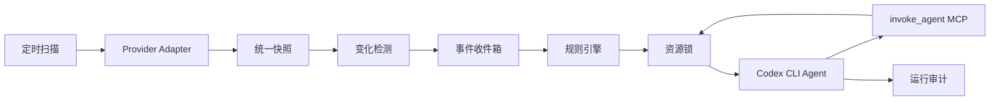

# 系统设计

## 1. 目标

系统负责定时扫描 GitHub Pull Request 与 GitLab Merge Request，根据状态变化触发配置好的 Agent。每个 Agent 由独立的 `codex exec` 进程执行，并可通过受控 MCP 工具将任务委托给其他配置好的 Agent。

第一版采用单服务、SQLite 和本地进程模型，优先保证配置清晰、状态可追溯、触发幂等以及写操作不会互相破坏。接口层保留替换 PostgreSQL、消息队列和远程执行器的空间。

## 2. 组件

1. **Provider Adapter**：将 GitHub/GitLab API 数据规范化为统一变更请求快照。
2. **Scanner**：按照固定间隔拉取变更请求，并与 SQLite 中的上一版快照比较。
3. **Event Detector**：输出提交、状态、Draft、标签、审批、流水线、可合并状态等语义事件。
4. **Event Inbox**：持久化待处理事件，使用稳定事件 ID 避免重复入队。
5. **Rule Engine**：按事件类型、仓库和条件选择 Agent。
6. **Agent Executor**：申请资源锁、组装提示词、启动 Codex CLI、解析 JSONL 输出并记录运行结果。
7. **Sub-agent MCP Gateway**：向 Codex 暴露 `invoke_agent`，执行白名单、深度和次数校验后启动另一个 Codex CLI。
8. **State Store**：保存快照、事件、Agent 运行记录和跨进程资源锁。

## 3. 数据流

## 4. 统一快照

快照包含：平台、仓库、编号、标题、状态、Draft、源分支、目标分支、Head SHA、标签、审批数、流水线状态、可合并状态、更新时间和网页地址。

统一状态采用：

- `opened`
- `closed`
- `merged`

平台原始字段保存在 `raw` 中，便于提示词使用和后续兼容。

## 5. 事件模型

支持以下事件：

- `change_request.discovered`
- `change_request.opened`
- `change_request.reopened`
- `change_request.closed`
- `change_request.merged`
- `change_request.commits_changed`
- `change_request.draft_changed`
- `change_request.labels_changed`
- `change_request.approvals_changed`
- `change_request.pipeline_changed`
- `change_request.merge_status_changed`
- `change_request.updated`

事件 ID 由仓库、变更请求编号、事件类型、旧值和新值生成。同一变化重复扫描不会产生第二个事件。

## 6. 规则条件

规则可匹配事件、仓库以及新旧快照字段。没有 `old.` 或 `new.` 前缀的字段默认读取新快照。

支持操作符：

- 等于：`state: opened`
- 不等于：`state__ne: closed`
- 包含：`labels__contains: security`
- 属于集合：`pipeline_status__in: [success, skipped]`
- 数值比较：`approvals__gte: 2`
- 字段发生变化：`head_sha__changed: true`

## 7. 写操作串行化

Agent 可声明以下写作用域：

- `change_request`：评论、审批、标签、合并等平台变更。
- `workspace`：修改本地代码、提交或推送。

资源锁按实际对象生成，因此不同 MR/PR 或不同工作目录仍可并发。锁以 SQLite 租约实现，支持同一调用链重入，并由后台心跳续期。

`write_scopes` 是编排器的并发与审计声明，不是操作系统级权限隔离。第一版仍需为 `gh`/`glab` 配置最小权限身份，并通过 Agent 提示词约束允许动作。需要强权限隔离的部署应使用独立容器或后续的平台专用 MCP 工具。

执行合并或推送前，Agent 仍应重新读取远端 Head SHA、CI、审批和冲突状态。资源锁防止本系统内部互相冲突，但不能阻止外部用户同时修改远端状态。

## 8. Sub-agent 安全边界

父 Agent 只能调用其 `allowed_sub_agents` 中列出的 Agent。系统同时限制：

- 最大递归深度。
- 单个根任务的最大 Agent 运行次数。
- 单次运行超时。
- 与父任务一致的仓库和变更请求上下文。
- 写 Agent 必须申请对应资源锁。

sub-agent 不是模型内部的逻辑角色，而是由编排器启动的另一个真实 `codex exec` 进程，因此具有独立日志、运行 ID 和超时。

父 Agent 调用 `invoke_agent(agent_name, task, extra_context)` 时负责指定目标 sub-agent 和具体委托任务。sub-agent 自动继承仓库标识与远端项目，但不自动继承根 Agent 的 MR / PR 数据或动作列表。父 Agent 判断任务确有需要时，可在 `task` 或 `extra_context` 中明确传递所需信息。sub-agent 是否与父 Agent 共用本地工作目录由触发规则的 `inherit_workspace` 决定。

## 9. 凭据与权限

Provider Token 优先从全局环境配置中的同名变量解析，没有配置时回退到宿主机环境。它只用于扫描器调用 API，并被强制标记为 Secret；启动 Codex CLI 前会从 Prompt 和子进程环境中移除，不把高权限 Provider Token 直接交给模型。

需要平台写操作时，推荐使用权限受控的 `gh`/`glab` 登录身份。生产版本可进一步增加窄权限的平台 MCP 工具，将评论、审批和合并变成可审计的确定性接口。

Codex 沙箱按 Agent 配置，默认 `read-only`。只有明确需要修改工作目录的 Agent 才使用 `workspace-write`，不默认开放 `danger-full-access`。

基础 Git 仓库不存在时，执行器根据仓库 SSH/HTTPS 地址原子克隆；已存在时只校验并 fetch。当前 MR/PR head 写入 `refs/teamwork/change-requests/<编号>/head`，每次运行再从该引用创建独立临时 worktree，不会 checkout 或覆盖基础仓库。

## 10. 已知边界

- 第一版使用轮询，不包含 Webhook。
- 扫描器按更新时间自动分页，并在上次成功扫描时间水位处提前停止；`max_items_per_repository` 作为单仓库单轮安全上限，`api_page_size` 只控制内部 API 分页大小。
- GitHub 审批数按每位用户最新有效 Review 粗略计算；复杂分支保护规则仍由合并前的远端检查兜底。
- 单机 SQLite 适合初期部署，多实例生产部署应迁移到 PostgreSQL。
- 根 Agent 与未继承父目录的 sub-agent 都使用按运行 ID 创建的独立 detached worktree；规则开启工作区继承时，sub-agent 调用链复用根 Agent 本次运行的 worktree 和实时 Git 状态。
- 第一版尚未提供窄权限的平台写入 MCP，评论、审批和合并依赖部署方预先认证的 `gh`/`glab`。

## 11. 后台管理服务

应用升级为 FastAPI 后台服务，HTTP API、配置管理、定时扫描和 Agent 队列在同一服务进程中运行。CLI 提供 `run` 前台运行，以及 `start`、`stop`、`end`、`restart` 本地后台进程管理；同一配置文件通过 PID 文件和进程锁保证只有一个服务实例。

`start` 使用脱离终端的子进程运行服务，并将标准输出与错误写入配置目录旁的 `data/teamwork-review-agents.log`。`stop` 先发送 `SIGTERM` 等待优雅收尾，超时后强制结束。PID 记录同时保存进程启动时间，防止 PID 被系统复用时误结束其他进程。

生产环境需要故障自动恢复和开机启动时，仍由 systemd、launchd 或容器平台运行 `run` 并负责保活。

后台支持立即扫描、暂停、恢复、配置热加载、服务心跳和运行状态汇总。默认只监听 `127.0.0.1`；监听非本机地址时必须配置管理员 Token。

## 12. 分层环境变量与模板

环境变量依次合并：全局、仓库、Agent、系统运行变量。后者覆盖前者，系统运行变量不可被用户覆盖。

每个变量支持字面值或显式引用宿主机环境变量，并可分别控制是否传给 Codex 进程、是否允许渲染进 Prompt。模板语法为 `${{ENV_NAME}}`，变量不存在或禁止向 Prompt 暴露时渲染为空字符串。

系统注入 `REPOSITORY_ID`、`REPOSITORY_PROJECT`、`REPOSITORY_WORKSPACE`、`MR_NUMBER`、`MR_TITLE`、`MR_STATE`、`MR_HEAD_SHA`、`MR_SOURCE_BRANCH`、`MR_TARGET_BRANCH`、`MR_URL`、`EVENT_TYPE` 和 `RUN_ID`。

Secret 默认不渲染进 Prompt。运行日志、环境变量快照、渲染 Prompt、最终消息及 Codex JSONL 事件在落库前统一脱敏。

## 13. 配置来源与热加载

YAML 是非敏感配置的唯一来源。UI 读取 YAML 的结构化内容，保存时执行以下流程：

1. 合并 UI 中未修改的 Secret 占位值。
2. 完整执行 Pydantic 校验与跨引用校验。
3. 写入同目录临时文件。
4. 使用原子替换更新正式配置。
5. 在 SQLite 中记录配置版本与内容快照。
6. 唤醒后台服务，让下一轮扫描和新 Agent 使用新版本。

手动修改 YAML 后也会被检测。配置无效时继续使用上一版有效配置，并在 UI 展示错误。

## 14. 实时运行日志

Codex CLI 的标准输出与标准错误按行异步读取。JSONL 事件在产生时写入 `run_logs`，包括线程启动、命令执行、文件变化、MCP 调用、Agent 消息、用量和错误。

UI 使用 SSE 按游标订阅日志。断线重连时从最后一条日志继续，不要求 Codex 进程重新发送历史内容。

## 15. 管理 UI

React 管理 UI 包含：

- 仪表盘：后台状态、扫描状态、队列、运行统计和最近错误。
- 仓库：Provider、项目、本地目录、启停和仓库环境变量。
- 全局环境变量：值、宿主机引用、Secret 和暴露策略。
- Agent：Prompt、模型、沙箱、超时、写作用域、环境变量和 sub-agent 白名单。
- 规则：MR 事件、仓库过滤、条件、目标 Agent 和启停。
- 运行：过滤列表、父子 Agent 关系、最终结果和实时日志。
- 配置历史：版本、来源、时间和内容查看。

规则中的触发事件、目标 Agent 和仓库范围均使用直接点击的复选框多选，不依赖浏览器原生 `Command/Ctrl` 多选操作；界面显示已选数量，底层 YAML 仍保存为字符串数组。

## 16. 已扫描变更请求与首次事件补发

管理首页分别展示“已扫描 MR / PR”与“变化事件”，避免把事件数量误认为远端变更请求数量。已扫描列表直接读取 SQLite 中的最新快照，展示仓库、编号、标题、远端状态、更新时间、最近扫描时间和原始链接。

对于首次建立基线时没有产生 `change_request.discovered` 的快照，管理员可以手动补发首次发现事件。补发操作不会删除或改写快照，也不会重新请求 Provider；它只根据当前快照幂等写入一条 `change_request.discovered` 事件，并唤醒后台周期按当前规则处理。若该 MR / PR 已存在首次发现事件，接口返回已存在状态，不会重复入队或重复运行 Agent。

由于补发事件可能触发具有写权限的 Agent，UI 必须在操作前说明影响并要求确认。没有匹配规则时事件仍会被记录，但不会启动 Agent。

## 17. 重复变化、规则去重与 Agent 输入

事件 ID 同时包含 MR / PR 的远端更新时间，因此同一个变更请求先后多次发生 `closed -> reopened` 等相同字段转换时，每一次被扫描器观察到的转换都会形成不同事件；同一远端快照被重复扫描时仍保持幂等。

规则可启用“单轮扫描同一 MR / PR 只触发一次”。启用后，一次扫描为同一个 MR / PR 产生的多个事件如果同时匹配同一规则，则每个目标 Agent 只运行一次，`action` 按事件产生顺序合并为数组。不同规则彼此独立，不同目标 Agent 也各自运行一次；后续扫描再次发生变化时仍可重新触发。

根 Agent 的动态输入只提供统一 MR / PR 信息，不暴露旧快照、新快照、变化字段或内部匹配字段。其 JSON 结构以 `mr` 为根对象，`mr.action` 始终是短动作名数组，例如 `["reopened", "updated"]`。sub-agent 的动态输入只包含仓库上下文，以及父 Agent 指定的 `delegated_task` 和可选 `delegated_context`；系统内部用于准备工作目录、加锁和审计的事件不会自动暴露给 sub-agent。

仅依靠快照轮询只能识别相邻两次扫描之间最终可见的状态。如果一次扫描间隔内先关闭又重新打开，且扫描器没有看到中间关闭状态，则平台最终快照仍是打开。GitHub 仓库额外读取 PR Timeline，以稳定的 `id` / `node_id` 恢复同一周期内的 `closed`、`reopened`、`merged`、`committed`、Draft 和标签变化；GitLab 等尚未实现活动流的 Provider 继续使用快照差异。需要更低延迟或更强投递保证时，仍应增加带签名校验的 Webhook 事件源，并保留周期扫描用于对账。

## 18. 每次运行独立工作区与 sub-agent 继承

仓库配置中的 `workspace` 是基础 Git 仓库，只负责克隆、校验、fetch 和管理 worktree，不再直接作为 Codex CLI 的工作目录。每次根 Agent 运行都会在数据库目录旁的 `worktrees/<仓库>/<run-id>/` 创建以当前 MR / PR Head 为起点的 detached Git worktree，并将该路径写入 Prompt 仓库上下文、`REPOSITORY_WORKSPACE`、运行审计和日志。这样同一仓库的不同 MR、不同分支或同一 Agent 的不同运行可以真正并发，互不共享当前分支、暂存区和未提交文件。

声明 `workspace` 写作用域时，资源锁按仓库与 MR 源分支生成，而不是按临时目录生成。同一源分支的写 Agent 串行执行，防止不同临时 worktree 同时 push 覆盖远端；不同源分支可以并发。`change_request` 写作用域仍按 MR / PR 资源键串行。

规则可配置 `inherit_workspace`，默认关闭。开启时，根 Agent 的后代 sub-agent 共用父 Agent 本次运行的临时 worktree，因此父 Agent 的分支切换、暂存区和未提交文件对子 Agent 可见；共享工作区委托在单个 MCP 进程内串行执行。关闭时，sub-agent 为自己的运行创建另一个独立 worktree。该选项只继承文件系统与 Git 状态，不自动继承 MR / PR Prompt、动作数组或父 Agent 对话内容。

拥有 worktree 的 Agent 结束后执行安全清理：运行成功且工作区无修改、没有新增提交，或者新增提交已经存在于远端引用时立即使用 `git worktree remove` 删除。失败、超时、存在未提交文件或新增提交尚未推送时保留工作区，并在运行记录中标记“待清理”。保留超过 `runtime.worktree_retention_days` 后，后台在下次准备同仓库工作区时强制清理；这项期限明确代表对遗留本地修改的最长恢复窗口。默认数据库位于项目 `data/` 时，仓库根目录的 `.gitignore` 必须忽略整个 `/data/worktrees/` 运行目录，包括保留标记，避免临时工作区进入版本控制；忽略规则不替代后台安全清理。

Agent 配置本身不绑定仓库或固定目录。管理 UI 在 Agent 页面说明基础仓库与临时运行工作区的关系，并在运行详情展示本次实际路径、清理状态和保留原因。

## 19. SKILL 管理与按 Agent 装载

配置顶层增加 `skills`，每个条目引用一个符合 Codex Skill 规范的目录；目录中必须存在带 `name` 与 `description` 元数据的 `SKILL.md`，并可同时包含 `scripts/`、`references/`、`assets/` 等资源。Agent 通过 `skills` 字符串数组独立选择本次运行允许装载的技能。sub-agent 使用自己的 Agent 配置，不继承父 Agent 的技能选择；规则的 `inherit_workspace` 仍只控制文件系统与 Git 状态。

管理 UI 增加独立的 SKILL 页面，支持填写服务端已有目录，也支持从浏览器选择整个技能文件夹并复制到配置文件旁的 `./skills/`。导入时校验目录层级、文件数量、总大小和 `SKILL.md` 元数据，并拒绝路径穿越、重复目标及非法文件。导入只负责保存技能目录，管理员仍需将其加入配置后再在 Agent 中选择。

运行 Codex CLI 前，执行器把应用配置中的技能完整投影到本次临时 worktree 的 `.agents/skills/` 下，并通过当前 Agent 的 Codex 配置显式启用已选技能、禁用其他由本应用管理的技能。投影保留技能内部相对路径和资源，但不修改技能源目录；Codex 子进程同时使用仅对本次进程生效的 Git 忽略文件，使投影不会出现在 `git status` 或普通 `git add -A` 中；进程结束后立即清理。根 Agent 与继承工作区的 sub-agent 可以看到同一份稳定投影，但各自的启用列表仍由各自 Agent 配置决定。未继承工作区的 sub-agent 在自己的临时 worktree 中创建和清理投影。

技能装载表示该技能可被 Codex 根据 `description` 隐式匹配，也可由 Prompt 使用 `$skill-name` 显式要求；选择技能不等于每次运行都强制执行。应用只控制 `skills` 中注册的技能，Codex 自带技能及部署环境原有的其他发现来源不在这份选择列表内。

## 20. GitHub Timeline 增量事件与快照对账

GitHub 扫描采用“候选 PR、活动流、当前快照”三层模型。PR 列表继续按 `updated_at` 倒序筛出本周期发生过活动的候选项；对每个候选 PR，Provider 在读取详情、Review 和提交状态之外读取 Issue Timeline。Timeline 不能替代 PR 列表，因为它按单个 PR 分页，也不能替代 PR 详情，因为审批汇总、流水线、可合并状态和完整分支信息仍来自其他接口。

Timeline 游标按 Provider、仓库和 PR 编号持久化。游标记录最后一个可见 Timeline 项的稳定标识和所在页；后续扫描从上一页开始重叠读取并寻找该标识，只转换它之后的新项目。每轮在按 `updated_at` 筛选候选 PR 之前，先为数据库中已有但缺少游标的快照补齐基线，避免升级后的第一次变化才开始初始化。游标与快照、语义事件在同一 SQLite 事务中提交，进程在事务前退出时可以安全重试；单独的首次基线不产生事件。首次启用 Timeline 或游标无法恢复时不重放不确定的历史动作，同时仍执行一次快照对账。

时间范围不作为幂等依据。`committed` Timeline 项没有统一的活动发生时间，commit 作者时间也可能早于它被推送到 PR 的时间；扫描请求延迟和失败重试还会跨越周期边界。因此系统使用 Timeline `id` / `node_id` 生成稳定事件 ID，时间只用于展示和排序。

Timeline 负责能够明确还原的离散动作：关闭、重新打开、合并、新增提交、强制推送、Draft 切换和标签变化。转换时按 Timeline 顺序构造事件发生时的旧、新快照，以便规则继续匹配 `old.*` 与 `new.*`；事件同时携带本轮最终快照，Agent 的 Prompt、环境变量、工作区和分支锁始终使用扫描结束时的当前真值。每个离散动作仍配套产生一条 `change_request.updated`，规则可通过 `deduplicate_per_scan` 合并同轮多动作。

活动转换完成后，系统从已应用活动的中间快照与最终 PR 快照继续执行差异检测，以补充审批数、流水线状态、可合并状态、标题等 Timeline 未覆盖或不适合直接汇总的字段。Timeline 已消费的状态、提交、Draft 和标签变化不会被快照逻辑重复生成。Provider 不支持活动流、首次建立活动基线或游标重置时，快照差异仍作为完整兜底路径。

## 21. 通用审核标准扩展

通用审核 Prompt 增加改动范围与爆炸半径、仓库卫生、路径可移植性、配置命名与归属四类跨项目检查。这些检查不引入 aGen 的目录白名单、环境变量前缀、Workflow 入口、Agent 工具边界或 Router 契约等项目专属规则。

新检查只扩展审核覆盖面，不改变阻塞问题的证据和影响门槛。改动较广、未拆分、出现普通临时产物、采用某种路径写法或命名不一致，都不会自动导致拒绝合并；仍需证明问题由本次变更引入、触发路径现实可达且具有实质影响，或由项目审核 Skill 明确规定为阻塞项。

## 22. Codex CLI 运行时默认配置

管理 UI 增加独立的“运行时配置”页面，用于配置本服务启动 Codex CLI 时采用的默认模型、推理强度、快速模式、输出详细度、交互风格和联网搜索策略。配置保存于 `runtime.codex`，只影响 Teamwork 发起的 Codex 进程，不修改用户的 `~/.codex/config.toml`。高级配置使用 Codex 原生点号键，并禁止覆盖 Sandbox、审批策略、MCP Server、Skill、模型结构化字段等由应用负责管理的安全或集成配置。

运行时参数遵循“Codex 用户/仓库配置 → Teamwork 运行时默认 → Agent 显式覆盖 → 应用托管安全与 MCP 参数”的合并顺序。Teamwork 通过每次 `codex exec` 的 `--config key=value` 注入运行时默认；Agent 的模型和同类可选字段在其后覆盖。sub-agent 使用目标 Agent 自己的设置，不继承父 Agent 的模型、推理强度、快速模式或其他运行参数；未设置时仍回退到同一份 Teamwork 运行时默认。

服务不再强制使用 `--ignore-user-config`，因此未被 Teamwork 或 Agent 覆盖的 Codex 配置仍按 CLI 原生层级生效。Teamwork 的应用托管 MCP 网关、当前运行 Skill 选择、工作目录和 Sandbox 继续由命令行显式指定，不能被运行时高级配置覆盖。

后端提供只读的 Codex 运行能力接口：优先调用当前配置的 `codex_binary debug models --bundled` 获取本机 CLI 已知模型、各模型支持的推理强度、默认推理强度和快速模式能力；命令不可用时 UI 仍允许手工填写。Agent 模型留空时，UI 按可验证来源显示继承结果：先显示 `runtime.codex.model`，否则尝试读取 `$CODEX_HOME/config.toml` 或 `~/.codex/config.toml` 的顶层 `model`；两者都没有时显示“由 CLI 与账号决定”，不猜测内置默认模型。仓库级 `.codex/config.toml` 可能因实际运行仓库不同而改变结果，UI 会明确提示这一点。

## 23. 内置 Agent、规则模板与 Prompt

项目在 `config_example.yaml` 中直接提供通用审核和增量文档更新所需的 Agent 定义，使用户复制示例配置后可以在管理 UI 中查看、调整并复用这些 Agent。示例中的所有内置规则都保留完整的事件、Agent、去重与工作区继承关系，但统一设置为 `enabled: false`；未由管理员主动启用前，扫描产生的事件不会因为内置模板而启动 Agent。

内置 Prompt 保存在仓库根目录的 `prompts/` 中，并通过 `.gitignore` 的精确例外纳入版本控制。除明确列出的内置文件外，UI 导入或部署环境自行创建的其他 Prompt 仍保持忽略，避免把本地 Prompt 或潜在敏感内容误提交。示例配置只包含 Agent 与禁用规则，不包含 Provider、仓库、真实 Token 或其他部署私有值。

## 24. 事件处理状态与 Agent 运行状态分离

事件收件箱只描述语义事件是否完成规则匹配和调度，不再把同批次中所有已领取事件笼统展示为“处理中”。事件依次经过 `pending`、短暂的内部 `processing`，然后进入 `unmatched`、`triggered`、`completed` 或 `failed`：没有匹配任何规则的事件在规划完成后立即成为 `unmatched`；至少产生一个 Agent 调度的事件成为 `triggered`，全部相关运行结束后再成为 `completed` 或 `failed`。

Agent 运行使用独立状态。运行记录创建后先为 `queued`，表示正在等待并发额度、资源锁或工作区准备；Codex CLI 真正开始执行前切换为 `running`，最终进入 `completed`、`failed` 或 `timed_out`。管理 UI 在事件状态旁单独聚合展示关联 Agent 的排队、执行、成功、失败和超时数量，避免把“事件被扫描器领取”误解为“Agent 正在执行”。

事件与运行之间通过持久化调度关联表连接，关联键使用现有幂等键。一个事件可以关联多个规则和 Agent；开启规则级单轮去重后，一次 Agent 运行也可以关联同批次中的多个事件。调度关联在启动异步任务前写入，因此 UI 可以在 Agent 进程尚未创建时显示排队状态，服务异常退出后也保留可审计关系。

## 25. 设计、历史变更与目标分支一致性审核

通用审核 Prompt 增加 `REVIEW_DESIGN_DOC_DIR` 和 `REVIEW_CHANGE_HISTORY_DIR` 两个单目录环境变量。它们与 `REVIEW_SKILLS` 在第一次工具操作中同时读取。非空值必须解析为当前仓库内可读的单个目录，错误配置阻止合并且不回退自动扫描；空值则在排除依赖、缓存、构建、临时和第三方目录后，扫描仓库中的设计、架构、ADR、spec、change 与历史归档目录。未找到相关目录只记录审核来源缺失，不自动阻塞。

审核者优先从本次 diff 中的设计文档识别当前功能意图，并与代码、测试、配置和对外契约交叉验证；随后扫描已定位目录的全部文件名和可检索内容，完整读取与功能、模块、接口、配置、数据模型、路由和状态相关的文档及其必要引用。只有能同时给出本次变更证据、既有设计或历史 change 位置，并证明两者无法同时成立的未解决矛盾，才构成一致性冲突；已明确替代旧设计并具有文档、兼容、迁移、回滚和测试证据的正常演进不属于未解决冲突。

代码一致性审核同时锁定源分支 `REVIEW_HEAD_SHA` 和目标分支 `REVIEW_TARGET_SHA`。以 `O` 表示两者的 merge base，`T` 表示已包含先前变更的目标分支基准，`H` 表示当前源分支，`M` 表示通过平台合并结果或只读三方合并分析得到的拟合并结果。审核必须比较 `O → T`、`O → H` 和真正会进入目标分支的 `T → M`，并在文件、代码块、符号、控制流、契约、schema、配置、路由、注册项和测试等重叠面上确认 `M` 没有意外覆盖、回退或破坏 `T` 中仍生效的功能。

任一基准 SHA 变化都使当前审核结果失效，必须立即结束，不评论、不自动切换至新版本继续审核、不合并。一旦有充分证据证明 `M` 与现行设计、历史决策或 `T` 中功能存在未解决冲突，必须作为阻塞问题。本规则不扩展到其他尚未合入目标分支的打开 MR / PR。

## 26. 首次扫描周期内的事件回看

首次扫描仓库时不能把全部历史 MR / PR 当成刚刚创建，也不能因为尚无本地快照而丢弃本扫描周期内真实发生的动作。扫描器为每个仓库维护最近一次成功轮次的开始与完成时间；已有成功水位时，事件回看窗口从上次成功轮次的开始时间起算，首次运行时则从本轮开始时间向前回看一个 `scanner.interval_seconds`。使用开始时间允许当前轮次与上一轮执行耗时重叠，避免恰好在列表读取之后创建的 PR 落入时间缝隙，稳定事件 ID 会消除重叠读取。候选列表仍使用带重叠量的更新时间水位，事件是否属于首次回看窗口则使用精确窗口，不把 API 重叠读取误当成新事件。

统一快照增加平台创建时间。首次见到的 MR / PR 只有在创建时间落入回看窗口时才产生 `change_request.opened` 及配套的 `change_request.updated`；更早的历史项目只建立当前快照。`scanner.emit_initial_events` 只控制是否额外产生不代表平台动作的 `change_request.discovered`，不再决定窗口内真实创建与活动是否输出。

GitHub 在首次建立单个 PR 的 Timeline 游标时，从最新页向前读取到回看窗口边界，只转换平台能够提供发生时间且位于窗口内的关闭、重新打开、合并、提交、强制推送、Draft 和标签动作，然后把游标推进到当前最新项。后续扫描继续使用稳定 Timeline 项 ID 增量读取，因此首次窗口事件不会重复。若首次快照包含多个窗口内活动，事件检测会从当前快照反向还原窗口开始时的必要状态，再按 Timeline 顺序生成每个具体事件及配套 `updated`；规则去重仍只影响 Agent 调度，不影响事件完整记录。

不支持活动流的 Provider 仍可依据创建时间产生窗口内的 `opened`，其余首次周期动作只能等待该 Provider 增加可定位时间和稳定 ID 的活动接口。活动没有可靠发生时间时不重放，避免把历史事件错误归入当前周期。

## 27. 后台 Codex 运行隔离、无进展超时与人工取消

Teamwork 启动的后台 Codex CLI 默认不继承用户 `config.toml` 中配置的 MCP Server。服务在启动命令中逐项关闭已发现的用户 MCP，只保留应用托管的 `teamwork_agent_gateway`；管理员可以通过 `runtime.allowed_user_mcp_servers` 显式放行确有需要的服务，也可以用 `runtime.inherit_user_mcp_servers` 恢复完整继承。GitHub / GitLab 管理 Agent 应优先使用本次 MR / PR 输入、平台 API、`gh` / `glab` 和本地工作区，不因用户桌面环境存在浏览器、Computer Use 或 REPL MCP 就自动获得这些能力。

运行时可以通过 `runtime.codex_home` 为后台服务指定独立 `CODEX_HOME`。独立目录隔离 `config.toml`、模型目录缓存和其他 Codex 状态，但凭据也属于该目录，部署者需要在该目录下单独完成 Codex 登录。留空时继续使用服务进程继承的 `CODEX_HOME` 或 `~/.codex`。`runtime.codex_binary` 仍决定实际二进制，`runtime.expected_codex_version` 可锁定期望版本；启动单次 Agent 前若实际版本不匹配，则直接失败而不执行任务。管理 UI 展示二进制解析路径、实际版本、当前 Codex Home、模型缓存记录的客户端版本和冲突警告，避免多个 Codex 版本共用缓存时只能从重复 stderr 猜测原因。

总运行超时与无进展超时分离。`Agent.timeout_seconds` 继续限制完整执行时间；`runtime.agent_idle_timeout_seconds` 是默认无进展窗口，Agent 可通过 `idle_timeout_seconds` 单独覆盖。只有 Codex stdout/JSONL 新事件表示语义进展，重复 stderr 诊断不会续期；连续超过窗口后服务终止整个 Codex 进程组并记录明确的 `run.idle_timed_out`。这样卡在某个 MCP/tool item 的运行无需等待完整二十分钟，同时正常持续输出的长任务仍可继续。

运行记录增加持久化取消请求。管理 API 取消某个运行时，会同时标记它的全部后代：仍在排队的运行直接进入 `cancelled`，已经执行的根 Agent 或跨 MCP 进程 sub-agent 通过 SQLite 短轮询感知请求，先发送 `SIGTERM`，宽限期后发送 `SIGKILL`。Runner 返回 `cancelled`，工作区继续走既有安全清理策略；脏工作区或未推送提交仍会保留。UI 只对 `queued`、`running` 展示“取消运行”，并把已取消数量独立纳入事件关联 Agent 的终态统计。

## 28. 后台服务进程发现与就绪确认

`start`、`stop` 和 `restart` 的成功语义必须对应真实进程状态，不能只依据 PID 文件已经写入或文件锁短暂持有。后台子进程启动后，父进程持续请求管理服务的 `/api/health`；健康响应携带实际服务 PID，只有响应 PID 与本次新建子进程一致时才视为启动成功。端口上若仍是旧实例，旧实例的健康响应不能让新进程产生假成功；新进程绑定失败、提前退出或超过就绪期限时，命令返回非零退出码并附带后台日志末尾。

正常情况下，进程管理器继续用配置专属 PID 文件、进程启动时间和文件锁确认服务身份。若 PID 或锁文件在服务运行期间丢失、被移动或损坏，管理器使用系统进程表作为恢复路径，只匹配同时满足 `python -m teamwork_review_agents run`、`--managed-child` 和同一配置绝对路径的托管子进程。不能仅凭监听端口终止进程，避免误杀其他应用；同一配置出现多个托管子进程时按异常多实例明确报告并由 `stop` 一并收尾。

`stop` 必须向全部已确认属于当前配置的服务进程发送 `SIGTERM`，等待其真实退出，超时后才对仍存活的托管进程组发送 `SIGKILL`。只有目标 PID 全部退出后才能返回成功。`restart` 严格串联“发现旧实例 → 确认旧实例退出 → 启动新实例 → 确认健康响应属于新 PID”；停止或启动任一阶段失败时立即返回失败，不得输出重启成功。

## 29. 运行列表、详情抽屉与消息化日志

“运行与日志”页面使用全宽运行列表承载扫描结果，不再把有限的页面宽度固定切分为列表和详情两栏。每条运行记录直接展示状态、Agent、仓库、MR / PR 编号、规则、开始时间、耗时和工作区保留状态；点击记录后从页面右侧滑出详情抽屉，桌面端保留列表上下文，窄屏设备使用全屏抽屉。抽屉支持关闭按钮、遮罩点击和 `Escape`，选择 sub-agent 时在同一抽屉内切换运行。

详情抽屉将实时日志解析为面向管理员的消息流，而不是直接铺开 JSON。Agent 文本使用安全 Markdown 渲染；命令、MCP 工具、文件变更、工作区准备、会话生命周期、完成状态和错误分别使用独立消息卡片。连续且内容相同的日志合并并显示重复次数，降低重复诊断对可读性的影响。无法识别的事件仍显示通用摘要，完整原始载荷保留在“查看原始数据”折叠区，保证排障信息不丢失。

消息流继续通过现有 SSE 游标实时追加。用户停留在底部附近时自动跟随新消息；用户主动向上查看历史时不抢夺滚动位置，只显示“有新消息”提示，点击后回到底部。抽屉将消息、最终结果、Prompt、环境审计、工作区和 sub-agent 分区展示；环境变量、完整 Prompt 和原始 JSON 默认折叠，继续遵循已有脱敏边界。

## 30. Agent 本地文件权限与命令联网权限分离

Agent 的本地文件能力与命令联网能力采用两个独立配置维度。`sandbox` 继续决定 Codex 对本地文件和命令执行的隔离级别；新增 `network_access` 决定 `workspace-write` 沙箱中的命令能否访问网络，`network_domains` 则在联网开启时提供可选域名白名单。管理 UI 必须把两类权限分区展示，避免把“工作区可写”误解为“命令可以联网”。

`workspace-write` 下默认禁止命令联网。开启联网且白名单为空时，Codex 使用不受域名限制的公开网络出口；白名单非空时，服务同时启用 Codex 网络代理，并把每个域名转换为 `allow` 规则。白名单支持精确主机、`*.example.com` 和 `**.example.com`，不接受协议、端口、路径或全局通配符。`read-only` 不支持通过本配置开放命令联网，UI 禁用开关并解释限制；`danger-full-access` 本身不提供可靠的域名隔离，因此 UI 明确显示网络不受白名单保护，不能把域名列表当作安全边界。

联网参数由 Teamwork 作为应用托管的 Codex CLI 覆盖项注入。Agent 高级配置不得覆盖 `sandbox_workspace_write.network_access` 或 `features.network_proxy`，避免绕过 UI 与配置校验。未开启联网时显式传入关闭状态；开启且白名单为空时显式关闭域名代理；开启且存在白名单时显式启用代理并传入域名映射，使行为不受用户 `config.toml` 中同名设置影响。

Provider Token 与命令联网权限完全分离。GitHub、GitLab 等 Provider 的 `token_env` 在创建 Codex 子进程前始终移除，不能通过开启联网、配置域名或 Agent 环境变量进入 Prompt 和命令环境。Codex 子进程继续继承宿主机 `HOME` 等基础环境，因此 `gh`、`glab` 可以使用各自已经建立的系统钥匙串或 CLI 登录态；Teamwork 不复制、不代理也不展示这些登录凭据。三个内置 Agent 默认都开启命令联网且不设置域名白名单，以便审核和增量文档任务按需使用自身 `gh` / `glab` 登录态；部署配置仍可由管理员收紧。

## 31. 独立 Codex Home 账户登录与额度展示

运行时页面只在 `runtime.codex_home` 已经保存为非空路径时提供后台 Codex 账户管理。留空继续沿用服务进程继承的 `CODEX_HOME` 或 `~/.codex`，不在 Teamwork 中展示登录、重新登录或账户详情，避免应用无意修改用户桌面和终端共用的认证状态。用户在编辑模式中刚填写但尚未保存的新路径也不能启动登录；账户操作始终绑定当前已生效配置中的 Codex 二进制与绝对 Home 路径。

账户管理使用当前 `runtime.codex_binary` 的 Codex App Server JSON-RPC 接口，不读取或解析 `auth.json`，也不把访问令牌、刷新令牌或 API Key 传到浏览器、SQLite 与应用日志。后端以指定 `CODEX_HOME` 启动独立 App Server，完成初始化后通过 `account/read` 获取认证类型、账号邮箱和套餐，通过 `account/rateLimits/read` 获取额度窗口、使用比例和重置时间，并在能力可用时通过 `account/usage/read` 获取用量摘要。API Key 等不提供 ChatGPT 额度的认证类型只展示认证方式，不伪造额度信息。

登录采用 App Server 的 `account/login/start`。本机管理界面优先使用 ChatGPT 浏览器授权地址；登录进程在成功、失败、取消或超时前保持存活，以承接本地 OAuth 回调和 `account/login/completed` 通知。管理 API 为每个 Codex Home 只保留一个内存登录会话，提供启动、查询和取消操作；服务重启后不恢复中间登录会话，而是重新通过 `account/read` 判断最终认证状态。重新登录复用同一授权流程，不先执行退出，避免授权失败时主动删除已有凭据。

运行时页面在只读模式下展示账户卡片，因为登录属于对已保存运行环境的操作而不是配置草稿。卡片区分未配置独立 Home、检查中、未登录、登录中、已登录和诊断失败；已登录时展示官方接口实际返回的邮箱、套餐、认证方式、额度使用比例和重置时间，并明确标记缺失字段。所有账户管理接口继续受管理 Token 保护，授权 URL 只返回给发起请求的管理员且不写日志。

## 32. 运行概览列表筛选、排序与展示数量

运行概览中的“已扫描 MR / PR”和“最近变化事件”分别提供独立的仓库、状态和展示数量筛选。仓库选项只包含当前启用的仓库并默认选择全部；MR / PR 状态使用统一快照的 `opened`、`closed`、`merged`，事件状态使用收件箱实际状态，两个状态筛选均默认选择全部。筛选只影响对应列表，不改变页面顶部全局统计卡的统计口径。

所有过滤在 SQLite 查询阶段完成，不能先截取固定数量再由浏览器过滤。MR / PR 按平台快照中的远端 `updated_at` 倒序，事件按统一事件载荷中的实际 `occurred_at` 倒序；两类查询都增加稳定次级排序，避免时间相同或自动刷新时行顺序跳动。最近扫描时间和事件入库时间仍保留用于内部审计，但不再决定列表顺序。

每张列表默认展示 10 条，可选 10、20、50、全部或自定义正整数。选择“全部”时后端查询真正移除 `LIMIT`，不使用固定上限近似；自定义数量由后端验证为正整数。两张列表的选择互不影响，页面三秒自动刷新时沿用当前筛选，切换筛选后立即按新条件查询。若已选仓库不再启用，前端自动回退到全部仓库。

## 33. 历史 PR 最新事件参考与手动触发

GitHub PR 的“最新事件”来自 Issues 命名空间下的 Timeline Events 接口，不根据当前 `opened`、`closed`、`merged` 快照状态推导。系统只选择能够转换成现有 `change_request.*` 规则事件的最新 Timeline 活动：关闭、重新打开、合并、提交或强制推送、Draft 切换和标签变化；评论、订阅等尚无统一规则语义的原始活动不作为可手动触发事件。GitLab 当前没有统一活动流实现，不能用 MR 状态伪造最新事件。

首次发现 MR / PR 时以事件回看窗口而不是创建时间区分处理方式。窗口内存在活动时，系统继续完整生成、入队并自动调度窗口内全部语义事件，同时缓存其中最新的 Provider 活动。历史 MR / PR 在窗口内没有活动时，只从 Timeline 基线保存最新可识别活动及其平台 ID、原始类型和发生时间，不把该历史参考写入事件收件箱，也不自动触发规则。旧 PR 在当前窗口内发生合并等动作仍属于窗口内事件，必须正常自动调度。

运行概览在每个快照行展示缓存的“最新事件”。管理员点击“手动触发”后，系统以当前快照为上下文、以缓存的 Provider 活动为审计来源，生成一个新的 `origin=manual` 语义事件；每次操作使用独立事件 ID，因此可以明确重跑规则。手动事件进入与扫描事件相同的仓库、条件、去重和 Agent 调度流程，没有匹配规则时正常落为 `unmatched`，但不会修改托管平台，也不会额外生成通用 `change_request.updated`。

最新活动随 Timeline 增量游标一起持久化，页面刷新不直接访问 GitHub。已有游标但缺少最新活动元数据的历史快照在后续扫描时执行一次基线补齐。事件调度使用独立于 Provider 扫描的唤醒路径，因此扫描暂停时仍可处理管理员明确提交的手动事件，同时保持扫描周期串行和全局 Agent 并发限制。

## 34. 概览操作确认弹窗

运行概览中的“补发首次事件”和“手动触发最新事件”不使用浏览器原生 `window.confirm`。两种操作统一使用应用内确认弹窗，以延续管理界面的深色视觉体系，并让管理员在确认前结构化核对仓库、MR / PR 编号、事件类型、平台事件时间和规则影响。

弹窗由遮罩、标题区、目标信息卡、规则影响提示、安全说明和操作区组成。手动触发必须明确显示缓存的语义事件及平台原事件时间；补发首次事件必须明确显示 `change_request.discovered`。当存在事件和仓库范围可能匹配的启用规则时，提示仍需满足规则条件且 Agent 可能执行其获准操作；没有候选规则时说明事件预计记录为未触发。两种操作都要声明不会直接修改远端 PR。

确认弹窗支持关闭按钮、取消按钮、点击遮罩和 `Escape` 取消。请求提交期间禁用全部关闭入口并展示进行中状态，防止重复提交；后端 API、事件幂等、唯一手动事件和调度语义保持不变。窄屏下弹窗宽度随视口收缩，内容区可滚动，操作按钮保持可见。

## 35. Agent 工作区准备状态与 Git 超时

Agent 运行在完成并发额度、业务写锁和仓库管理锁等待后，从 `queued` 切换为 `preparing`。该状态覆盖基础仓库首次克隆、远端 fetch、MR / PR 引用获取、过期 worktree 清理和本次隔离 worktree 创建；只有 Codex CLI 即将启动时才切换为 `running`。运行列表、详情、事件聚合和统计均单独展示“准备工作区”，避免把耗时 Git 网络操作误解为等待并发槽。

运行时新增 `runtime.git_timeout_seconds`，默认 600 秒，并统一传入克隆、fetch、worktree 创建与清理等 Git 操作。Git 操作开始时写入操作阶段日志，执行期间按固定间隔写入已等待秒数，完成后写入耗时；日志不包含可能带凭据的完整命令或远端 URL。管理员取消准备中的运行时，持久化取消请求必须终止整个 Git 进程组，避免 SSH、index-pack 等子进程继续占用网络和临时目录。

首次克隆继续在目标目录旁的临时目录执行，成功后原子移动为正式基础仓库。超时、取消或失败时终止完整进程组并清理当前临时目录；系统不把不完整克隆当成可复用仓库。若网络速度不足以在默认十分钟内完成，管理员可以提高超时、预先完成基础仓库克隆，或把仓库工作目录指向已有的完整本地克隆。

## 36. 基础仓库初始化与状态管理

仓库配置页面在配置表单之外增加“基础仓库状态”操作区，只针对当前已保存且启用的仓库。每个仓库展示已解析绝对路径、初始化状态、最近操作阶段、已耗时、最近完成时间、磁盘占用和脱敏错误。目录不存在或不是完整 Git 仓库时显示“初始化仓库”；有效仓库显示“立即更新”。配置草稿中的仓库 ID、远端或工作目录与已保存配置不一致时，禁止对该仓库执行操作，避免初始化错误目标。

初始化任务使用当前 Provider 与仓库配置：目录缺失时通过既有原子克隆流程创建基础仓库；目录已经有效时校验并执行 `fetch --prune origin`。任务不创建 Agent worktree、不切换基础仓库分支，也不复制或修改工作文件。初始化与 Agent 工作区准备共用相同的 `git_repository:<绝对路径>` 资源锁，因此并发操作先显示等待仓库锁，取得锁后再进入克隆、校验或更新阶段。

初始化管理器在服务进程内维护每个仓库唯一的任务与取消事件，状态不会写入 SQLite。页面刷新后仍可查询同一服务进程内的任务；服务退出时先请求取消并等待 Git 进程组回收，重启后重新从磁盘检查仓库是否完整。初始化和更新统一使用 `runtime.git_timeout_seconds`，进度只记录操作名称、状态和耗时，不返回完整 Git 命令、远端 URL、stdout、stderr 或凭据。取消会终止 git、ssh、index-pack 等完整进程组。
