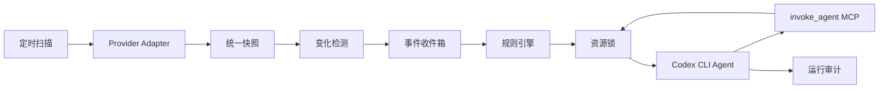

# 系统设计

## 1. 目标

系统负责定时扫描 GitHub Pull Request 与 GitLab Merge Request，根据状态变化触发配置好的 Agent。每个 Agent 由独立的 `codex exec` 进程执行，并可通过受控 MCP 工具将任务委托给其他配置好的 Agent。

第一版采用单服务、SQLite 和本地进程模型，优先保证配置清晰、状态可追溯、触发幂等以及写操作不会互相破坏。接口层保留替换 PostgreSQL、消息队列和远程执行器的空间。

## 2. 组件

1. **Provider Adapter**：将 GitHub/GitLab API 数据规范化为统一变更请求快照。
2. **Scanner**：按照固定间隔拉取变更请求，并与 SQLite 中的上一版快照比较。
3. **Event Detector**：输出提交、状态、Draft、标签、审批、流水线、可合并状态等语义事件。
4. **Event Inbox**：持久化待处理事件，使用稳定事件 ID 避免重复入队。
5. **Rule Engine**：按事件类型、仓库和条件选择 Agent。
6. **Agent Executor**：申请资源锁、组装提示词、启动 Codex CLI、解析 JSONL 输出并记录运行结果。
7. **Sub-agent MCP Gateway**：向 Codex 暴露 `invoke_agent`，执行白名单、深度和次数校验后启动另一个 Codex CLI。
8. **State Store**：保存快照、事件、Agent 运行记录和跨进程资源锁。

## 3. 数据流

## 4. 统一快照

快照包含：平台、仓库、编号、标题、状态、Draft、源分支、目标分支、Head SHA、标签、审批数、流水线状态、可合并状态、更新时间和网页地址。

统一状态采用：

- `opened`
- `closed`
- `merged`

平台原始字段保存在 `raw` 中，便于提示词使用和后续兼容。

## 5. 事件模型

支持以下事件：

- `change_request.discovered`
- `change_request.opened`
- `change_request.reopened`
- `change_request.closed`
- `change_request.merged`
- `change_request.commits_changed`
- `change_request.draft_changed`
- `change_request.labels_changed`
- `change_request.approvals_changed`
- `change_request.pipeline_changed`
- `change_request.merge_status_changed`
- `change_request.updated`

事件 ID 由仓库、变更请求编号、事件类型、旧值和新值生成。同一变化重复扫描不会产生第二个事件。

## 6. 规则条件

规则可匹配事件、仓库以及新旧快照字段。没有 `old.` 或 `new.` 前缀的字段默认读取新快照。

支持操作符：

- 等于：`state: opened`
- 不等于：`state__ne: closed`
- 包含：`labels__contains: security`
- 属于集合：`pipeline_status__in: [success, skipped]`
- 数值比较：`approvals__gte: 2`
- 字段发生变化：`head_sha__changed: true`

## 7. 写操作串行化

Agent 可声明以下写作用域：

- `change_request`：评论、审批、标签、合并等平台变更。
- `workspace`：修改本地代码、提交或推送。

资源锁按实际对象生成，因此不同 MR/PR 或不同工作目录仍可并发。锁以 SQLite 租约实现，支持同一调用链重入，并由后台心跳续期。

`write_scopes` 是编排器的并发与审计声明，不是操作系统级权限隔离。第一版仍需为 `gh`/`glab` 配置最小权限身份，并通过 Agent 提示词约束允许动作。需要强权限隔离的部署应使用独立容器或后续的平台专用 MCP 工具。

执行合并或推送前，Agent 仍应重新读取远端 Head SHA、CI、审批和冲突状态。资源锁防止本系统内部互相冲突，但不能阻止外部用户同时修改远端状态。

## 8. Sub-agent 安全边界

父 Agent 只能调用其 `allowed_sub_agents` 中列出的 Agent。系统同时限制：

- 最大递归深度。
- 单个根任务的最大 Agent 运行次数。
- 单次运行超时。
- 与父任务一致的仓库和变更请求上下文。
- 写 Agent 必须申请对应资源锁。

sub-agent 不是模型内部的逻辑角色，而是由编排器启动的另一个真实 `codex exec` 进程，因此具有独立日志、运行 ID 和超时。

## 9. 凭据与权限

Provider Token 只用于扫描器调用 API，启动 Codex CLI 前会从子进程环境中移除。第一版不把高权限 Provider Token 直接交给模型。

需要平台写操作时，推荐使用权限受控的 `gh`/`glab` 登录身份。生产版本可进一步增加窄权限的平台 MCP 工具，将评论、审批和合并变成可审计的确定性接口。

Codex 沙箱按 Agent 配置，默认 `read-only`。只有明确需要修改工作目录的 Agent 才使用 `workspace-write`，不默认开放 `danger-full-access`。

## 10. 已知边界

- 第一版使用轮询，不包含 Webhook。
- 扫描分页由 `max_pages` 限制，超大型仓库需要增量游标优化。
- GitHub 审批数按每位用户最新有效 Review 粗略计算；复杂分支保护规则仍由合并前的远端检查兜底。
- 单机 SQLite 适合初期部署，多实例生产部署应迁移到 PostgreSQL。
- 第一版不自动创建分支或工作树，工作目录生命周期由部署方管理。
- 第一版尚未提供窄权限的平台写入 MCP，评论、审批和合并依赖部署方预先认证的 `gh`/`glab`。

## 11. 后台管理服务

应用升级为 FastAPI 后台服务，HTTP API、配置管理、定时扫描和 Agent 队列在同一服务进程中运行。生产环境由 systemd、launchd 或容器平台负责保活，不在应用内部自行 fork daemon。

后台支持立即扫描、暂停、恢复、配置热加载、服务心跳和运行状态汇总。默认只监听 `127.0.0.1`；监听非本机地址时必须配置管理员 Token。

## 12. 分层环境变量与模板

环境变量依次合并：全局、仓库、Agent、系统运行变量。后者覆盖前者，系统运行变量不可被用户覆盖。

每个变量支持字面值或显式引用宿主机环境变量，并可分别控制是否传给 Codex 进程、是否允许渲染进 Prompt。模板语法为 `${{ENV_NAME}}`，变量不存在或禁止向 Prompt 暴露时渲染为空字符串。

系统注入 `REPOSITORY_ID`、`REPOSITORY_PROJECT`、`REPOSITORY_WORKSPACE`、`MR_NUMBER`、`MR_TITLE`、`MR_STATE`、`MR_HEAD_SHA`、`MR_SOURCE_BRANCH`、`MR_TARGET_BRANCH`、`MR_URL`、`EVENT_TYPE` 和 `RUN_ID`。

Secret 默认不渲染进 Prompt。运行日志、环境变量快照、渲染 Prompt、最终消息及 Codex JSONL 事件在落库前统一脱敏。

## 13. 配置来源与热加载

YAML 是非敏感配置的唯一来源。UI 读取 YAML 的结构化内容，保存时执行以下流程：

1. 合并 UI 中未修改的 Secret 占位值。
2. 完整执行 Pydantic 校验与跨引用校验。
3. 写入同目录临时文件。
4. 使用原子替换更新正式配置。
5. 在 SQLite 中记录配置版本与内容快照。
6. 唤醒后台服务，让下一轮扫描和新 Agent 使用新版本。

手动修改 YAML 后也会被检测。配置无效时继续使用上一版有效配置，并在 UI 展示错误。

## 14. 实时运行日志

Codex CLI 的标准输出与标准错误按行异步读取。JSONL 事件在产生时写入 `run_logs`，包括线程启动、命令执行、文件变化、MCP 调用、Agent 消息、用量和错误。

UI 使用 SSE 按游标订阅日志。断线重连时从最后一条日志继续，不要求 Codex 进程重新发送历史内容。

## 15. 管理 UI

React 管理 UI 包含：

- 仪表盘：后台状态、扫描状态、队列、运行统计和最近错误。
- 仓库：Provider、项目、本地目录、启停和仓库环境变量。
- 全局环境变量：值、宿主机引用、Secret 和暴露策略。
- Agent：Prompt、模型、沙箱、超时、写作用域、环境变量和 sub-agent 白名单。
- 规则：MR 事件、仓库过滤、条件、目标 Agent 和启停。
- 运行：过滤列表、父子 Agent 关系、最终结果和实时日志。
- 配置历史：版本、来源、时间和内容查看。
