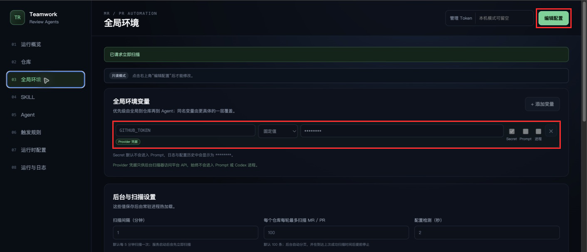
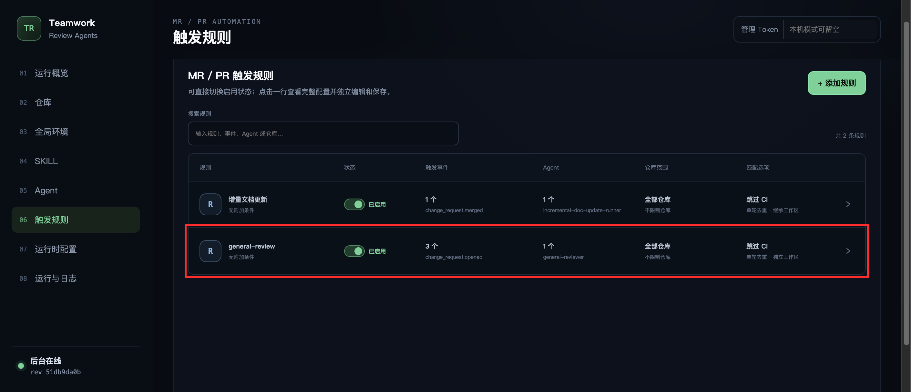

# 首次配置指南

本文按管理界面的实际顺序，说明第一次启动 Teamwork Review Agents 后如何完成最小可用配置。完成后，服务应能扫描 GitHub PR 或 GitLab MR，并在启用规则后启动对应 Agent。

> 截图来自一个已经运行的示例实例，仓库名称、规则状态、版本号和统计数字仅用于说明界面位置，请不要照抄。新安装的内置触发规则默认关闭，应先验证扫描，再按需启用。

## 1. 准备本机登录和 Token

启动 Teamwork 服务的系统用户必须具备以下登录态：

- 已登录的 Codex CLI。
- GitHub 仓库使用已登录的 `gh`；GitLab 仓库使用已登录的 `glab`。
- 扫描器使用的 `GITHUB_TOKEN` 或 `GITLAB_TOKEN` 已存在于启动服务的宿主机环境中。

Provider Token 只供后台扫描器访问平台 API，不会传给 Codex，也不能代替 `gh` / `glab` 登录态。具体登录与验证命令见[配置 `gh` / `glab`](platform-cli-auth.md)。

首次启动前，从示例生成本地配置。

Linux、macOS 或 WSL2：

```bash
python -m pip install -e .
cp config_example.yaml config.yaml
teamwork-review-agents validate
teamwork-review-agents start
```

Windows PowerShell：

```powershell
python -m pip install -e .
Copy-Item config_example.yaml config.yaml
teamwork-review-agents validate
teamwork-review-agents start
```

原生 Windows 可以直接使用 `run`、`start`、`stop`、`restart` 和 `scan-once`。`codex`、`gh`、`glab` 的登录与状态检查命令也可以直接在 PowerShell 中执行；必须使用启动 Teamwork 服务的同一系统用户完成登录。

`config.yaml` 已被 Git 忽略，不要把真实 Token 或部署环境配置提交到仓库。

## 2. 配置平台连接和仓库

打开 [http://127.0.0.1:8080](http://127.0.0.1:8080)，进入“仓库”。平台连接在各自卡片内独立编辑和保存，仓库则在列表或详情页独立管理。


先添加 GitHub / GitLab 连接：

1. 为连接填写一个唯一名称。
2. 选择 GitHub 或 GitLab。
3. 公有 GitHub 使用 `https://api.github.com`；自建 GitHub Enterprise 或 GitLab 使用实际 API 地址。
4. Provider Token 变量名填写 `GITHUB_TOKEN`、`GITLAB_TOKEN` 或部署环境约定的其他名称。

然后添加仓库：

1. 仓库 ID 用于管理界面、事件、规则和 Agent 输入，必须唯一。
2. 选择刚才创建的平台连接。
3. 填写平台项目路径、SSH 地址或 HTTPS Git 地址。
4. 填写本地基础仓库目录。新建仓库默认启用，也可在仓库列表中直接切换启停状态。目录不存在时，服务会在需要时自动克隆。

平台连接负责扫描 API；仓库配置负责远端项目定位和本地 Git 基础目录，两者不能互相替代。Agent 不会直接在基础仓库中运行；可写 Agent 创建独立临时 clone，只读 Agent 创建轻量 linked worktree。

## 3. 引用宿主机 Provider Token

进入“全局环境”，为平台连接使用的 Token 变量添加同名配置。推荐选择“宿主机环境”，避免把 Token 明文写入 `config.yaml`。



以 GitHub 为例：

- 变量名：`GITHUB_TOKEN`
- 来源：宿主机环境
- 宿主机变量名：`GITHUB_TOKEN`
- Secret：开启
- Prompt：关闭
- 进程：关闭

Provider 凭据会被系统强制视为 Secret，并禁止进入 Prompt 和 Codex 子进程。如果是在服务启动后才设置宿主机环境变量，需要由你手动重启服务，让新进程继承该变量。

在 Windows 中，`$env:GITHUB_TOKEN` 或 `$env:GITLAB_TOKEN` 只属于当前 PowerShell 会话及其后代进程。使用这种方式时，必须从同一个 PowerShell 会话启动 Teamwork；如果改为用户级环境变量或由 Windows 服务管理器、任务计划程序注入，也只有之后创建的服务进程能够读取。不要在文档、截图或 Git 仓库中填写真实 Token。

## 4. 检查 Agent

进入“Agent”。项目内置审核和文档更新 Agent，可以点击任意一行查看完整配置，并在详情页独立编辑和保存。


首次配置至少检查：

- Prompt 文件路径或内联 Prompt 是否存在。
- 本地文件权限是否符合任务需要。
- 需要调用 `gh`、`glab` 或其他联网命令时，是否开启“允许命令联网”。
- 如配置域名白名单，是否包含任务需要访问的域名。
- Skill 和允许调用的 sub-agent 是否符合最小权限原则。
- 总超时和无进展超时是否适合任务时长。

命令联网权限与 Codex 的联网搜索是两项独立配置。Provider Token 不会进入 Agent；`gh` / `glab` 使用本机钥匙串或各自配置目录中的登录态。

## 5. 检查运行时配置

进入“运行时配置”，确认：

- 实际 Codex CLI 路径和版本符合预期。
- 如配置独立 `CODEX_HOME`，该目录已经单独完成 Codex 登录。
- 默认无进展超时不会误杀正常的长任务。
- 后台默认隔离用户 MCP；确实需要的 MCP 已显式加入白名单。

如果页面提示 CLI 版本与模型缓存客户端不一致，应先统一 Codex 版本或改用独立 `CODEX_HOME`，再执行真实 Agent 任务。

## 6. 配置并启用触发规则

进入“触发规则”，点击一行查看详情。规则把一个或多个语义事件映射到一个或多个 Agent，也可以限制仓库和附加条件。



重点检查：

- 触发事件是否符合预期，例如 `change_request.opened`、`change_request.reopened` 或 `change_request.merged`。
- 触发 Agent 是否正确。
- 仓库留空表示匹配全部已启用仓库；限制仓库时只会匹配选中的仓库。
- 是否需要单轮去重、仓库 Preflight CI 或 sub-agent 继承当前工作区。

截图展示的是已经启用规则的运行实例。新安装应先保持内置规则关闭，完成一次只读扫描并确认事件正确后，再逐条启用需要的规则。

## 7. 保存并执行首次扫描

保存配置后返回“运行概览”，点击“立即扫描”。


确认以下结果：

1. 顶部显示“服务运行正常”。
2. “已扫描 MR / PR”出现目标仓库的最新快照。
3. “最近变化事件”出现本轮检测到的语义事件。
4. 启用规则后，“Agent 运行”与“运行与日志”出现对应任务和最终状态。

如果扫描正常但 Agent 无法操作平台，优先使用启动服务的同一系统用户执行 `gh auth status` 或 `glab auth status`。如果仓库未出现，检查平台连接、Provider Token、项目路径和仓库启用状态。

## 完成检查

- `teamwork-review-agents validate` 通过。
- Codex、`gh` / `glab` 使用启动服务的同一系统用户登录。
- Provider Token 来自宿主机环境，未进入 Prompt 或 Codex 进程。
- 仓库基础目录已就绪，扫描结果中能看到目标 PR / MR。
- 事件符合预期后才启用触发规则。
- 能在“运行与日志”查看 Agent 的消息、最终结果和运行详情。
